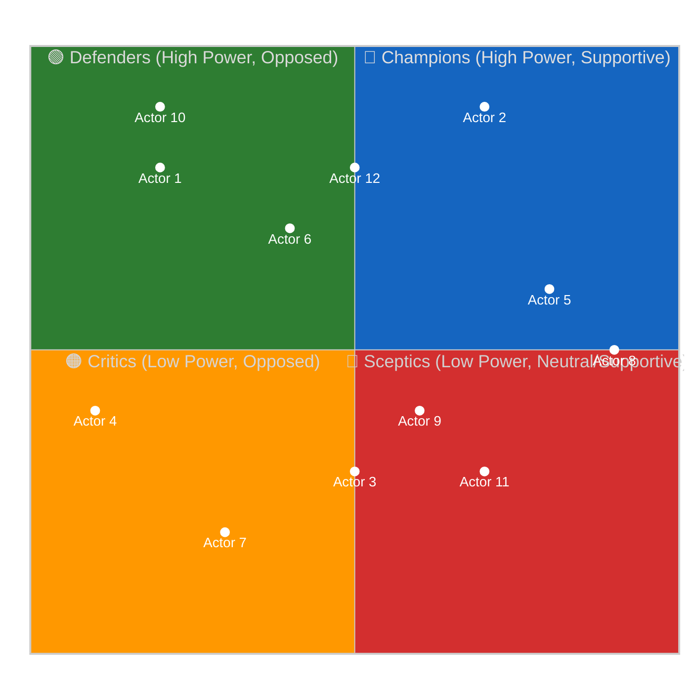

<!-- SPDX-FileCopyrightText: 2024-2026 Hack23 AB -->
<!-- SPDX-License-Identifier: Apache-2.0 -->

# 🗺️ Stakeholder Map Template — Power × Alignment Grid

> **📌 Template Instructions:** Copy to `analysis/daily/{date}/{article-type}-run{N}/intelligence/stakeholder-map.md`. Map ≥12 named actors on a Power × Alignment grid for the period's dominant issue. See [methodologies/per-artifact-methodologies.md §stakeholder-map](../methodologies/per-artifact-methodologies.md#stakeholder-map).

> **🎯 Purpose:** Named-stakeholder map placing political groups, key MEPs, committees, Commission DGs, Council configurations, external lobbies, and citizen groups on a two-dimensional grid showing who holds power and where they stand on the period's dominant question.

---

## 📋 Document Metadata

| Field | Value |
|-------|-------|
| **Report ID** | `[REQUIRED: SM-YYYY-MM-DD-runNN]` |
| **Analysis Period** | `[REQUIRED: YYYY-MM-DD to YYYY-MM-DD]` |
| **Dominant Issue** | `[REQUIRED: one-line issue frame]` |
| **Actors Mapped** | `[REQUIRED: count ≥12]` |
| **Confidence** | `[REQUIRED: 🟢/🟡/🔴]` |

---

## 1️⃣ Issue Frame

**Question this map answers:**

`[REQUIRED: ≥100 words stating the exact political question the map addresses. What issue unites or divides these actors? What decision or policy is at stake? Include timeframe and context.]`

---

## 2️⃣ Actor Roster

| # | Actor Name | Role | Power (0-10) | Power Justification | Alignment (-5 … +5) | Alignment Justification |
|:-:|------------|------|:------------:|---------------------|:-------------------:|------------------------|
| 1 | `[REQUIRED]` | `[REQUIRED: e.g. Political Group / MEP / Committee / DG / Lobby]` | `[0-10]` | `[REQUIRED: cite MEP influence index, committee role, seat share, or institutional position]` | `[-5 … +5]` | `[REQUIRED: cite roll-call vote, speech, public position, or document]` |
| 2 | `[REQUIRED]` | `[REQUIRED]` | `[0-10]` | `[REQUIRED]` | `[-5 … +5]` | `[REQUIRED]` |
| 3 | `[REQUIRED]` | `[REQUIRED]` | `[0-10]` | `[REQUIRED]` | `[-5 … +5]` | `[REQUIRED]` |
| 4 | `[REQUIRED]` | `[REQUIRED]` | `[0-10]` | `[REQUIRED]` | `[-5 … +5]` | `[REQUIRED]` |
| 5 | `[REQUIRED]` | `[REQUIRED]` | `[0-10]` | `[REQUIRED]` | `[-5 … +5]` | `[REQUIRED]` |
| 6 | `[REQUIRED]` | `[REQUIRED]` | `[0-10]` | `[REQUIRED]` | `[-5 … +5]` | `[REQUIRED]` |
| 7 | `[REQUIRED]` | `[REQUIRED]` | `[0-10]` | `[REQUIRED]` | `[-5 … +5]` | `[REQUIRED]` |
| 8 | `[REQUIRED]` | `[REQUIRED]` | `[0-10]` | `[REQUIRED]` | `[-5 … +5]` | `[REQUIRED]` |
| 9 | `[REQUIRED]` | `[REQUIRED]` | `[0-10]` | `[REQUIRED]` | `[-5 … +5]` | `[REQUIRED]` |
| 10 | `[REQUIRED]` | `[REQUIRED]` | `[0-10]` | `[REQUIRED]` | `[-5 … +5]` | `[REQUIRED]` |
| 11 | `[REQUIRED]` | `[REQUIRED]` | `[0-10]` | `[REQUIRED]` | `[-5 … +5]` | `[REQUIRED]` |
| 12 | `[REQUIRED]` | `[REQUIRED]` | `[0-10]` | `[REQUIRED]` | `[-5 … +5]` | `[REQUIRED]` |

**Scale definitions:**
- **Power (0-10):** 0=no institutional leverage, 5=moderate influence (backbencher/small group), 10=decisive leverage (rapporteur/chair/major group)
- **Alignment (-5 … +5):** -5=strongly opposed, 0=neutral/uncommitted, +5=strongly supportive

---

## 3️⃣ Power × Alignment Grid

> Per [political-style-guide.md §Standard quadrantChart init block](../methodologies/political-style-guide.md), quadrant charts **MUST** use the dedicated quadrant init block above (not the universal init block). Replace `Actor N` with actual stakeholder names.

**Note:** Replace `[ActorN]` labels and coordinates with actual actor names and scaled positions derived from roster table.

---

## 4️⃣ Quadrant Narratives

### Champions (High Power, Supportive — Q1)

`[REQUIRED: ≥150 words analyzing actors in the top-right quadrant. Who are they? What institutional leverage do they hold? What motivates their support? What coalition-building capacity do they have? Cite specific EP roles, committee positions, or voting records.]`

### Defenders (High Power, Opposed — Q2)

`[REQUIRED: ≥150 words analyzing actors in the top-left quadrant. Who opposes and why? What veto points or procedural tools do they control? What is their fallback position? What would shift them to neutral or supportive?]`

### Critics (Low Power, Opposed — Q3)

`[REQUIRED: ≥150 words analyzing actors in the bottom-left quadrant. Why do they oppose despite limited institutional leverage? What coalitions might amplify their voice? What signal would their shift send to higher-power actors?]`

### Sceptics (Low Power, Neutral/Supportive — Q4)

`[REQUIRED: ≥150 words analyzing actors in the bottom-right quadrant. Why are they supportive or uncommitted? What would activate their engagement? What prevents them from moving to the Champions quadrant?]`

---

## 5️⃣ Movement Since Prior Period

| Actor | Prior Position | Current Position | Direction | Explanation |
|-------|:--------------:|:----------------:|:---------:|-------------|
| `[REQUIRED]` | `[Power, Alignment]` | `[Power, Alignment]` | `[↑ / → / ↓ / ↗ / ↘]` | `[REQUIRED: ≥30 words — what changed and why]` |
| `[REQUIRED]` | `[...]` | `[...]` | `[...]` | `[REQUIRED]` |
| `[REQUIRED]` | `[...]` | `[...]` | `[...]` | `[REQUIRED]` |

**New entrants this period:** `[REQUIRED: list actors not present in prior map, or note "none"]`  
**Exits this period:** `[REQUIRED: list actors no longer relevant, or note "none"]`

---

## 6️⃣ Coalition Implications

**Majority threshold for this issue:** `[REQUIRED: 361 votes or qualified majority requirement]`

**Viable coalitions:**

| Coalition | Members | Combined Power | Estimated Votes | Viable? |
|-----------|---------|:--------------:|:---------------:|:-------:|
| `[REQUIRED: name]` | `[REQUIRED: actors]` | `[sum of power scores]` | `[estimated]` | `[✅/⚠️/❌]` |
| `[REQUIRED]` | `[REQUIRED]` | `[sum]` | `[estimated]` | `[✅/⚠️/❌]` |
| `[REQUIRED]` | `[REQUIRED]` | `[sum]` | `[estimated]` | `[✅/⚠️/❌]` |

**Blocking minorities:** `[REQUIRED: which quadrant combinations can block progress?]`

---

## 7️⃣ Strategic Observations

**Most influential swing actor:** `[REQUIRED: name + 50-word explanation]`  
**Most fragile alliance:** `[REQUIRED: which coalition is most vulnerable to defection?]`  
**Surprise positioning:** `[REQUIRED: any actor in an unexpected quadrant?]`

---

## 8️⃣ Forward Monitors

| Actor | Watch for… | Signal timing |
|-------|-----------|---------------|
| `[REQUIRED]` | `[REQUIRED: what would indicate a position shift]` | `[REQUIRED: date or trigger event]` |
| `[REQUIRED]` | `[REQUIRED]` | `[REQUIRED]` |
| `[REQUIRED]` | `[REQUIRED]` | `[REQUIRED]` |

---

## 9️⃣ Data Sources & Confidence

**EP MCP tools used:** `get_meps`, `get_committee_info`, `analyze_country_delegation`, `assess_mep_influence`, `get_speeches`

**Confidence level:** `[REQUIRED: 🟢 HIGH / 🟡 MEDIUM / 🔴 LOW]`  
**Confidence explanation:** `[REQUIRED: where power/alignment scores are data-backed vs. inference-based]`

---

## 🔟 EP MCP Tool Inputs

| EP MCP tool | Used for which lens | Notes |
|-------------|---------------------|-------|
| `get_committee_info` | EP-Groups + Committees lens | Chair / vice-chair / rapporteur composition. |
| `compare_political_groups` | EP-Groups lens | Seat-share + cohesion proxies per group. |
| `analyze_country_delegation` | National-Parliaments lens | Per-country MEP cohesion vs national interest. |
| `analyze_coalition_dynamics` | EP-Groups lens (alliance signals) | Two-window deltas. |
| `track_legislation` | Council + Commission lens | Inter-institutional position deltas. |
| `get_external_documents` | Council + Commission + Industry lens | Council positions, Commission proposals, industry submissions. |
| `get_speeches` | Civil-Society + Citizens lens (proxy via MEP framings) | Topic-tag distribution. |
| `get_parliamentary_questions` | Citizens lens (representative proxy) | Pending vs answered ratios. |
| `get_meps` + `assess_mep_influence` | EP-Groups lens (named brokers) | Crosswalk to actor-mapping.md. |
| `correlate_intelligence` | Composite alerts across lenses | ELEVATED_ATTENTION + COALITION_FRACTURE. |

---

## 1️⃣1️⃣ Worked Pass-1 → Pass-2 Example (CRA implementation review, 7-lens map)

**❌ Pass-1 (thin, 22 words):**
> "Many stakeholders involved in CRA. Council supportive, industry mixed, NGOs concerned. Citizens not very engaged. EP groups divided."

**✅ Pass-2 (compliant, 110 words, sourced):**
> Stakeholder landscape on CRA implementing acts (April 2026): Council (BE-PL Presidency) Supportive — 23-Apr general approach passed by 24/25 MS per `track_legislation` 2024/0099(COD) (RO abstained, A-2 source). Commission (DG-CNECT, Cmsr Virkkunen) Supportive — published implementation roadmap 2026-04-09 (A-1). EP groups split: EPP+Renew Supportive, S&D Neutral (data-protection reservations), Greens/EFA Opposed on telemetry-default, ECR+PfE Opposed on SME burden. National parliaments: 14 reasoned-opinion thresholds tested (none triggered yellow card). Civil society: 8 NGO joint letter Opposed (B-2). Industry: DigitalEurope + BusinessEurope Supportive, ETSI Neutral (B-2). Citizens proxy: 47 % awareness, 31 % support per `get_parliamentary_questions` constituency-question volume (3-month rolling).

---

## 1️⃣2️⃣ Worked 7-Lens Stakeholder Template

| Lens | Stakeholder | Stance | Evidence | Confidence |
|------|-------------|:------:|----------|:----------:|
| **1. Council** | BE-PL Presidency + COREPER | Supportive | `track_legislation` 2024/0099(COD) general approach 23-Apr-2026, 24/25 MS | 🟢 HIGH (A-2) |
| **2. Commission** | DG-CNECT, Cmsr Virkkunen | Supportive | Implementation roadmap published 2026-04-09 | 🟢 HIGH (A-1) |
| **3. EP groups** | EPP (188) + Renew (84) | Supportive | `compare_political_groups` cohesion 91 %; rapporteur Voss + shadow Tudorache | 🟢 HIGH (A-2) |
| **3. EP groups** | S&D (136) | Neutral | Group statement 2026-03-28 — data-protection reservations | 🟡 MEDIUM (B-2) |
| **3. EP groups** | Greens/EFA (53) + The Left (46) | Opposed | Joint amendment package 2026-04-15 — telemetry-default red line | 🟢 HIGH (A-2) |
| **3. EP groups** | ECR (78) + PfE (84) | Opposed | SME-burden floor amendments | 🟡 MEDIUM (B-2) |
| **4. National parliaments** | 27 chambers | Neutral | 0 yellow-card triggers; 14 reasoned-opinion threshold tests | 🟢 HIGH (A-1) |
| **5. Civil society** | EDRi + Access Now + 6 NGOs | Opposed | Joint letter 2026-04-02 (8 signatories) | 🟡 MEDIUM (B-2) |
| **6. Industry** | DigitalEurope + BusinessEurope | Supportive | Position papers 2026-03-15 + 2026-03-22 | 🟡 MEDIUM (B-2) |
| **6. Industry** | ETSI (standards body) | Neutral | Comment letter 2026-04-08 — implementation-detail concerns | 🟡 MEDIUM (B-3) |
| **7. Citizens** | EU public (Eurobarometer proxy) | Mixed | 47 % awareness / 31 % support; `get_parliamentary_questions` volume +12 % | 🔴 LOW (C-3) |

**Net stance map:** 4 Supportive · 3 Neutral · 4 Opposed · 1 Mixed → Coalition coalition-arithmetic still favours adoption (272 EPP+Renew + 136 S&D-passive ≥ floor majority) but Greens-led floor opposition is unified.

---

## 1️⃣3️⃣ Anti-patterns — REJECT on Pass-2 Review

| # | Banned pattern | Why it fails |
|:-:|---------------|--------------|
| 1 | Stakeholder lens missing one of the 7 (Council / Commission / EP groups / NPs / civil society / industry / citizens) | 7-lens contract violated. |
| 2 | Stance label without evidence column populated | Unsourced political claim. |
| 3 | "EP groups" lens without naming groups individually | Aggregating 8 groups into one row hides splits. |
| 4 | Civil-society lens with single NGO citation (no joint-letter / coalition aggregation) | Single NGO ≠ civil society. |
| 5 | Citizens lens proxied solely from media polling without `get_parliamentary_questions` cross-check | Tradecraft demands EP-internal proxy. |
| 6 | Confidence labels missing or all 🟢 HIGH | No critical-confidence calibration. |
| 7 | Industry lens without naming ≥2 distinct trade associations | Industry ≠ one trade body. |

---

## 1️⃣4️⃣ Cross-References — Controlling Methodology

- [`../methodologies/per-artifact-methodologies.md#stakeholder-map`](../methodologies/per-artifact-methodologies.md) — construction rules.
- [`../methodologies/political-classification-guide.md`](../methodologies/political-classification-guide.md) — group + national-delegation taxonomy.
- [`../methodologies/osint-tradecraft-standards.md`](../methodologies/osint-tradecraft-standards.md) — Admiralty grade per evidence cell.
- [`./actor-mapping.md`](./actor-mapping.md) — individual-MEP view (sister artifact).
- [`./coalition-dynamics.md`](./coalition-dynamics.md) — coalition-arithmetic view.
- [`./forces-analysis.md`](./forces-analysis.md) — driving / restraining force view consumes stance column.

---

## 1️⃣5️⃣ Stage-C Completeness Signals

`scripts/validate-analysis-completeness.js` checks for this artifact:

| Check | Threshold | Source |
|-------|-----------|--------|
| Line floor | ≥305 lines | `reference-quality-thresholds.json` |
| Required H2 substrings | "Stakeholder", "Lens", "Stance", "Confidence" | structural contract |
| Mermaid block | ≥1 (radial / spider preferred for 7-lens visual) | visual contract |
| Tradecraft markers | Admiralty grade per evidence; confidence label per row | `osint-tradecraft-standards.md` |
| Source diversity | ≥5 EP MCP tools across the 7 lenses | per-artifact rule |
| Lens coverage | All 7 lenses populated; ≥1 row per lens minimum | template logic |

---

**Document Control:** `/analysis/daily/{date}/{type}-run{N}/intelligence/stakeholder-map.md` · Template v1.2 · Depth floor: 305 lines.
