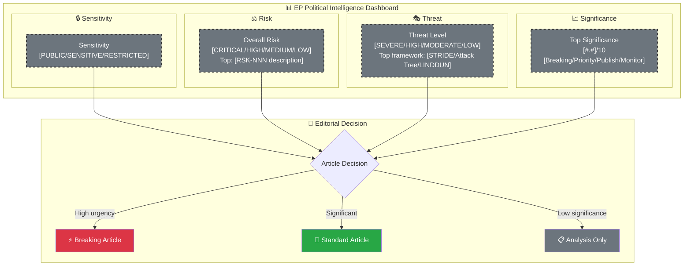
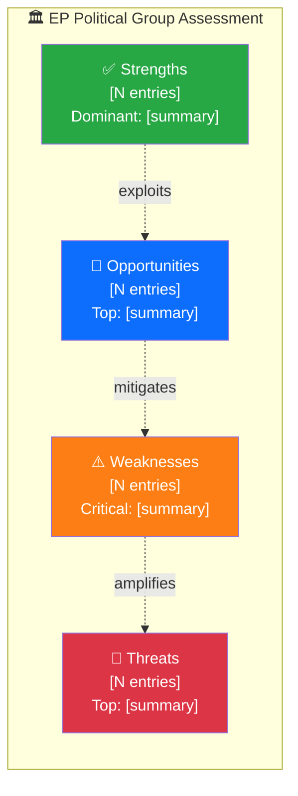

  

<h1 align="center">🧩 Political Intelligence Synthesis Template — European Parliament</h1>

  <strong>📊 Integrated Analysis Summary Combining All Intelligence Streams</strong> 
  <em>🎯 Classification · SWOT · Risk · Threat · Stakeholder · Significance</em>

  
  
  
  

**📋 Document Owner:** CEO | **📄 Version:** 1.0 | **📅 Last Updated:** 2026-03-30 (UTC)
**🏢 Owner:** Hack23 AB (Org.nr 5595347807) | **🏷️ Classification:** Public

> **📌 Template Instructions:** This template synthesizes the outputs of all other analysis templates into a single intelligence summary. Copy to `analysis/{date}/{article-type-slug}/` and save as `synthesis-summary.md`. This file is consumed by the news article generators to determine narrative direction.

> **🚨 Anti-Pattern Warning:** Plain prose without structured tables, Mermaid diagrams, or evidence citations is REJECTED. Every analysis file MUST follow this template exactly: metadata header, structured tables with evidence columns, ≥1 color-coded Mermaid diagram, confidence labels on all claims. See [ai-driven-analysis-guide.md](../methodologies/ai-driven-analysis-guide.md) for good vs. bad examples.

---

## 📋 Synthesis Context

| Field | Value |
|-------|-------|
| **Synthesis ID** | `[REQUIRED: SYN-YYYY-MM-DD-NNN]` |
| **Analysis Date** | `[REQUIRED: YYYY-MM-DD HH:MM UTC]` |
| **Documents Analyzed** | `[REQUIRED: N]` |
| **Analysis Period** | `[REQUIRED: e.g. "2026-03-30 00:00–18:00 UTC"]` |
| **Produced By** | `[REQUIRED: workflow name, e.g. news-weekly-review]` |
| **Overall Confidence** | `[REQUIRED: HIGH / MEDIUM / LOW]` |

---

## 📊 Intelligence Dashboard

### EP Political Landscape

> **AI Instructions:** Replace all placeholder values with actual analysis results. Update each node's `style` line from grey dashed placeholder to the appropriate level color:
> - **Sensitivity:** 🟢 PUBLIC `#28a745` · 🟡 SENSITIVE `#ffc107` · 🔴 RESTRICTED `#dc3545`
> - **Risk / Threat / Significance:** use the standard palette (`#dc3545` / `#fd7e14` / `#ffc107` / `#28a745`)

---

## 🏆 Top Findings by Significance

| Rank | EP Reference | Title | Significance | Risk Tier | SWOT Impact | Recommendation |
|:----:|-------------|-------|:-----------:|:---------:|:-----------:|----------------|
| 1 | `[REQUIRED: e.g. P9_TA(2026)XXXX]` | `[REQUIRED]` | `[#.#]` | `[🟢/🟡/🟠/🔴]` | `[S/W/O/T dominant]` | `[Breaking/Priority/Publish/Monitor]` |
| 2 | `[REQUIRED]` | `[REQUIRED]` | `[#.#]` | `[tier]` | `[quadrant]` | `[action]` |
| 3 | `[REQUIRED]` | `[REQUIRED]` | `[#.#]` | `[tier]` | `[quadrant]` | `[action]` |
| 4 | `[OPTIONAL]` | `[OPTIONAL]` | `[#.#]` | `[tier]` | `[quadrant]` | `[action]` |
| 5 | `[OPTIONAL]` | `[OPTIONAL]` | `[#.#]` | `[tier]` | `[quadrant]` | `[action]` |

---

## 💪 Aggregated SWOT Summary

> *Combines individual document SWOT analyses into a landscape-level view of EP political dynamics.*

### Political Group Balance

| Quadrant | Count | Highest-Impact Entry | Evidence |
|----------|:-----:|---------------------|----------|
| ✅ Strengths | `[N]` | `[REQUIRED: strongest finding]` | `[EP doc reference]` |
| ⚠️ Weaknesses | `[N]` | `[REQUIRED: most critical weakness]` | `[EP doc reference]` |
| 🚀 Opportunities | `[N]` | `[REQUIRED: best opportunity]` | `[EP doc reference]` |
| 🔴 Threats | `[N]` | `[REQUIRED: most serious threat]` | `[EP doc reference]` |

**SWOT Balance Assessment:** `[REQUIRED: 1–2 sentences — e.g. "Grand coalition (EPP-S&D) strengths outweigh weaknesses this period, but ECR-PfE alignment on migration creates medium-term fragmentation risk."]`

---

## ⚖️ Risk Landscape Summary

| Risk Category | Score Range | Highest Risk | Trend vs. Previous |
|--------------|:----------:|-------------|:------------------:|
| Grand Coalition Stability | `[N–N]` | `[RSK-NNN: description]` | `[↑/→/↓]` |
| Policy Implementation | `[N–N]` | `[RSK-NNN: description]` | `[↑/→/↓]` |
| Budget / MFF | `[N–N]` | `[RSK-NNN: description]` | `[↑/→/↓]` |
| Electoral / EP Elections | `[N–N]` | `[RSK-NNN: description]` | `[↑/→/↓]` |
| Democratic Process | `[N–N]` | `[RSK-NNN: description]` | `[↑/→/↓]` |
| External / Geopolitical | `[N–N]` | `[RSK-NNN: description]` | `[↑/→/↓]` |

**Overall Risk Level:** `[REQUIRED: LOW / MEDIUM / HIGH / CRITICAL]`

---

## 🎭 Threat Summary

> *Multi-framework threat assessment — not limited to STRIDE. Includes attack tree findings, LINDDUN privacy threats, and PESTLE macro-environmental factors.*

| Threat Framework | Category | Threat Level | Key Finding |
|-----------------|----------|:------------:|-------------|
| STRIDE | S — Disinformation | `[LOW/MOD/HIGH/SEVERE]` | `[1 sentence]` |
| STRIDE | T — Process Manipulation | `[LOW/MOD/HIGH/SEVERE]` | `[1 sentence]` |
| STRIDE | R — Accountability Evasion | `[LOW/MOD/HIGH/SEVERE]` | `[1 sentence]` |
| STRIDE | I — Transparency Failure | `[LOW/MOD/HIGH/SEVERE]` | `[1 sentence]` |
| STRIDE | D — Democratic Obstruction | `[LOW/MOD/HIGH/SEVERE]` | `[1 sentence]` |
| STRIDE | E — Power Concentration | `[LOW/MOD/HIGH/SEVERE]` | `[1 sentence]` |
| Attack Tree | Coalition Destabilisation | `[LOW/MOD/HIGH/SEVERE]` | `[1 sentence]` |
| Attack Tree | Legislative Capture | `[LOW/MOD/HIGH/SEVERE]` | `[1 sentence]` |
| LINDDUN | Privacy/Data Protection | `[LOW/MOD/HIGH/SEVERE]` | `[1 sentence]` |
| PESTLE | Macro-Environmental | `[LOW/MOD/HIGH/SEVERE]` | `[1 sentence]` |

**Overall Threat Level:** `[REQUIRED: LOW / MODERATE / HIGH / SEVERE]`

---

## 👥 Stakeholder Impact Overview

| Stakeholder | Impact | Direction | Key Driver |
|------------|:------:|:---------:|------------|
| 🇪🇺 EU Citizens | `[H/M/L/N]` | `[positive/negative/neutral]` | `[REQUIRED]` |
| 🏛️ EU Institutions (Commission, Council) | `[H/M/L/N]` | `[positive/negative/neutral]` | `[REQUIRED]` |
| 🗳️ EP Political Groups | `[H/M/L/N]` | `[positive/negative/neutral]` | `[REQUIRED]` |
| 🏭 Business & Industry | `[H/M/L/N]` | `[positive/negative/neutral]` | `[REQUIRED]` |
| 🤝 Civil Society & NGOs | `[H/M/L/N]` | `[positive/negative/neutral]` | `[REQUIRED]` |
| 🌍 International Partners | `[H/M/L/N]` | `[positive/negative/neutral]` | `[REQUIRED]` |
| 🇪🇺 Member States | `[H/M/L/N]` | `[positive/negative/neutral]` | `[REQUIRED]` |

---

## 🎯 Narrative Direction

`[REQUIRED: 4–6 sentences providing the primary narrative direction for article generation. This is the lede thesis that the article generator should use. Be specific about the central political tension, the key actors, and the intelligence-level insight. Include confidence assessment.]`

**Primary Narrative Angle:** `[REQUIRED: 1 sentence — the article headline thesis]`
**Secondary Angles:** `[OPTIONAL: 1–2 alternative narrative framings]`
**Confidence:** `[REQUIRED: HIGH / MEDIUM / LOW]`

---

## 🔮 Forward Indicators

| # | Indicator | Timeline | Source | Watch Priority |
|---|-----------|----------|--------|:--------------:|
| 1 | `[REQUIRED: specific EP event or metric to monitor]` | `[days/weeks]` | `[EP MCP data source]` | `🔴/🟠/🟡/🟢` |
| 2 | `[REQUIRED]` | `[timeline]` | `[source]` | `[tier]` |
| 3 | `[OPTIONAL]` | `[timeline]` | `[source]` | `[tier]` |

---

## 📋 Analysis Artifacts Inventory

| File | Status | Key Output |
|------|:------:|-----------|
| `classification-results.md` | `[✅/⚠️/❌]` | `[REQUIRED: main classification finding]` |
| `risk-assessment.md` | `[✅/⚠️/❌]` | `[REQUIRED: overall risk level]` |
| `swot-analysis.md` | `[✅/⚠️/❌]` | `[REQUIRED: SWOT balance]` |
| `threat-analysis.md` | `[✅/⚠️/❌]` | `[REQUIRED: overall threat level]` |
| `stakeholder-perspectives.md` | `[✅/⚠️/❌]` | `[REQUIRED: highest-impact stakeholder]` |
| `significance-scoring.md` | `[✅/⚠️/❌]` | `[REQUIRED: top significance score]` |
| Per-file `.analysis.md` files | `[N created]` | `[REQUIRED: count of per-file analyses]` |

---

## 📂 MCP Data Files Used

`[REQUIRED: List all EP MCP data file paths consulted for this synthesis]`

---

**Document Control:**
- **Template Path:** `/analysis/templates/synthesis-summary.md`
- **Consumed By:** All news article generator workflows
- **Classification:** Public
- **Next Review:** 2026-06-30
