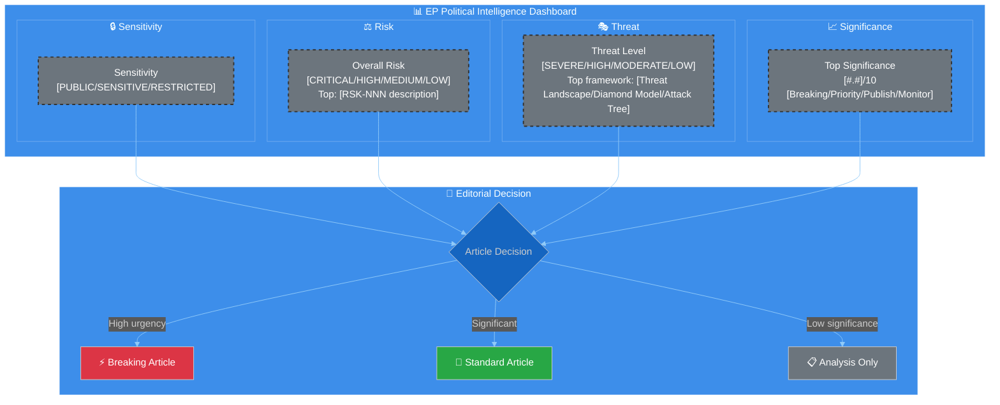
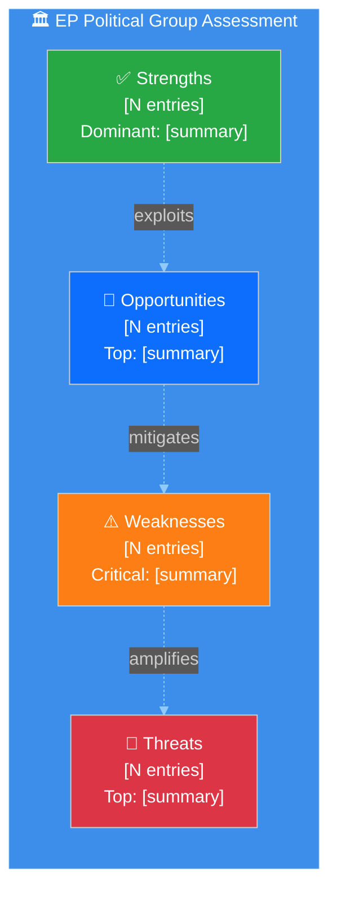
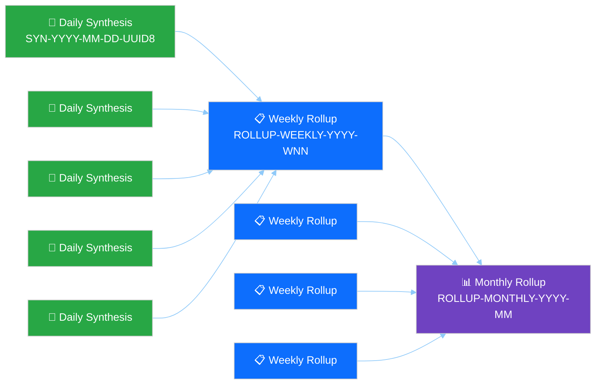

<p align="center">
  
</p>

<h1 align="center">🧩 Political Intelligence Synthesis Template — European Parliament</h1>

<p align="center">
  <strong>📊 Integrated Analysis Summary Combining All Intelligence Streams</strong><br>
  <em>🎯 Classification · SWOT · Risk · Threat · Stakeholder · Significance</em>
</p>

<p align="center">
  <a href="#"></a>
  <a href="#"></a>
  <a href="#"></a>
  <a href="#"></a>
</p>

**📋 Document Owner:** CEO | **📄 Version:** 1.3 | **📅 Last Updated:** 2026-04-10 (UTC)
**🏢 Owner:** Hack23 AB (Org.nr 5595347807) | **🏷️ Classification:** Public

> **📌 Template Instructions:** This template synthesizes the outputs of all other analysis templates into a single intelligence summary. Copy to `analysis/daily/{date}/{article-type-slug}/` and save as `synthesis-summary.md`. This file is consumed by the news article generators to determine narrative direction.

> **🚨 Anti-Pattern Warning:** Plain prose without structured tables, Mermaid diagrams, or evidence citations is REJECTED. Every analysis file MUST follow this template exactly: metadata header, structured tables with evidence columns, ≥1 color-coded Mermaid diagram, confidence labels on all claims. See [ai-driven-analysis-guide.md](../methodologies/ai-driven-analysis-guide.md) for good vs. bad examples.

> **🔴 Deep Data Requirement (NEW):** A synthesis that cites political group positions (e.g., "ECR split on trade vote") without actual voting record data from `get_voting_records` or `get_meeting_decisions` MUST mark those claims as LOW confidence. The synthesis MUST include a "Data Sources Used" section listing every MCP tool called, items returned, and any failed endpoints with the direct fallback attempted.

> **🔴 Cross-Run Consistency (NEW):** When citing political group seat counts, use EXACTLY the same numbers as other analysis files in the same run. Inconsistencies between breaking-run and committee-reports-run on the same day (e.g., EPP=185 vs EPP=188) undermine credibility. Use a single canonical source per run and record it.

---

## 📋 Synthesis Context

| Field | Value |
|-------|-------|
| **Synthesis ID** | `[REQUIRED: SYN-YYYY-MM-DD-NNN]` |
| **Analysis Date** | `[REQUIRED: YYYY-MM-DD HH:MM UTC]` |
| **Documents Analyzed** | `[REQUIRED: N]` |
| **Analysis Period** | `[REQUIRED: e.g. "2026-03-30 00:00–18:00 UTC"]` |
| **Produced By** | `[REQUIRED: workflow name, e.g. news-weekly-review]` |
| **Overall Confidence** | `[REQUIRED: HIGH / MEDIUM / LOW]` |

---

## 📊 Intelligence Dashboard

### EP Political Landscape

> **AI Instructions:** Replace all placeholder values with actual analysis results. Update each node's `style` line from grey dashed placeholder to the appropriate level color:
> - **Sensitivity:** 🟢 PUBLIC `#28a745` · 🟡 SENSITIVE `#ffc107` · 🔴 RESTRICTED `#dc3545`
> - **Risk / Threat / Significance:** use the standard palette (`#dc3545` / `#fd7e14` / `#ffc107` / `#28a745`)


```mermaid
%%{init: {"theme":"dark","themeVariables":{"primaryColor":"#1565C0","primaryTextColor":"#ffffff","primaryBorderColor":"#0A3F7F","lineColor":"#90CAF9","secondaryColor":"#2E7D32","secondaryTextColor":"#ffffff","secondaryBorderColor":"#0F3F00","tertiaryColor":"#FF9800","tertiaryTextColor":"#000000","tertiaryBorderColor":"#7F4F00","mainBkg":"#1565C0","secondBkg":"#2E7D32","tertiaryBkg":"#FF9800","noteBkgColor":"#FFC107","noteTextColor":"#000000","noteBorderColor":"#7F6000","errorBkgColor":"#D32F2F","errorTextColor":"#ffffff","fontFamily":"Inter, Helvetica, Arial, sans-serif","pie1":"#1565C0","pie2":"#2E7D32","pie3":"#FF9800","pie4":"#D32F2F","pie5":"#FFC107","pie6":"#7B1FA2","pie7":"#9E9E9E","pie8":"#0288D1","pie9":"#388E3C","pie10":"#F57C00","pie11":"#C62828","pie12":"#FBC02D","pieTitleTextSize":"18px","pieSectionTextSize":"14px","pieLegendTextSize":"13px","pieStrokeColor":"#1e1e1e","pieOuterStrokeColor":"#1e1e1e","git0":"#1565C0","git1":"#2E7D32","git2":"#FF9800","git3":"#D32F2F","gitBranchLabel0":"#ffffff","gitBranchLabel1":"#ffffff","gitBranchLabel2":"#000000","gitBranchLabel3":"#ffffff","cScale0":"#1565C0","cScale1":"#2E7D32","cScale2":"#FF9800","cScale3":"#D32F2F","cScale4":"#FFC107","cScale5":"#7B1FA2","cScale6":"#9E9E9E","cScale7":"#0288D1","xyChart":{"backgroundColor":"#1e1e1e","plotColorPalette":"#1565C0,#2E7D32,#FF9800,#D32F2F,#FFC107,#7B1FA2,#9E9E9E"}}}}%%
graph TD
    subgraph "📊 EP Political Intelligence Dashboard"
        direction TB
        subgraph "🔒 Sensitivity"
            CLS["Sensitivity<br/>[PUBLIC/SENSITIVE/RESTRICTED]"]
        end
        subgraph "⚖️ Risk"
            RSK["Overall Risk<br/>[CRITICAL/HIGH/MEDIUM/LOW]<br/>Top: [RSK-NNN description]"]
        end
        subgraph "🎭 Threat"
            THR["Threat Level<br/>[SEVERE/HIGH/MODERATE/LOW]<br/>Top framework: [Threat Landscape/Diamond Model/Attack Tree]"]
        end
        subgraph "📈 Significance"
            SIG["Top Significance<br/>[#.#]/10<br/>[Breaking/Priority/Publish/Monitor]"]
        end
    end

    subgraph "🎯 Editorial Decision"
        DEC{Article Decision}
        DEC -->|"High urgency"| BRK["⚡ Breaking Article"]
        DEC -->|"Significant"| STD["📰 Standard Article"]
        DEC -->|"Low significance"| MON["📋 Analysis Only"]
    end

    CLS --> DEC
    RSK --> DEC
    THR --> DEC
    SIG --> DEC

    style CLS fill:#6c757d,stroke:#333,stroke-width:2px,stroke-dasharray:5 5,color:#fff
    style RSK fill:#6c757d,stroke:#333,stroke-width:2px,stroke-dasharray:5 5,color:#fff
    style THR fill:#6c757d,stroke:#333,stroke-width:2px,stroke-dasharray:5 5,color:#fff
    style SIG fill:#6c757d,stroke:#333,stroke-width:2px,stroke-dasharray:5 5,color:#fff

    %% ⚠️ AI Agent: When filling actual values, replace grey dashed styles above
    %% with appropriate level colours from the standard palette:
    %% CRITICAL/RESTRICTED: fill:#dc3545  HIGH/SENSITIVE: fill:#fd7e14
    %% MEDIUM: fill:#ffc107  LOW/PUBLIC: fill:#28a745
    style BRK fill:#dc3545,color:#fff
    style STD fill:#28a745,color:#fff
    style MON fill:#6c757d,color:#fff
```

---

## 🏆 Top Findings by Significance

| Rank | EP Reference | Title | Significance | Risk Tier | SWOT Impact | WEP Band | Time Horizon | Admiralty Grade | Recommendation |
|:----:|-------------|-------|:-----------:|:---------:|:-----------:|:--------:|:------------:|:---------------:|----------------|
| 1 | `[REQUIRED: e.g. P9_TA(2026)XXXX]` | `[REQUIRED]` | `[#.#]` | `[🟢/🟡/🟠/🔴]` | `[S/W/O/T dominant]` | `[Likely / Very Likely / …]` | `[e.g. next plenary / by Q3 2026 / within mandate]` | `[A1–F6]` | `[Breaking/Priority/Publish/Monitor]` |
| 2 | `[REQUIRED]` | `[REQUIRED]` | `[#.#]` | `[tier]` | `[quadrant]` | `[WEP]` | `[horizon]` | `[A1–F6]` | `[action]` |
| 3 | `[REQUIRED]` | `[REQUIRED]` | `[#.#]` | `[tier]` | `[quadrant]` | `[WEP]` | `[horizon]` | `[A1–F6]` | `[action]` |
| 4 | `[OPTIONAL]` | `[OPTIONAL]` | `[#.#]` | `[tier]` | `[quadrant]` | `[WEP]` | `[horizon]` | `[A1–F6]` | `[action]` |
| 5 | `[OPTIONAL]` | `[OPTIONAL]` | `[#.#]` | `[tier]` | `[quadrant]` | `[WEP]` | `[horizon]` | `[A1–F6]` | `[action]` |

---

## 💪 Aggregated SWOT Summary

> *Combines individual document SWOT analyses into a landscape-level view of EP political dynamics.*

### Political Group Balance


```mermaid
%%{init: {"theme":"dark","themeVariables":{"primaryColor":"#1565C0","primaryTextColor":"#ffffff","primaryBorderColor":"#0A3F7F","lineColor":"#90CAF9","secondaryColor":"#2E7D32","secondaryTextColor":"#ffffff","secondaryBorderColor":"#0F3F00","tertiaryColor":"#FF9800","tertiaryTextColor":"#000000","tertiaryBorderColor":"#7F4F00","mainBkg":"#1565C0","secondBkg":"#2E7D32","tertiaryBkg":"#FF9800","noteBkgColor":"#FFC107","noteTextColor":"#000000","noteBorderColor":"#7F6000","errorBkgColor":"#D32F2F","errorTextColor":"#ffffff","fontFamily":"Inter, Helvetica, Arial, sans-serif","pie1":"#1565C0","pie2":"#2E7D32","pie3":"#FF9800","pie4":"#D32F2F","pie5":"#FFC107","pie6":"#7B1FA2","pie7":"#9E9E9E","pie8":"#0288D1","pie9":"#388E3C","pie10":"#F57C00","pie11":"#C62828","pie12":"#FBC02D","pieTitleTextSize":"18px","pieSectionTextSize":"14px","pieLegendTextSize":"13px","pieStrokeColor":"#1e1e1e","pieOuterStrokeColor":"#1e1e1e","git0":"#1565C0","git1":"#2E7D32","git2":"#FF9800","git3":"#D32F2F","gitBranchLabel0":"#ffffff","gitBranchLabel1":"#ffffff","gitBranchLabel2":"#000000","gitBranchLabel3":"#ffffff","cScale0":"#1565C0","cScale1":"#2E7D32","cScale2":"#FF9800","cScale3":"#D32F2F","cScale4":"#FFC107","cScale5":"#7B1FA2","cScale6":"#9E9E9E","cScale7":"#0288D1","xyChart":{"backgroundColor":"#1e1e1e","plotColorPalette":"#1565C0,#2E7D32,#FF9800,#D32F2F,#FFC107,#7B1FA2,#9E9E9E"}}}}%%
graph LR
    subgraph "🏛️ EP Political Group Assessment"
        GS["✅ Strengths<br/>[N entries]<br/>Dominant: [summary]"]
        GW["⚠️ Weaknesses<br/>[N entries]<br/>Critical: [summary]"]
        GO["🚀 Opportunities<br/>[N entries]<br/>Top: [summary]"]
        GT["🔴 Threats<br/>[N entries]<br/>Top: [summary]"]
    end

    GS -.->|"exploits"| GO
    GW -.->|"amplifies"| GT
    GO -.->|"mitigates"| GW

    style GS fill:#28a745,color:#fff
    style GW fill:#fd7e14,color:#fff
    style GO fill:#0d6efd,color:#fff
    style GT fill:#dc3545,color:#fff
```

| Quadrant | Count | Highest-Impact Entry | Evidence |
|----------|:-----:|---------------------|----------|
| ✅ Strengths | `[N]` | `[REQUIRED: strongest finding]` | `[EP doc reference]` |
| ⚠️ Weaknesses | `[N]` | `[REQUIRED: most critical weakness]` | `[EP doc reference]` |
| 🚀 Opportunities | `[N]` | `[REQUIRED: best opportunity]` | `[EP doc reference]` |
| 🔴 Threats | `[N]` | `[REQUIRED: most serious threat]` | `[EP doc reference]` |

**SWOT Balance Assessment:** `[REQUIRED: 1–2 sentences — e.g. "Grand coalition (EPP-S&D) strengths outweigh weaknesses this period, but ECR-PfE alignment on migration creates medium-term fragmentation risk."]`

---

## ⚖️ Risk Landscape Summary

| Risk Category | Score Range | Highest Risk | Trend vs. Previous |
|--------------|:----------:|-------------|:------------------:|
| Grand Coalition Stability | `[N–N]` | `[RSK-NNN: description]` | `[↑/→/↓]` |
| Policy Implementation | `[N–N]` | `[RSK-NNN: description]` | `[↑/→/↓]` |
| Budget / MFF | `[N–N]` | `[RSK-NNN: description]` | `[↑/→/↓]` |
| Electoral / EP Elections | `[N–N]` | `[RSK-NNN: description]` | `[↑/→/↓]` |
| Democratic Process | `[N–N]` | `[RSK-NNN: description]` | `[↑/→/↓]` |
| External / Geopolitical | `[N–N]` | `[RSK-NNN: description]` | `[↑/→/↓]` |

**Overall Risk Level:** `[REQUIRED: LOW / MEDIUM / HIGH / CRITICAL]`

---

## 🎭 Threat Summary

> *Multi-framework threat assessment using the Political Threat Landscape (6 dimensions), Diamond Model for adversary analysis, Attack Trees for systemic risks, PESTLE for macro factors, and Scenario Planning for forward-looking assessments.*

| Framework | Dimension / Category | Threat Level | Key Finding |
|-----------|---------------------|:------------:|-------------|
| Threat Landscape | 🔄 Coalition Shifts | `[LOW/MOD/HIGH/SEVERE]` | `[1 sentence]` |
| Threat Landscape | 🔍 Transparency Deficit | `[LOW/MOD/HIGH/SEVERE]` | `[1 sentence]` |
| Threat Landscape | ↩️ Policy Reversal | `[LOW/MOD/HIGH/SEVERE]` | `[1 sentence]` |
| Threat Landscape | 🏛️ Institutional Pressure | `[LOW/MOD/HIGH/SEVERE]` | `[1 sentence]` |
| Threat Landscape | ⏳ Legislative Obstruction | `[LOW/MOD/HIGH/SEVERE]` | `[1 sentence]` |
| Threat Landscape | 📉 Democratic Erosion | `[LOW/MOD/HIGH/SEVERE]` | `[1 sentence]` |
| Attack Tree | Coalition Destabilisation | `[LOW/MOD/HIGH/SEVERE]` | `[1 sentence]` |
| Attack Tree | Legislative Capture | `[LOW/MOD/HIGH/SEVERE]` | `[1 sentence]` |
| LINDDUN | Privacy/Data Protection | `[LOW/MOD/HIGH/SEVERE]` | `[1 sentence]` |
| PESTLE | Macro-Environmental | `[LOW/MOD/HIGH/SEVERE]` | `[1 sentence]` |

**Overall Threat Level:** `[REQUIRED: LOW / MODERATE / HIGH / SEVERE]`

---

## 👥 Stakeholder Impact Overview

| Stakeholder | Impact | Direction | Key Driver |
|------------|:------:|:---------:|------------|
| 🇪🇺 EU Citizens | `[H/M/L/N]` | `[positive/negative/neutral]` | `[REQUIRED]` |
| 🏛️ EU Institutions (Commission, Council) | `[H/M/L/N]` | `[positive/negative/neutral]` | `[REQUIRED]` |
| 🗳️ EP Political Groups | `[H/M/L/N]` | `[positive/negative/neutral]` | `[REQUIRED]` |
| 🏭 Business & Industry | `[H/M/L/N]` | `[positive/negative/neutral]` | `[REQUIRED]` |
| 🤝 Civil Society & NGOs | `[H/M/L/N]` | `[positive/negative/neutral]` | `[REQUIRED]` |
| 🌍 International Partners | `[H/M/L/N]` | `[positive/negative/neutral]` | `[REQUIRED]` |
| 🇪🇺 Member States | `[H/M/L/N]` | `[positive/negative/neutral]` | `[REQUIRED]` |

---

## 🧩 Cross-Method Intelligence Correlation — New in v1.3

> **AI Instructions:** This section synthesises findings from ALL analysis streams (Classification + SWOT + Risk + Threat + Stakeholder + Significance) into integrated intelligence nuggets. Do NOT repeat findings verbatim from individual sections — identify how results from different frameworks **reinforce, contradict, or amplify** each other.

### Cross-Method Correlation Matrix

For each significant event in this synthesis, complete a correlation row:

| Event / Document | Classification Signal | Risk Finding | Threat Finding | SWOT Dominant Quadrant | Significance | Correlated Intelligence Nugget |
|-----------------|----------------------|-------------|----------------|:---------------------:|:------------:|-------------------------------|
| `[EP ref + event name]` | `[Sensitivity/Domain/Urgency]` | `[Risk tier + score]` | `[Threat level + framework]` | `[S/W/O/T]` | `[score]` | `[REQUIRED: 1–2 sentences synthesising what these frameworks together tell us — is there convergence, contradiction, or amplification?]` |
| `[event 2]` | `[...]` | `[...]` | `[...]` | `[...]` | `[...]` | `[...]` |

**Convergence Assessment:** `[REQUIRED: When 3+ frameworks flag the same event as significant, that convergence is a strong analytical signal. State which events show multi-framework convergence and what that means.]`

**Contradiction Assessment:** `[REQUIRED: When frameworks diverge — e.g. low risk score but high threat level, or high significance but few stakeholder impacts — identify the contradiction and explain it. Contradictions often reveal hidden complexity.]`

### Integrated Intelligence Nuggets

Each synthesis session MUST produce at least **3 integrated intelligence nuggets** — concise, actionable findings that only emerge when frameworks are combined:

**Format:**
```
🔶 NUGGET [N]: [Short label — what this is about]
Frameworks: [List which frameworks contributed]
Finding: [1–3 sentences — what the combined analysis reveals that no single framework shows alone]
Action: [What this means for the article generator / editorial decision]
Confidence: [HIGH / MEDIUM / LOW]
```

**Example:**

```
🔶 NUGGET 1: EPP Cohesion Signal Amplified Across Frameworks
Frameworks: Risk (Grand Coalition Stability ↑), Threat (Coalition Shift — MODERATE), SWOT (Threat quadrant dominant), Classification (SENSITIVE)
Finding: Three independent frameworks converge on EPP cohesion stress: the risk assessment 
identifies rising coalition instability (Score 12→↑), the threat analysis flags coalition shift 
at MODERATE severity (RCV-2026-0298, 11 defections), and the SWOT threat quadrant is dominant 
for the first time since EP10 inauguration. This multi-framework convergence elevates confidence 
from MEDIUM to HIGH that EPP internal tension is a structural development — not an isolated vote.
Action: Lead with EPP cohesion as primary narrative angle; significance score upgrades from 7.8 
to 8.3 based on cross-framework convergence and reinforcing signals across the analyses.
Confidence: HIGH
```

**❌ BAD (single-framework regurgitation):**
```markdown
## Cross-Method Correlation
Risk is HIGH, threat is MODERATE, significance is 8.3. All indicate important developments.
```

**✅ GOOD (genuine synthesis revealing emergent insight):**
```markdown
🔶 NUGGET 1: Converging signals reveal structural EPP realignment, not tactical dissent.
Frameworks: Risk ↑ (Score 12), Threat CS-MODERATE, SWOT Threat-dominant, Classification SENSITIVE
Finding: The Migration Package vote (RCV-2026-0298) appears as a tactical EPP dissent in 
isolation — 11 members voting against group line. But when the classification (SENSITIVE 
sensitivity level reflecting institutional sensitivity), the trajectory tracking (EPP cohesion 
declined from 72%→61% over 4 weeks), and the threat analysis (coalition shift MODERATE for the 
third consecutive procedure) are combined, the pattern suggests structural: EPP is rebalancing 
its position on migration, which historically prefigures group position changes within 3–6 months.
Action: Frame as EPP repositioning story, not single-vote anomaly; connect to 2029 election 
positioning; flag for ongoing monitoring in weekly rollup.
Confidence: HIGH (3/3 frameworks align)
```

### Framework Signal Summary

| Framework | Dominant Signal | Confidence | Anomalies / Surprises |
|-----------|:--------------:|:----------:|----------------------|
| Classification | `[Sensitivity/Domain/Urgency level]` | `[H/M/L]` | `[Any classification surprises — e.g., higher sensitivity than expected?]` |
| Risk Assessment | `[Highest tier + category]` | `[H/M/L]` | `[Any risk contradictions — e.g., high likelihood but low impact?]` |
| SWOT Analysis | `[Dominant quadrant]` | `[H/M/L]` | `[Any SWOT contradictions — e.g., strengths and threats both HIGH simultaneously?]` |
| Threat Analysis | `[Highest severity + framework]` | `[H/M/L]` | `[Unexpected threat vectors — e.g., LINDDUN privacy threat on a fiscal document?]` |
| Stakeholder Impact | `[Most-affected stakeholder]` | `[H/M/L]` | `[Unexpected impacts — e.g., international impact higher than domestic?]` |
| Significance Scoring | `[Composite score + decision]` | `[H/M/L]` | `[Score outliers — e.g., high urgency but low public interest?]` |

---

## 🔗 Cross-Article Intelligence (Rule 18 Compliance) — New in v1.3

> **AI Instructions:** When ≥2 different workflow types (e.g., `breaking` + `committee-reports`, or `week-ahead` + `propositions`) have produced analysis for events that overlap in the current synthesis window, this section is **MANDATORY**. Cross-article correlation reveals insights that single-workflow analysis cannot — for example, a breaking news event may be more significant when it also appears in a committee report analysis with deeper procedural context. Use the exact Rule 18 structure below. See [ai-driven-analysis-guide.md Rule 18](../methodologies/ai-driven-analysis-guide.md) for the authoritative requirement.

### Cross-Article Intelligence

| Other Article Type | Date | Corroborating Signal | Contradiction? |
|--------------------|------|----------------------|----------------|
| `[REQUIRED if ≥2 workflows overlap: e.g., committee-reports / week-ahead / propositions]` | `[YYYY-MM-DD]` | `[What signal from the other article type corroborates, deepens, or changes the current synthesis?]` | `[No / Partial / Yes — explain briefly]` |
| `[other article type 2]` | `[YYYY-MM-DD]` | `[corroborating or qualifying signal]` | `[No / Partial / Yes]` |

### Cross-Article Intelligence Findings

`[REQUIRED if ≥2 workflows overlap: 2–4 sentences describing what the cross-article evidence reveals overall. Explicitly state whether the other article types corroborate, deepen, or contradict the current synthesis, and whether combined significance should be adjusted upward, downward, or remain unchanged. E.g., "The CBAM vote (breaking analysis, SIG-2026-04-06-001, score 8.1) is corroborated by the committee-reports analysis dated 2026-04-06 (SIG-2026-04-06-003, score 7.2), which adds procedural depth by noting that ENVI rapporteur Schmidt signalled willingness to compromise on Article 12. This does not contradict the breaking analysis; it deepens it. Combined significance: 8.4 (upward adjustment due to procedural depth)."]`

**❌ BAD (no cross-workflow synthesis):**
```markdown
Breaking news covered the CBAM vote. Committee reports also covered CBAM. Both are important.
```

**✅ GOOD (genuine cross-workflow insight):**
```markdown
The breaking analysis (SIG-2026-04-06-001) captured the headline vote result (412–156–52) 
and immediate coalition dynamics. The committee-reports analysis (SIG-2026-04-06-003) adds 
critical procedural context: rapporteur Schmidt's compromise on Article 12 was negotiated 
in the April 2 ENVI shadow rapporteur meeting — information absent from the plenary record. 
Combined, these reveal that the "surprise" EPP support was pre-negotiated, not spontaneous — 
upgrading coalition stability confidence from MEDIUM to HIGH.
```

---

## 🎯 Narrative Direction

`[REQUIRED: 4–6 sentences providing the primary narrative direction for article generation. This is the lede thesis that the article generator should use. Be specific about the central political tension, the key actors, and the intelligence-level insight. Include confidence assessment. Reference any integrated intelligence nuggets from the Cross-Method Correlation section above.]`

**Primary Narrative Angle:** `[REQUIRED: 1 sentence — the article headline thesis]`
**Secondary Angles:** `[OPTIONAL: 1–2 alternative narrative framings]`
**Confidence:** `[REQUIRED: HIGH / MEDIUM / LOW]`

---

## 🔮 Forward Indicators

| # | Indicator | Timeline | Source | Watch Priority |
|---|-----------|----------|--------|:--------------:|
| 1 | `[REQUIRED: specific EP event or metric to monitor]` | `[days/weeks]` | `[EP MCP data source]` | `🔴/🟠/🟡/🟢` |
| 2 | `[REQUIRED]` | `[timeline]` | `[source]` | `[tier]` |
| 3 | `[OPTIONAL]` | `[timeline]` | `[source]` | `[tier]` |

---

## 📋 Analysis Artifacts Inventory

| File | Status | Key Output |
|------|:------:|-----------|
| `classification-results.md` | `[✅/⚠️/❌]` | `[REQUIRED: main classification finding]` |
| `risk-assessment.md` | `[✅/⚠️/❌]` | `[REQUIRED: overall risk level]` |
| `swot-analysis.md` | `[✅/⚠️/❌]` | `[REQUIRED: SWOT balance]` |
| `threat-analysis.md` | `[✅/⚠️/❌]` | `[REQUIRED: overall threat level]` |
| `stakeholder-perspectives.md` | `[✅/⚠️/❌]` | `[REQUIRED: highest-impact stakeholder]` |
| `significance-scoring.md` | `[✅/⚠️/❌]` | `[REQUIRED: top significance score]` |
| Per-file `.analysis.md` files | `[N created]` | `[REQUIRED: count of per-file analyses]` |

---

## 🔄 Temporal Aggregation — Rollup Guidance

> **AI Instructions:** Synthesis summaries accumulate over time. Use the following rules to aggregate daily analyses into weekly and monthly intelligence products. When producing a weekly or monthly synthesis, reference the underlying daily syntheses rather than re-analysing raw MCP data. Daily synthesis IDs use the generator-issued format `SYN-YYYY-MM-DD-UUID8` (8-character uppercase hex suffix). Weekly and monthly rollups are distinct aggregation artifacts with their own ID scheme.

### Aggregation Hierarchy


```mermaid
%%{init: {"theme":"dark","themeVariables":{"primaryColor":"#1565C0","primaryTextColor":"#ffffff","primaryBorderColor":"#0A3F7F","lineColor":"#90CAF9","secondaryColor":"#2E7D32","secondaryTextColor":"#ffffff","secondaryBorderColor":"#0F3F00","tertiaryColor":"#FF9800","tertiaryTextColor":"#000000","tertiaryBorderColor":"#7F4F00","mainBkg":"#1565C0","secondBkg":"#2E7D32","tertiaryBkg":"#FF9800","noteBkgColor":"#FFC107","noteTextColor":"#000000","noteBorderColor":"#7F6000","errorBkgColor":"#D32F2F","errorTextColor":"#ffffff","fontFamily":"Inter, Helvetica, Arial, sans-serif","pie1":"#1565C0","pie2":"#2E7D32","pie3":"#FF9800","pie4":"#D32F2F","pie5":"#FFC107","pie6":"#7B1FA2","pie7":"#9E9E9E","pie8":"#0288D1","pie9":"#388E3C","pie10":"#F57C00","pie11":"#C62828","pie12":"#FBC02D","pieTitleTextSize":"18px","pieSectionTextSize":"14px","pieLegendTextSize":"13px","pieStrokeColor":"#1e1e1e","pieOuterStrokeColor":"#1e1e1e","git0":"#1565C0","git1":"#2E7D32","git2":"#FF9800","git3":"#D32F2F","gitBranchLabel0":"#ffffff","gitBranchLabel1":"#ffffff","gitBranchLabel2":"#000000","gitBranchLabel3":"#ffffff","cScale0":"#1565C0","cScale1":"#2E7D32","cScale2":"#FF9800","cScale3":"#D32F2F","cScale4":"#FFC107","cScale5":"#7B1FA2","cScale6":"#9E9E9E","cScale7":"#0288D1","xyChart":{"backgroundColor":"#1e1e1e","plotColorPalette":"#1565C0,#2E7D32,#FF9800,#D32F2F,#FFC107,#7B1FA2,#9E9E9E"}}}}%%
flowchart LR
    D1["📄 Daily Synthesis<br/>SYN-YYYY-MM-DD-UUID8"] --> W["📋 Weekly Rollup<br/>ROLLUP-WEEKLY-YYYY-WNN"]
    D2["📄 Daily Synthesis"] --> W
    D3["📄 Daily Synthesis"] --> W
    D4["📄 Daily Synthesis"] --> W
    D5["📄 Daily Synthesis"] --> W
    W --> M["📊 Monthly Rollup<br/>ROLLUP-MONTHLY-YYYY-MM"]
    W2["📋 Weekly Rollup"] --> M
    W3["📋 Weekly Rollup"] --> M
    W4["📋 Weekly Rollup"] --> M

    style D1 fill:#28a745,color:#fff
    style D2 fill:#28a745,color:#fff
    style D3 fill:#28a745,color:#fff
    style D4 fill:#28a745,color:#fff
    style D5 fill:#28a745,color:#fff
    style W fill:#0d6efd,color:#fff
    style W2 fill:#0d6efd,color:#fff
    style W3 fill:#0d6efd,color:#fff
    style W4 fill:#0d6efd,color:#fff
    style M fill:#6f42c1,color:#fff
```

### Daily Synthesis (Default — this template)

| Parameter | Rule |
|-----------|------|
| **Scope** | All MCP data files downloaded in a single workflow run |
| **ID Format** | `SYN-YYYY-MM-DD-UUID8` (e.g., `SYN-2026-04-06-A1B2C3D4`) |
| **Content** | Full template as defined above |
| **Retention** | Permanent — stored in `analysis/YYYY-MM-DD/{slug}/` |

### Weekly Rollup

| Parameter | Rule |
|-----------|------|
| **Scope** | Aggregates all daily syntheses from Monday–Sunday of one EP week |
| **ID Format** | `ROLLUP-WEEKLY-YYYY-WNN` (e.g., `ROLLUP-WEEKLY-2026-W14`) |
| **Trigger** | Produced by `news-weekly-review` workflow |
| **Content** | Top 5 findings ranked by peak daily significance score; risk trend across the week (↑/→/↓); SWOT balance shift; narrative arc (how the week's story evolved); cumulative stakeholder impact showing net effect per group (positive/negative/neutral) with the most-affected group highlighted |
| **Aggregation Rules** | Use highest daily significance per event (not average); report risk trend direction; count total documents analysed across all daily runs |

### Monthly Rollup

| Parameter | Rule |
|-----------|------|
| **Scope** | Aggregates all weekly rollups from a calendar month |
| **ID Format** | `ROLLUP-MONTHLY-YYYY-MM` (e.g., `ROLLUP-MONTHLY-2026-04`) |
| **Trigger** | Produced by `news-monthly-review` workflow |
| **Content** | Top 10 findings of the month; risk trajectory (4-week trend line); SWOT evolution (which quadrant grew/shrank); strategic themes (recurring patterns); legislative pipeline throughput; stakeholder impact distribution |
| **Aggregation Rules** | Use weekly peak scores; identify events that persisted across multiple weeks (sustained significance); flag risks that escalated from MEDIUM→HIGH or higher during the month |

### Cross-Session Intra-Day Aggregation

| Parameter | Rule |
|-----------|------|
| **Scope** | Multiple runs on the same day (e.g., breaking-1, breaking-2, breaking-3) |
| **ID Format** | `SYN-YYYY-MM-DD-UUID8` (increment session; each run gets a unique generator-issued ID) |
| **Content** | Delta section comparing to previous same-day session |
| **Aggregation Rules** | Later sessions supersede earlier sessions for the same event; new events are appended; significance scores update (show delta); risk levels update with Bayesian prior from earlier session |

---

## 🏷️ AI-Generated Article Metadata

> **🔴 MANDATORY**: The AI agent MUST generate these values based on the analysis results above. These are passed to the article generator via `--title` and `--description` CLI flags. Titles and descriptions are NEVER generated by code.

| Field | AI-Generated Value |
|-------|-------------------|
| **Article Title** | `[REQUIRED: Newsworthy headline ≤70 chars, names key legislation/action, active voice — e.g. "Parliament Advances Anti-Corruption Directive as ECR Dissents"]` |
| **Article Description** | `[REQUIRED: 150-160 chars explaining political significance — e.g. "EP plenary breakthrough on anti-corruption legislation reveals shifting alliance dynamics as ECR breaks with EPP on trade response"]` |
| **Primary Keywords** | `[REQUIRED: 5-8 specific keywords from analysis — committee names, legislation titles, political group names]` |
| **Justification** | `[REQUIRED: Which significance score or SWOT finding drove this headline choice]` |

**Title generation protocol:**
1. Review the Top 3 Findings table above
2. Select the finding with the highest significance composite score
3. Write a headline that names the specific action and its political impact
4. Verify the headline would be rejected by Rule 9 anti-patterns (no dates-only, no data counts)

---

## 📊 IMF Economic Context Summary (primary, Wave-4)

> **AI Instructions (Wave-4):** Include a summary of **IMF** data context for the synthesis period — IMF is the required primary source for every economic citation. World Bank is retained only for non-economic domains and is optional/additive. Reference `analysis/imf/indicator-catalog.md` + `analysis/imf/database-directory.md` as the full indicator/database references, and `analysis/methodologies/imf-indicator-mapping.md §8` for per-article-type indicator floors.

### Period Economic Snapshot (IMF primary)

| Indicator (SDMX) | Database | EU / EA Aggregate | Top Mover | Bottom Mover | Trend |
|------------------|:--------:|:-----------------:|-----------|-------------|:-----:|
| `NGDP_RPCH` (real GDP growth %) | WEO | `[EU value]` | `[e.g. PL +3.1%]` | `[e.g. DE -0.5%]` | ↑↓→ |
| `PCPIPCH` (CPI inflation %) | WEO | `[EA value]` | | | ↑↓→ |
| `LUR` (unemployment %) | WEO | `[EA value]` | | | ↑↓→ |
| `GGXWDG_NGDP` (gov debt % GDP) | FM | `[EA value]` | | | ↑↓→ |

**Vintage:** `[REQUIRED: e.g. WEO-April-2026]`

### Non-Economic Period Snapshot (WB, optional)

| Indicator (WB code) | EU average | Member-state movers | Trend |
|---------------------|:----------:|---------------------|:-----:|
| `[OPTIONAL: e.g. SH.XPD.CHEX.GD.ZS health]` | | | |

### Key Indicators for This Period

`[REQUIRED: 2-3 sentences explaining which IMF economic indicators are most relevant to the political developments summarized above, and why. E.g., "Rising inflation across Southern EU states (IMF IFS monthly CPI +0.4pp) explains ECON committee urgency on ECB oversight reform." Any forecast number MUST include a forecast marker within 30 words plus the vintage in prose.]`

### Recommended Chart for Article

`[REQUIRED: Specify which Chart.js template from analysis/imf/chart-integration-guide.md (primary economic series) or analysis/worldbank/chart-integration-guide.md (non-economic) should be used to visualize the context in the generated article.]`

---

## 📂 MCP Data Files Used

`[REQUIRED: List all EP MCP data file paths consulted for this synthesis]`

---

**Document Control:**
- **Template Path:** `/analysis/templates/synthesis-summary.md`
- **Version:** 1.4
- **What's New in 1.4:** Top-Findings table gains WEP Band + Admiralty Grade columns (per [`osint-tradecraft-standards.md`](../methodologies/osint-tradecraft-standards.md) §2 + §3.1). Every synthesis headline judgement must now express probability as a WEP band and cite the primary source with an Admiralty grade.
- **What's New in 1.3:** Cross-Method Intelligence Correlation section with integrated intelligence nuggets, framework signal summary, convergence/contradiction assessment; Cross-Article-Type Intelligence / Rule 18 compliance section
- **What's New in 1.2:** AI-Generated Article Metadata section (mandatory --title and --description for article generator)
- **Consumed By:** All news article generator workflows
- **Classification:** Public
- **Next Review:** 2026-06-30
