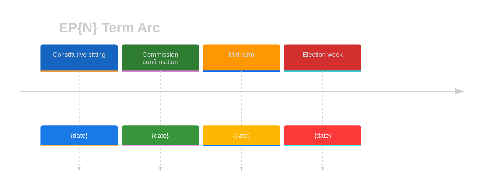

<!-- SPDX-FileCopyrightText: 2024-2026 Hack23 AB -->
<!-- SPDX-License-Identifier: Apache-2.0 -->

# 🗓️ Term Arc Template

**Template Purpose:** EP-term-scoped artifact — term-progress timeline, mandate-delivery scorecard, coalition-trajectory chart. Provides the "where are we in the 5-year arc" view that long-horizon and electoral horizons require.

**Methodology:** [electoral-cycle-methodology.md §3](../methodologies/electoral-cycle-methodology.md) and [electoral-domain-methodology.md](../methodologies/electoral-domain-methodology.md)

**Min Lines:** 280 (`year-in-review`), 320 (`term-outlook`), 360 (`election-cycle`).

**Required by:** `term-outlook`, `election-cycle`, `year-in-review`.

---

## 📋 Header Block

```markdown
# Term Arc — EP{N} ({term-start} → {term-end}) — {Run Date}

**Classification:** PUBLIC
**Term:** EP10 (16 Jul 2024 → ~Jun 2029) — or EP11 (~Jul 2029 → ~Jun 2034)
**Term-progress index:** {months elapsed} / {months total} ({percent} %)
**Months to next EP election:** {N}
**Sister artifacts:** seat-projection.md · mandate-fulfilment-scorecard.md · presidency-trio-context.md · commission-wp-alignment.md
```

---

## 📈 Section 1 — Term-Progress Timeline

Mermaid timeline depicting the term arc with key milestones placed in time:



---

## 🎯 Section 2 — Mandate-Delivery Scorecard (summary)

Per major group, a single-row score with a link to the full [`mandate-fulfilment-scorecard.md`](./mandate-fulfilment-scorecard.md):

```markdown
| Group | Pledges traced | Delivered | Partial | Failed | Score | Trajectory |
|---|---|---|---|---|---|---|
| EPP | N | N | N | N | A–F | ↗ / → / ↘ |
| S&D | N | N | N | N | A–F | ↗ / → / ↘ |
| Renew | N | N | N | N | A–F | ↗ / → / ↘ |
| Greens/EFA | N | N | N | N | A–F | ↗ / → / ↘ |
| ECR | N | N | N | N | A–F | ↗ / → / ↘ |
| ID/PfE | N | N | N | N | A–F | ↗ / → / ↘ |
| The Left | N | N | N | N | A–F | ↗ / → / ↘ |
```

---

## 🤝 Section 3 — Coalition Trajectory Chart

A chronological line chart (rendered as Markdown table or Mermaid `xychart-beta`) showing the rolling cohesion of every plausible majority across the term so far:

```mermaid
%%{init: {"theme":"dark","themeVariables":{"primaryColor":"#1565C0","primaryTextColor":"#ffffff","primaryBorderColor":"#0A3F7F","lineColor":"#90CAF9","secondaryColor":"#2E7D32","secondaryTextColor":"#ffffff","secondaryBorderColor":"#0F3F00","tertiaryColor":"#FF9800","tertiaryTextColor":"#000000","tertiaryBorderColor":"#7F4F00","mainBkg":"#1565C0","secondBkg":"#2E7D32","tertiaryBkg":"#FF9800","noteBkgColor":"#FFC107","noteTextColor":"#000000","noteBorderColor":"#7F6000","errorBkgColor":"#D32F2F","errorTextColor":"#ffffff","fontFamily":"Inter, Helvetica, Arial, sans-serif","pie1":"#1565C0","pie2":"#2E7D32","pie3":"#FF9800","pie4":"#D32F2F","pie5":"#FFC107","pie6":"#7B1FA2","pie7":"#9E9E9E","pie8":"#0288D1","pie9":"#388E3C","pie10":"#F57C00","pie11":"#C62828","pie12":"#FBC02D","pieTitleTextSize":"18px","pieSectionTextSize":"14px","pieLegendTextSize":"13px","pieStrokeColor":"#1e1e1e","pieOuterStrokeColor":"#1e1e1e","git0":"#1565C0","git1":"#2E7D32","git2":"#FF9800","git3":"#D32F2F","gitBranchLabel0":"#ffffff","gitBranchLabel1":"#ffffff","gitBranchLabel2":"#000000","gitBranchLabel3":"#ffffff","cScale0":"#1565C0","cScale1":"#2E7D32","cScale2":"#FF9800","cScale3":"#D32F2F","cScale4":"#FFC107","cScale5":"#7B1FA2","cScale6":"#9E9E9E","cScale7":"#0288D1","xyChart":{"backgroundColor":"#1e1e1e","plotColorPalette":"#1565C0,#2E7D32,#FF9800,#D32F2F,#FFC107,#7B1FA2,#9E9E9E"}}}}%%
xychart-beta
    title "Coalition cohesion — rolling 90-day window"
    x-axis [Q3-2024, Q4-2024, Q1-2025, Q2-2025, Q3-2025, Q4-2025, Q1-2026, Q2-2026]
    y-axis "Cohesion %" 40 --> 100
    line [Grand : 80, 78, 76, 74, 72, 70, 68, 66]
    line [Centre-right : 65, 64, 64, 65, 66, 66, 67, 68]
    line [Climate : 60, 62, 63, 65, 66, 65, 64, 63]
```

---

## 🗳️ Section 4 — Majority Arithmetic Snapshot

Reuses the coalition-mathematics template — name the current arithmetic majority and its stress points:

```markdown
| Coalition | Seats | Threshold | Margin | Stress (1–5) |
|---|---|---|---|---|
| Grand | … | 361 (EP10) | +M | 2 |
| Centre-right | … | 361 | +M | 4 |
| Climate | … | 361 | -M | 5 |
```

---

## 🔁 Section 5 — Mid-Term Pivot Diagnosis

Where in the arc are we? Apply the term-progress index from the header to classify:

| Phase | Months elapsed | What dominates analytical focus |
|---|---|---|
| Honeymoon | 0–6 | Commission confirmation, group formation, agenda-setting |
| Setup | 6–18 | First mandate-delivery wins, Commission Work Programme alignment |
| Mid-term | 18–36 | Coalition stress tests, electoral spillover from member-state polls |
| Pre-election | 36–54 | Spitzenkandidaten arithmetic, treaty-revision feasibility, mandate scorecard |
| Election | 54–60 | Wind-down legislation, EP11 forecast, term retrospective |

---

## 🪞 Section 6 — Continuity & Drift vs Prior Run

Compare against the previous `term-arc.md` (last run of `term-outlook` / `election-cycle` / `year-in-review`). Surface any group whose A–F score moved more than one letter, any coalition whose stress moved ≥ 2 levels.

---

## 📝 Section 7 — Pass-2 Quality Self-Audit

```markdown
- [ ] Term-progress index numerically computed
- [ ] Mermaid timeline includes ≥ 4 milestones already crossed
- [ ] Mandate scorecard summary populated for all major groups
- [ ] Coalition trajectory chart spans ≥ 4 quarters
- [ ] Mid-term phase classified
- [ ] Drift vs prior run documented
```

---

## ⚙️ Section 8 — Methodology Compliance

Cross-link [`electoral-cycle-methodology.md`](../methodologies/electoral-cycle-methodology.md) §1 (term anchors) and [`electoral-domain-methodology.md`](../methodologies/electoral-domain-methodology.md). Note any term-anchor override (e.g. early dissolution).
