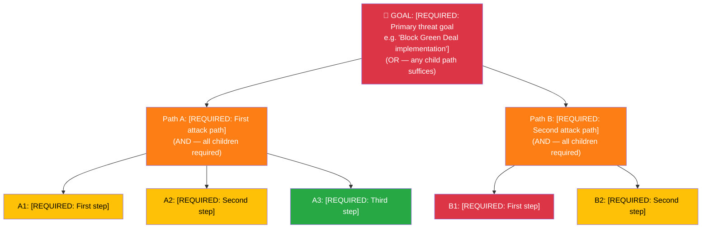

<!-- SPDX-FileCopyrightText: 2024-2026 Hack23 AB -->
<!-- SPDX-License-Identifier: Apache-2.0 -->

# 🎭 Political Threat Landscape Analysis Template — European Parliament

> **📌 Template Instructions:** This template uses the **Political Threat Landscape** as the primary framework — a purpose-built 6-dimension model for EU democratic threats. Layer Diamond Model, Attack Trees, PESTLE, Scenario Planning, and Kill Chain for threats rated MODERATE or above. See [methodologies/political-threat-framework.md](../methodologies/political-threat-framework.md) for full methodology. Copy to `analysis/YYYY-MM-DD/{article-type-slug}/` and name `threat-analysis.md`. The AI agent MUST process ALL downloaded MCP data (in `analysis/YYYY-MM-DD/{article-type-slug}/data/`) to identify threats.

> **🚨 Anti-Pattern Warning:** Generic scripted analysis is REJECTED. Statements like "Coalition stability appears maintained" or "No significant signals detected" indicate the agent has NOT analysed the data. Every threat finding MUST cite specific EP MCP data. The AI must READ actual data, IDENTIFY specific threats, and PRODUCE original analysis with evidence. See [methodologies/ai-driven-analysis-guide.md](../methodologies/ai-driven-analysis-guide.md) for quality requirements.

---

## 📋 Threat Analysis Context

| Field | Value |
|-------|-------|
| **Threat Analysis ID** | `[REQUIRED: THR-YYYY-MM-DD-NNN]` |
| **Analysis Date** | `[REQUIRED: YYYY-MM-DD HH:MM UTC]` |
| **Analysis Period** | `[REQUIRED: e.g. "2026-W13 (2026-03-23 to 2026-03-29)"]` |
| **Produced By** | `[REQUIRED: workflow name]` |
| **Political Context** | `[REQUIRED: 2–3 sentences on current EP political situation based on MCP data]` |
| **Overall Threat Level** | `[REQUIRED: MINIMAL / LOW / MODERATE / HIGH / SEVERE]` |

---

## 🏛️ Political Threat Landscape Assessment (6 Dimensions)

### 🔄 Dimension 1: Coalition Shifts

| Threat ID | Finding | Evidence (EP MCP Data) | Severity (1–5) | Trend |
|-----------|---------|----------------------|:--------------:|:-----:|
| `CS-001` | `[REQUIRED: Specific finding from voting patterns, coalition dynamics data]` | `[REQUIRED: MCP tool + data reference]` | `[#]` | `[↑/→/↓]` |
| `CS-002` | `[OPTIONAL]` | `[EP MCP reference]` | `[#]` | `[↑/→/↓]` |

**Dimension Assessment:** `[MINIMAL / LOW / MODERATE / HIGH / SEVERE]` — `[1-2 sentence summary with confidence level]`

---

### 🔍 Dimension 2: Transparency Deficit

| Threat ID | Finding | Evidence (EP MCP Data) | Severity (1–5) | Trend |
|-----------|---------|----------------------|:--------------:|:-----:|
| `TD-001` | `[REQUIRED: Specific transparency gap identified from committee, declaration, or procedure data]` | `[REQUIRED: MCP tool + data reference]` | `[#]` | `[↑/→/↓]` |
| `TD-002` | `[OPTIONAL]` | `[EP MCP reference]` | `[#]` | `[↑/→/↓]` |

**Dimension Assessment:** `[MINIMAL / LOW / MODERATE / HIGH / SEVERE]` — `[1-2 sentence summary with confidence level]`

---

### ↩️ Dimension 3: Policy Reversal

| Threat ID | Finding | Evidence (EP MCP Data) | Severity (1–5) | Trend |
|-----------|---------|----------------------|:--------------:|:-----:|
| `PR-001` | `[REQUIRED: Specific policy reversal or contradiction identified from voting/procedure data]` | `[REQUIRED: MCP tool + data reference]` | `[#]` | `[↑/→/↓]` |
| `PR-002` | `[OPTIONAL]` | `[EP MCP reference]` | `[#]` | `[↑/→/↓]` |

**Dimension Assessment:** `[MINIMAL / LOW / MODERATE / HIGH / SEVERE]` — `[1-2 sentence summary with confidence level]`

---

### 🏛️ Dimension 4: Institutional Pressure

| Threat ID | Finding | Evidence (EP MCP Data) | Severity (1–5) | Trend |
|-----------|---------|----------------------|:--------------:|:-----:|
| `IP-001` | `[REQUIRED: Specific institutional overreach or power concentration from procedure/committee data]` | `[REQUIRED: MCP tool + data reference]` | `[#]` | `[↑/→/↓]` |
| `IP-002` | `[OPTIONAL]` | `[EP MCP reference]` | `[#]` | `[↑/→/↓]` |

**Dimension Assessment:** `[MINIMAL / LOW / MODERATE / HIGH / SEVERE]` — `[1-2 sentence summary with confidence level]`

---

### ⏳ Dimension 5: Legislative Obstruction

| Threat ID | Finding | Evidence (EP MCP Data) | Severity (1–5) | Trend |
|-----------|---------|----------------------|:--------------:|:-----:|
| `LO-001` | `[REQUIRED: Specific obstruction/delay from legislative pipeline or committee data]` | `[REQUIRED: MCP tool + data reference]` | `[#]` | `[↑/→/↓]` |
| `LO-002` | `[OPTIONAL]` | `[EP MCP reference]` | `[#]` | `[↑/→/↓]` |

**Dimension Assessment:** `[MINIMAL / LOW / MODERATE / HIGH / SEVERE]` — `[1-2 sentence summary with confidence level]`

---

### 📉 Dimension 6: Democratic Erosion

| Threat ID | Finding | Evidence (EP MCP Data) | Severity (1–5) | Trend |
|-----------|---------|----------------------|:--------------:|:-----:|
| `DE-001` | `[REQUIRED: Specific democratic norm concern from attendance, question quality, or Article 7 data]` | `[REQUIRED: MCP tool + data reference]` | `[#]` | `[↑/→/↓]` |
| `DE-002` | `[OPTIONAL]` | `[EP MCP reference]` | `[#]` | `[↑/→/↓]` |

**Dimension Assessment:** `[MINIMAL / LOW / MODERATE / HIGH / SEVERE]` — `[1-2 sentence summary with confidence level]`

---

## 📊 Threat Landscape Summary

| Dimension | Highest Threat | Severity | Assessment | Trend |
|-----------|---------------|:--------:|:----------:|:-----:|
| 🔄 Coalition Shifts | `[threat ID]` | `[#]` | `[level]` | `[↑/→/↓]` |
| 🔍 Transparency Deficit | `[threat ID]` | `[#]` | `[level]` | `[↑/→/↓]` |
| ↩️ Policy Reversal | `[threat ID]` | `[#]` | `[level]` | `[↑/→/↓]` |
| 🏛️ Institutional Pressure | `[threat ID]` | `[#]` | `[level]` | `[↑/→/↓]` |
| ⏳ Legislative Obstruction | `[threat ID]` | `[#]` | `[level]` | `[↑/→/↓]` |
| 📉 Democratic Erosion | `[threat ID]` | `[#]` | `[level]` | `[↑/→/↓]` |

---

## 💎 Diamond Model Analysis (for MODERATE+ threats)

> *Apply Diamond Model when specific adversaries are identified with clear motivation. Skip if all dimensions are LOW or MINIMAL.*

| Element | Actor 1 | Actor 2 |
|---------|---------|---------|
| **Adversary** | `[Political actor with identified motivation]` | `[OPTIONAL]` |
| **Capability** | `[Resources, votes, procedural knowledge]` | `[OPTIONAL]` |
| **Infrastructure** | `[Institutional channels used]` | `[OPTIONAL]` |
| **Victim** | `[Democratic process under threat]` | `[OPTIONAL]` |

---

## 🎯 Threat Actor Mapping

| Actor Type | Specific Actor | Primary Dimension | Intent | Capability | Evidence |
|-----------|---------------|:-----------------:|--------|:----------:|----------|
| Political Group | `[e.g. ECR leadership]` | `[CS/TD/PR/IP/LO/DE]` | `[known/suspected]` | `[H/M/L]` | `[EP MCP ref]` |
| EU Institution | `[e.g. Commission]` | `[CS/TD/PR/IP/LO/DE]` | `[known/suspected]` | `[H/M/L]` | `[EP MCP ref]` |
| External State | `[e.g. Russia]` | `[CS/TD/PR/IP/LO/DE]` | `[known/suspected]` | `[H/M/L]` | `[EP MCP ref]` |
| Lobby/Industry | `[e.g. specific sector]` | `[CS/TD/PR/IP/LO/DE]` | `[known/suspected]` | `[H/M/L]` | `[EP MCP ref]` |

---

## 🛡️ Priority Mitigations

1. **[Threat ID]:** `[Mitigation action — what monitoring or editorial response]`
2. **[Threat ID]:** `[Mitigation action]`
3. **[Threat ID]:** `[Mitigation action]`

---

## 🔮 Forward Indicators

| # | Indicator | Timeline | Trigger Condition | Watch Priority |
|---|-----------|----------|-------------------|:--------------:|
| 1 | `[REQUIRED: specific EP event or metric to monitor]` | `[days/weeks]` | `[what would escalate this threat]` | `🔴/🟠/🟡/🟢` |
| 2 | `[REQUIRED]` | `[timeline]` | `[trigger]` | `🔴/🟠/🟡/🟢` |

**Overall Threat Level:** `[REQUIRED: MINIMAL / LOW / MODERATE / HIGH / SEVERE]`
**Assessment Confidence:** `[REQUIRED: HIGH / MEDIUM / LOW]`

### MCP Data Files Used

```
[REQUIRED: List all analysis/YYYY-MM-DD/{article-type-slug}/data/ files consulted]
```

---

## 🌳 Attack Tree — Primary Threat Decomposition

> **AI Instructions:** Build an attack tree for the single most significant threat identified. The root is the threat goal; decompose using AND/OR gates down to leaf-level actions. Color-code by feasibility.



### Attack Path Assessment

| Path | Steps Required | Feasibility (1–5) | Detectability (1–5) | Political Cost | Most Likely? |
|------|:--------------:|:-----------------:|:-------------------:|:--------------:|:------------:|
| Path A | `[#]` | `[1-5]` | `[1-5]` | `[H/M/L]` | `[Y/N]` |
| Path B | `[#]` | `[1-5]` | `[1-5]` | `[H/M/L]` | `[Y/N]` |

**Cheapest attack path:** `[REQUIRED: Which path has highest feasibility and lowest political cost?]`

**Early warning indicators:** `[REQUIRED: What EP MCP-detectable signals precede each path?]`

---

## ⛓️ Kill Chain Assessment

> **AI Instructions:** Assess how far the primary threat has progressed along the Political Kill Chain. Mark each stage as Not Started / Active / Complete.

| Kill Chain Stage | Status | Evidence | Disruption Opportunity |
|:----------------:|:------:|---------|----------------------|
| 1️⃣ Reconnaissance | `[Not Started / Active / Complete]` | `[EP procedure ref or evidence]` | `[How to stop here]` |
| 2️⃣ Mobilization | `[Not Started / Active / Complete]` | `[EP procedure ref or evidence]` | `[How to stop here]` |
| 3️⃣ Positioning | `[Not Started / Active / Complete]` | `[EP procedure ref or evidence]` | `[How to stop here]` |
| 4️⃣ Execution | `[Not Started / Active / Complete]` | `[EP procedure ref or evidence]` | `[How to stop here]` |
| 5️⃣ Exploitation | `[Not Started / Active / Complete]` | `[EP procedure ref or evidence]` | `[Recovery action]` |

**Current kill chain stage:** `[REQUIRED: 1-5]`
**Next expected stage:** `[REQUIRED: What happens next if unchecked?]`

---

## 💎 Diamond Model — Primary Threat Actor

| Diamond Element | Assessment | Evidence |
|----------------|-----------|---------|
| **Adversary** | `[REQUIRED: Who? Political group + key MEPs + role]` | `[EP MCP data reference]` |
| **Capability** | `[REQUIRED: What parliamentary/political tools do they wield?]` | `[Seat count, committee positions, rapporteurships]` |
| **Infrastructure** | `[REQUIRED: Alliances, media channels, institutional access]` | `[Cross-group alliances, national party support]` |
| **Victim** | `[REQUIRED: Who/what is targeted?]` | `[Legislation, Commissioner, coalition stability]` |

### Threat Actor ICO Profile

| Attribute | Assessment | Confidence |
|-----------|-----------|:----------:|
| **Intent** | `[REQUIRED: What do they want?]` | `[H/M/L]` |
| **Capability** | `[REQUIRED: What can they actually do in EP?]` | `[H/M/L]` |
| **Opportunity** | `[REQUIRED: What upcoming EP events create windows?]` | `[H/M/L]` |
| **Track Record** | `[REQUIRED: Have they acted on similar threats before?]` | `[H/M/L]` |
| **Constraints** | `[REQUIRED: What limits their action?]` | `[H/M/L]` |
| **Overall ICO Level** | `[REQUIRED: HIGH / MEDIUM / LOW]` | `[H/M/L]` |

---

## ⚡ Escalation Decision

| Condition | Escalate? | Action |
|-----------|:---------:|--------|
| Any threat dimension severity ≥ 5 | **YES** | Immediate breaking analysis; all 14-language deployment |
| ≥ 2 threat dimensions severity ≥ 4 | **YES** | Priority analysis; article within 2 hours |
| Overall threat level = SEVERE | **YES** | Editor notification + all-language deployment |
| Overall threat level = HIGH | **MONITOR** | Flag in daily synthesis; include in periodic analysis |
| Overall threat level ≤ MODERATE | **NO** | Include in regular daily/weekly/monthly reporting |
