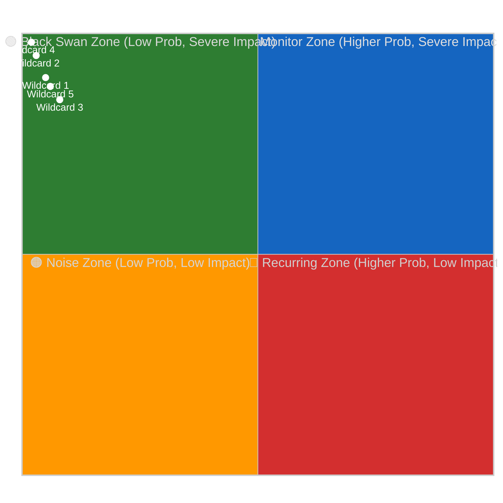
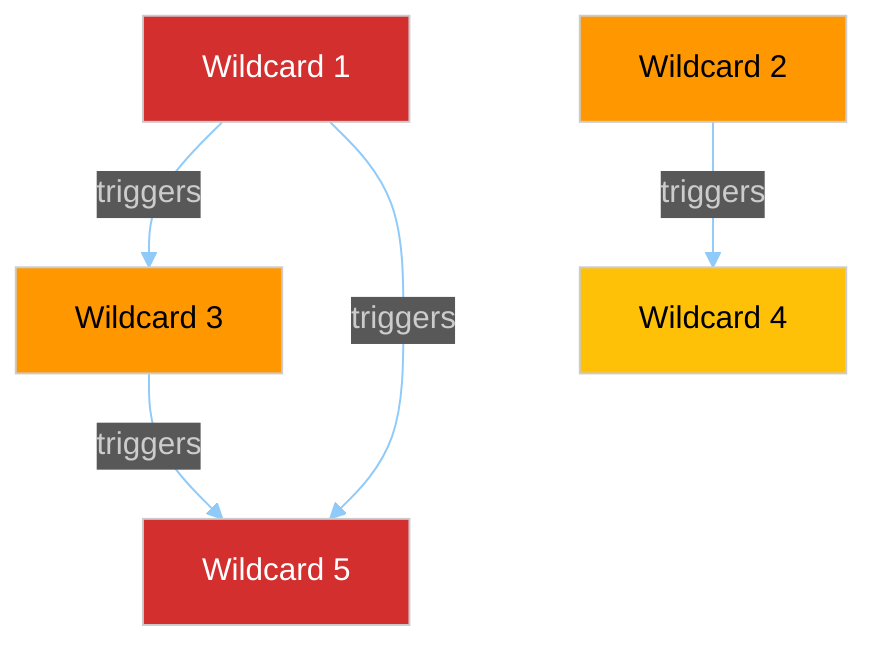

<!-- SPDX-FileCopyrightText: 2024-2026 Hack23 AB -->
<!-- SPDX-License-Identifier: Apache-2.0 -->

# 🦢 Wildcards & Black Swans Template — Low-Probability / High-Impact Events

> **📌 Template Instructions:** Copy to `analysis/daily/{date}/{article-type}-run{N}/intelligence/wildcards-blackswans.md`. Low-probability / high-impact reserve watchlist of events that would invalidate main scenarios if they occurred. See [methodologies/per-artifact-methodologies.md §wildcards-blackswans](../methodologies/per-artifact-methodologies.md#wildcards-blackswans).

> **🎯 Purpose:** Systematically identify tail-risk events that are unlikely but consequential. Provides early-warning signals and cascade analysis for scenario-invalidating shocks.

---

## 📋 Document Metadata

| Field | Value |
|-------|-------|
| **Report ID** | `[REQUIRED: WBS-YYYY-MM-DD-runNN]` |
| **Analysis Period** | `[REQUIRED: YYYY-MM-DD to YYYY-MM-DD]` |
| **Wildcards Identified** | `[REQUIRED: count ≥5]` |
| **Confidence** | `[REQUIRED: 🟢/🟡/🔴]` |

---

## 1️⃣ Wildcard Roster

| # | Wildcard Name | Probability (0-10%) | Impact | Trigger Signals |
|:-:|---------------|:-------------------:|:------:|-----------------|
| 1 | `[REQUIRED: Specific, named wildcard — e.g. "Unexpected ECJ ruling invalidates key Green Deal regulation"]` | `[%]` | `[High / Severe]` | `[REQUIRED: ≥2 signals, e.g. "Case C-XXX/24 oral hearing scheduled", "Advocate General opinion released"]` |
| 2 | `[REQUIRED]` | `[%]` | `[High / Severe]` | `[REQUIRED]` |
| 3 | `[REQUIRED]` | `[%]` | `[High / Severe]` | `[REQUIRED]` |
| 4 | `[REQUIRED]` | `[%]` | `[High / Severe]` | `[REQUIRED]` |
| 5 | `[REQUIRED]` | `[%]` | `[High / Severe]` | `[REQUIRED]` |

**Impact definitions:**
- **High:** Disrupts current legislative session or coalition arithmetic
- **Severe:** Invalidates multiple baseline scenarios or fundamentally alters EP power balance

---

## 2️⃣ Probability × Impact Quadrant Chart

**Note:** Replace `Wildcard N` with actual names and plot probabilities (0-0.1 = 0-10%) on x-axis, impact severity (0.7-1.0) on y-axis. Per [political-style-guide.md §Standard quadrantChart init block](../methodologies/political-style-guide.md), quadrant charts **MUST** use the dedicated quadrant init block above (not the universal init block).

**Black Swan Zone (low prob, severe impact):** `[REQUIRED: list which wildcards fall here]`

---

## 3️⃣ Per-Wildcard Analysis

### Wildcard 1: `[REQUIRED: Name]`

**Probability:** `[REQUIRED: 0-10%]`  
**Impact:** `[REQUIRED: High / Severe]`

**Scenario:**

`[REQUIRED: ≥100 words describing how this wildcard would unfold. What sequence of events? Which EP procedures, coalitions, or institutional functions would be affected? How does this differ from baseline scenarios? Cite named actors, procedure IDs, or institutional mechanisms where relevant.]`

**Trigger signals:**

1. `[REQUIRED: specific, measurable early-warning indicator]`
2. `[REQUIRED]`
3. `[REQUIRED]`

**Why this would invalidate baseline scenarios:**

`[REQUIRED: ≥60 words explaining which baseline assumptions this wildcard breaks and how scenario probabilities would shift if this occurred.]`

---

### Wildcard 2: `[REQUIRED]`

*(Repeat structure for all ≥5 wildcards)*

---

### Wildcard 3: `[REQUIRED]`

---

### Wildcard 4: `[REQUIRED]`

---

### Wildcard 5: `[REQUIRED]`

---

## 4️⃣ Early-Warning Matrix

**What signals would elevate a wildcard to a scenario:**

| Wildcard | Current Signal Strength | Threshold for Elevation | Action if Threshold Crossed |
|----------|:-----------------------:|------------------------|----------------------------|
| `[REQUIRED: wildcard name]` | `[🟢 Absent / 🟡 Weak / 🔴 Present]` | `[REQUIRED: e.g. "≥2 of 3 trigger signals observed within 7 days"]` | `[REQUIRED: e.g. "Promote to Scenario 4 in next run with 15% probability"]` |
| `[REQUIRED]` | `[...]` | `[REQUIRED]` | `[REQUIRED]` |
| `[REQUIRED]` | `[...]` | `[REQUIRED]` | `[REQUIRED]` |

**Monitoring frequency:**

`[REQUIRED: ≥60 words explaining how often these signals should be checked and by whom. Are some wildcards on continuous watch (media monitoring) vs. periodic check (quarterly CJEU docket review)?]`

---

## 5️⃣ Cascade Map — Cross-Wildcard Triggers

**Which wildcard triggering would activate which other wildcards:**

**Cascade table:**

| Primary Wildcard | Secondary Wildcard(s) Triggered | Mechanism |
|------------------|--------------------------------|-----------|
| `[REQUIRED: wildcard name]` | `[REQUIRED: which other wildcard(s) this activates]` | `[REQUIRED: ≥30 words explaining causal link]` |
| `[REQUIRED]` | `[REQUIRED]` | `[REQUIRED]` |
| `[REQUIRED]` | `[REQUIRED]` | `[REQUIRED]` |

**Worst-case cascade:**

`[REQUIRED: ≥80 words identifying the single wildcard whose triggering would activate the most severe chain reaction. What is the domino sequence? What would be the ultimate political outcome?]`

---

## 6️⃣ Institutional Preparedness

**EP contingency mechanisms for wildcard scenarios:**

| Wildcard | Existing EP Tool / Procedure | Adequacy |
|----------|------------------------------|:--------:|
| `[REQUIRED: wildcard name]` | `[REQUIRED: EP Rule of Procedure, treaty provision, or institutional practice that provides response capacity]` | `[🟢 Adequate / 🟡 Partial / 🔴 Insufficient]` |
| `[REQUIRED]` | `[REQUIRED]` | `[...]` |
| `[REQUIRED]` | `[REQUIRED]` | `[...]` |

**Preparedness gaps:**

`[REQUIRED: ≥80 words identifying wildcards for which the EP has no established response protocol. What would need to be improvised? What pre-positioned agreements or fallback procedures would reduce chaos?]`

---

## 7️⃣ Historical Precedents

**Past wildcards that materialized:**

| Event | Date | Probability Estimate (Pre-Event) | Actual Impact | Lessons |
|-------|:----:|:--------------------------------:|:-------------:|---------|
| `[REQUIRED: e.g. "Brexit referendum result"]` | `[YYYY-MM-DD]` | `[%]` | `[REQUIRED: one-line]` | `[REQUIRED: ≥30 words on what this teaches about current wildcards]` |
| `[REQUIRED]` | `[YYYY-MM-DD]` | `[%]` | `[REQUIRED]` | `[REQUIRED]` |

---

## 8️⃣ Data Sources

**EP MCP tools used:** `track_legislation`, `get_procedures`, `get_plenary_sessions`  
**External sources:** `[REQUIRED: list CJEU docket, Council press releases, media monitoring, or other sources consulted for wildcard identification]`

---

## 9️⃣ Confidence Assessment

**Overall confidence:** `[REQUIRED: 🟢 HIGH / 🟡 MEDIUM / 🔴 LOW]`

**Confidence rationale:** `[REQUIRED: ≥60 words explaining where wildcard identification is data-informed vs. speculative. Note: by definition, wildcards are low-confidence on probability but should be high-confidence on plausibility and impact if triggered.]`

---

**Document Control:** `/analysis/daily/{date}/{type}-run{N}/intelligence/wildcards-blackswans.md` · Template v1.1 · Depth floor: 275 lines.
