<!-- SPDX-FileCopyrightText: 2024-2026 Hack23 AB -->
<!-- SPDX-License-Identifier: Apache-2.0 -->

# ⚙️ Workflow Audit Template — Agentic Run Self-Assessment

> **📌 Template Instructions:** Copy to `analysis/daily/{date}/{article-type}-run{N}/intelligence/workflow-audit.md`. The AI agent produces this at the end of the run as a structured self-audit of how the 10-step protocol was executed. See [methodologies/per-artifact-methodologies.md §workflow-audit](../methodologies/per-artifact-methodologies.md#workflow-audit).

> **🎯 Purpose:** Transparent record of workflow execution — which phases ran, which MCP tools were called, which rules of [ai-driven-analysis-guide.md](../methodologies/ai-driven-analysis-guide.md) were satisfied, and where the run fell short. A downstream reviewer (and the next same-type run) can use this to understand the run's internal quality.

---

## 📋 Document Metadata

```yaml
articleType: [REQUIRED]
runId: [REQUIRED]
date: [REQUIRED: YYYY-MM-DD]
analysisPhase: workflow-audit
confidenceLevel: [REQUIRED: HIGH / MEDIUM / LOW]
rulesAudited: [REQUIRED: integer — 11 Core Principles, see §3 below]
complianceRate: [REQUIRED: 0–100]
```


---

## 1️⃣ Workflow Execution Summary

```mermaid
%%{init: {"theme":"dark","themeVariables":{"primaryColor":"#1565C0","primaryTextColor":"#ffffff","primaryBorderColor":"#0A3F7F","lineColor":"#90CAF9","secondaryColor":"#2E7D32","secondaryTextColor":"#ffffff","tertiaryColor":"#FF9800","tertiaryTextColor":"#000000","mainBkg":"#1565C0","secondBkg":"#2E7D32","tertiaryBkg":"#FF9800","noteBkgColor":"#FFC107","noteTextColor":"#000000","errorBkgColor":"#D32F2F","fontFamily":"Inter, Helvetica, Arial, sans-serif"}}}%%
flowchart LR
    P0["Phase 0<br/>Health gate"] --> P1["Phase 1<br/>Data collection"]
    P1 --> P2["Phase 2<br/>Editorial context"]
    P2 --> P3["Phase 3<br/>Analysis"]
    P3 --> P4["Phase 4<br/>Significance gate"]
    P4 --> P5["Phase 5<br/>Validation"]
    P5 --> P6["Phase 6<br/>PR creation"]

    style P0 fill:#1565C0,color:#ffffff
    style P1 fill:#1565C0,color:#ffffff
    style P2 fill:#0288D1,color:#ffffff
    style P3 fill:#7B1FA2,color:#ffffff
    style P4 fill:#FF9800,color:#000000
    style P5 fill:#2E7D32,color:#ffffff
    style P6 fill:#2E7D32,color:#ffffff
```



| Phase | Status | Notes |
|-------|:------:|-------|
| Phase 0 — Health gate | `[✅ / ⚠️ / ❌]` | `[REQUIRED: what gate returned]` |
| Phase 1 — Data collection | `[✅ / ⚠️ / ❌]` | `[REQUIRED: feeds attempted, feeds succeeded]` |
| Phase 2 — Editorial context | `[✅ / ⚠️ / ❌]` | `[REQUIRED]` |
| Phase 3 — Analysis | `[✅ / ⚠️ / ❌]` | `[REQUIRED: artifacts produced]` |
| Phase 4 — Significance gate | `[✅ / ⚠️ / ❌]` | `[REQUIRED: composite score vs. threshold]` |
| Phase 5 — Validation | `[✅ / ⚠️ / ❌]` | `[REQUIRED: validator exit code]` |
| Phase 6 — PR creation | `[✅ / ⚠️ / ❌ / ⏳]` | `[REQUIRED]` |

---

## 2️⃣ MCP Tool Call Log

| # | Tool | Args (truncated) | Result | Records | Latency |
|---|------|------------------|:------:|:-------:|:-------:|
| 1 | `[REQUIRED]` | `[REQUIRED]` | `[✅/⚠️/❌]` | `[#]` | `[ms]` |
| 2 | `[REQUIRED]` | `[REQUIRED]` | `[...]` | `[#]` | `[ms]` |
| 3 | `[REQUIRED]` | `[REQUIRED]` | `[...]` | `[#]` | `[ms]` |

Total MCP calls: `[REQUIRED]` · Successful: `[#]` · Degraded: `[#]` · Failed: `[#]`

---

## 3️⃣ Core Principles Compliance (11-principle protocol)

See [ai-driven-analysis-guide.md §Core Principles](../methodologies/ai-driven-analysis-guide.md#-core-principles-the-11-rules-that-replace-rules-122).

| # | Principle | Status | Evidence in run |
|:-:|-----------|:------:|-----------------|
| 1 | Folder isolation | `[✅/❌]` | `[REQUIRED: run dir path]` |
| 2 | AI does analysis, scripts do HTML | `[✅/❌]` | `[REQUIRED]` |
| 3 | Methodologies before analysis | `[✅/❌]` | `[REQUIRED: METHODOLOGIES_READ log line]` |
| 4 | Multi-framework depth | `[✅/⚠️/❌]` | `[REQUIRED: frameworks applied]` |
| 5 | Always commit analysis | `[✅/❌]` | `[REQUIRED]` |
| 6 | Article type everywhere | `[✅/❌]` | `[REQUIRED]` |
| 7 | Two passes, full time budget | `[✅/⚠️/❌]` | `[REQUIRED: Pass 1 min + Pass 2 min]` |
| 8 | AI-authored headlines + descriptions | `[✅/❌/ N/A]` | `[REQUIRED]` |
| 9 | Complete data + historical baseline | `[✅/⚠️/❌]` | `[REQUIRED]` |
| 10 | Read-before-article + footer + ratio + floors | `[✅/⚠️/❌]` | `[REQUIRED: validator output]` |
| 11 | OSINT / INTOP tradecraft discipline (WEP bands, Admiralty grades, ≥10 SATs in methodology-reflection) | `[✅/⚠️/❌]` | `[REQUIRED: link to methodology-reflection.md §12 SATs applied + Admiralty-graded source list]` |

**Compliance rate**: `[# principles ✅] / 11` = **`[%]`**

---

## 4️⃣ Artifact Production

| Folder | Planned | Produced | Short (< floor) | Notes |
|--------|:-------:|:--------:|:---------------:|-------|
| `intelligence/` | `[#]` | `[#]` | `[#]` | `[REQUIRED]` |
| `classification/` | `[#]` | `[#]` | `[#]` | `[REQUIRED]` |
| `risk-scoring/` | `[#]` | `[#]` | `[#]` | `[REQUIRED]` |
| `threat-assessment/` | `[#]` | `[#]` | `[#]` | `[REQUIRED]` |
| `documents/` | `[#]` | `[#]` | `[#]` | `[REQUIRED]` |

---

## 5️⃣ Time Budget

| Step | Target | Actual | Delta |
|------|:------:|:------:|:-----:|
| Step 2 — Read methodologies | 4–6 min | `[REQUIRED]` | `[± min]` |
| Step 3 — Collect EP data | 5–10 min | `[REQUIRED]` | `[± min]` |
| Steps 4–7 — Analysis Pass 1 | ≥12 min | `[REQUIRED]` | `[± min]` |
| Step 9 — Pass 2 | ≥8 min | `[REQUIRED]` | `[± min]` |
| Step 10 — Validate + commit | 2–5 min | `[REQUIRED]` | `[± min]` |
| **Total run time** | ≥20 min active | `[REQUIRED]` | `[± min]` |

---

## 6️⃣ Issues & Deviations

For every deviation from the standard protocol:

### Issue 1 — `[REQUIRED: short name]`
- **Symptom**: `[REQUIRED]`
- **Root cause**: `[REQUIRED]`
- **Workaround in this run**: `[REQUIRED]`
- **Next-run recommendation**: `[REQUIRED]`

*(repeat per issue; no issues → state "No deviations from protocol observed.")*

---

## 7️⃣ Recommendations for the Next Same-Type Run

1. `[REQUIRED: concrete, actionable — e.g. "raise historical-baseline depth to ≥200 lines by fetching 3 additional prior-run comparables"]`
2. `[REQUIRED]`
3. `[REQUIRED]`

---

**Document Control:** `/analysis/daily/{date}/{type}-run{N}/intelligence/workflow-audit.md` · Template v1.1 · Depth floor: 100 lines.
