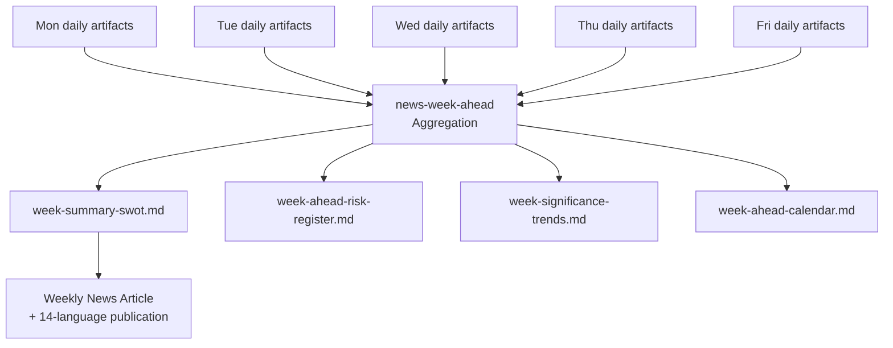

<p align="center">
  
</p>

<h1 align="center">📅 Weekly Analysis Directory — European Parliament</h1>

<p align="center">
  <strong>📊 Per-Week Aggregated Analysis from Daily Agentic Workflow Artifacts</strong><br>
  <em>🎯 YYYY-WNN ISO naming · Week-ahead intelligence · Aggregated risk & SWOT</em>
</p>

<p align="center">
  <a href="#"></a>
  <a href="#"></a>
  <a href="#"></a>
  <a href="#"></a>
</p>

**📋 Document Owner:** CEO | **📄 Version:** 1.0 | **📅 Last Updated:** 2026-03-30 (UTC)
**🏢 Owner:** Hack23 AB (Org.nr 5595347807) | **🏷️ Classification:** Public

---

## 🎯 Purpose

The `analysis/weekly/` directory stores weekly aggregated analysis artifacts. Each week that `news-week-ahead` or `news-weekly-review` runs, a new subdirectory is created using the ISO 8601 week number format `YYYY-WNN`. Weekly artifacts aggregate the week's daily analyses into strategic intelligence for the upcoming EP session week.

---

## 📅 Naming Convention

```
analysis/weekly/
├── YYYY-WNN/           ← ISO 8601 week number (zero-padded)
│   ├── week-summary-swot.md
│   ├── week-ahead-risk-register.md
│   ├── week-significance-trends.md
│   └── week-ahead-calendar.md
```

**Rules:**
- Always use `YYYY-WNN` — zero-pad: `2026-W03` not `2026-W3`
- ISO 8601 weeks start **Monday**, end **Sunday**
- Never use locale-specific week numbering

---

## 📁 Files Created Per Week

| File | Purpose | Source Data |
|------|---------|-------------|
| `week-summary-swot.md` | Aggregated SWOT from the week's daily artifacts | Daily SWOT analyses merged and deduplicated |
| `week-ahead-risk-register.md` | Forward-looking risk register for the coming EP plenary week | Daily risk snapshots + EP plenary calendar |
| `week-significance-trends.md` | Trending EU political topics by significance score | Daily significance scores aggregated |
| `week-ahead-calendar.md` | Key EP events, votes, and committee meetings for the coming week | EP MCP `get_plenary_sessions`, `get_events` |

---

## 🔗 Aggregation Flow



---

## 🗑️ Retention Policy

| Age | Status |
|-----|--------|
| 0–12 weeks | **Active** — all files present |
| 13–26 weeks | **Recent** — monthly aggregation is primary reference |
| 27+ weeks | **Archive** — external archival |

---

**Document Control:**
- **Path:** `/analysis/weekly/README.md`
- **Classification:** Public
- **Next Review:** 2026-06-30
