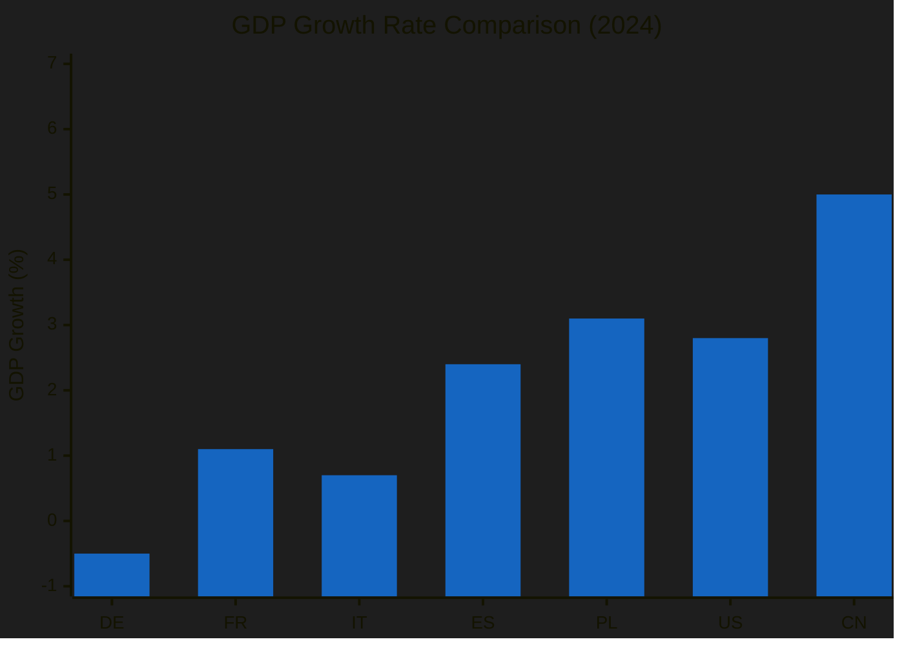
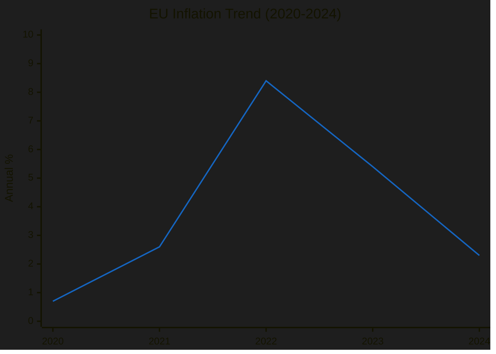
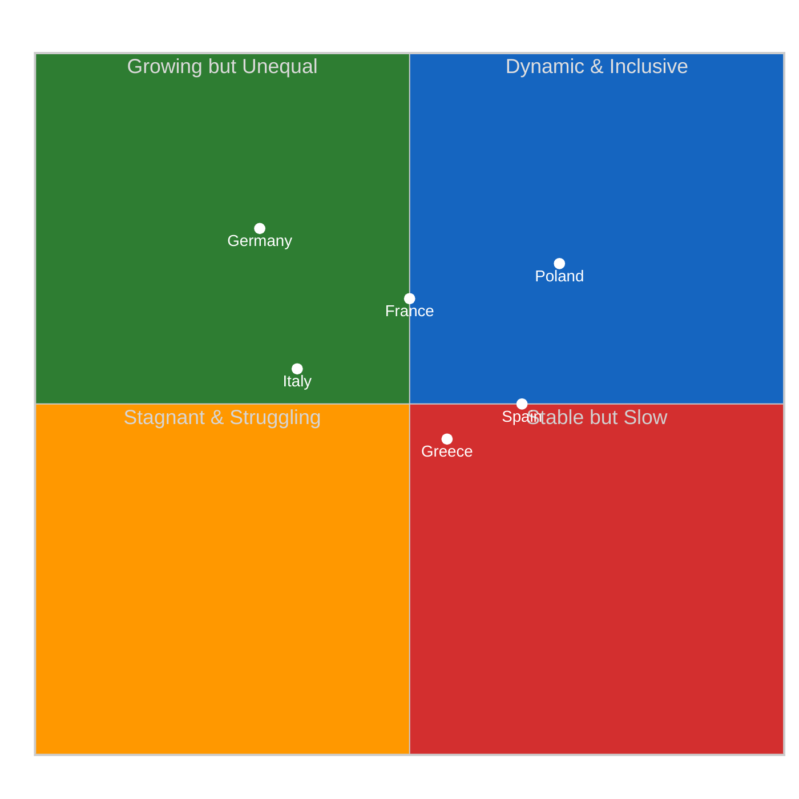
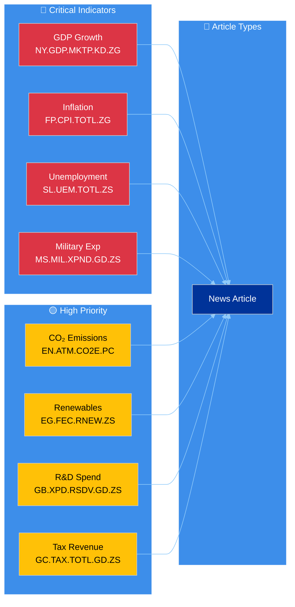
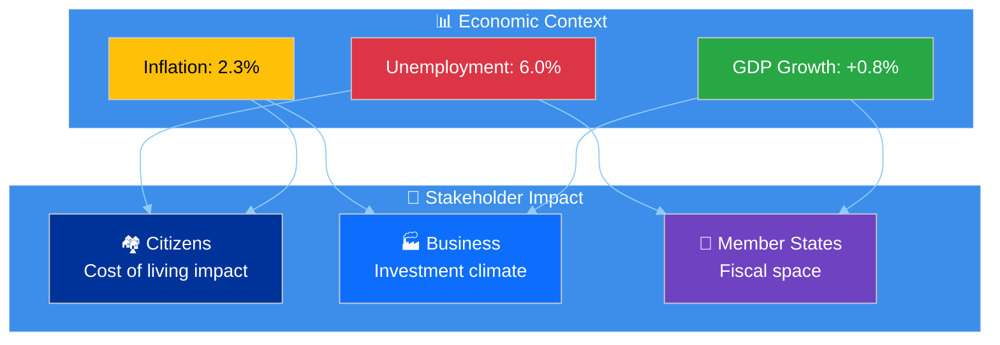
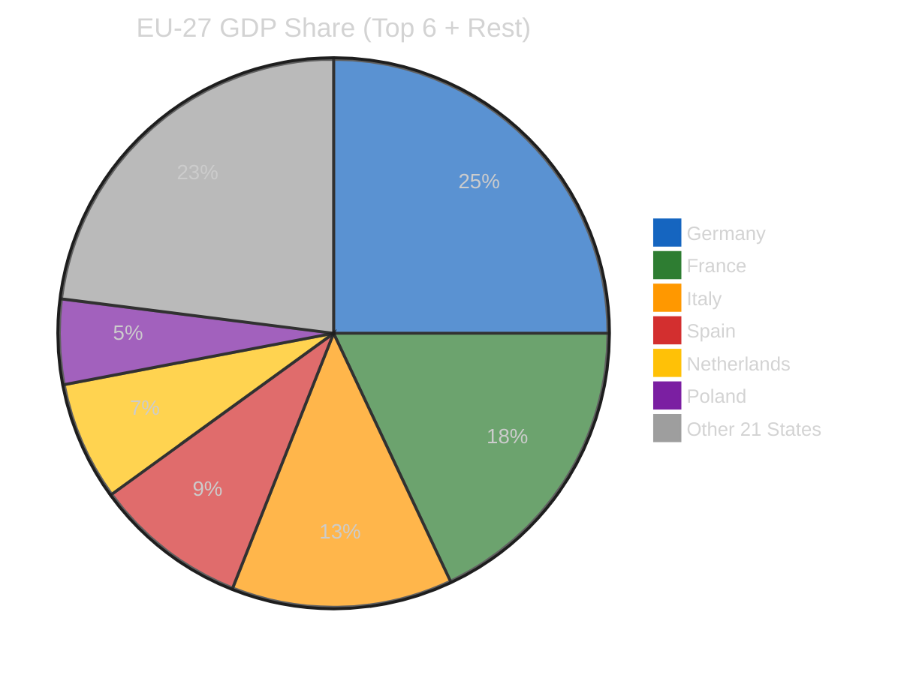
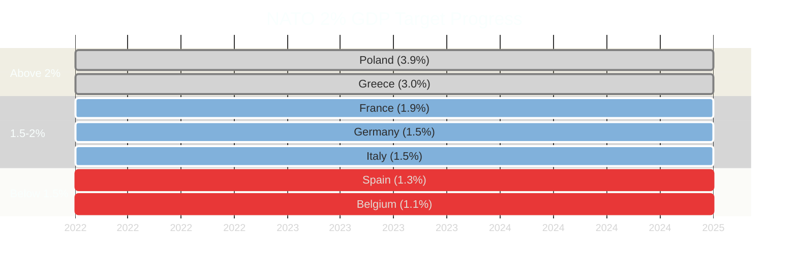

# 📊 Chart Integration Guide — World Bank Data in EU Parliament Articles

> **Purpose**: Technical guide for embedding World Bank indicator data as Chart.js visualizations in generated EU Parliament news articles. D3.js is used for mindmaps, force graphs, and SWOT matrices (see `js/d3-init.js`) but Chart.js is the primary library for World Bank data charts.

**📅 Last Updated:** 2026-04-11 | **🏷️ Classification:** Public

---

## 🏗️ Architecture Overview

```
World Bank MCP Server  ──▶  AI Agent (Copilot)  ──▶  TypeScript Generator  ──▶  HTML Article
 (worldbank-mcp@1.0.1)      (fetches data,           (generateArticleHTML)       (with canvas
                              creates chart configs)    (embeds as data attrs)     elements)
                                                                                     │
                                                                                     ▼
                                                                              Client-side hydration
                                                                              (js/chart-init.js)
                                                                              (js/d3-init.js)
```

### Key Files

| File | Role |
|------|------|
| `js/chart-init.js` | Client-side Chart.js hydration — reads `data-chart-config` attributes |
| `js/d3-init.js` | Client-side D3.js hydration — treemaps, force graphs, SWOT |
| `js/vendor/chart.umd.min.js` | Chart.js library (v4.5.1) |
| `js/vendor/chartjs-plugin-annotation.min.js` | Annotation plugin for reference lines |
| `js/vendor/d3.min.js` | D3.js library (v7.9.0) |
| `src/generators/dashboard-content.ts` | Dashboard section builder with Chart.js configs |
| `src/types/visualization.ts` | Dashboard and chart type definitions |

---

## 📈 Chart.js Integration Pattern

### How It Works

1. **AI agent** fetches World Bank data via MCP tools
2. **AI agent** calls `buildDashboardSection` with chart configuration
3. TypeScript generator embeds chart config as `data-chart-config` JSON attribute on `<canvas>` elements
4. Client-side `js/chart-init.js` reads these attributes and initializes Chart.js instances

### Canvas Element Format

```html
<div class="chart-container">
  <canvas
    data-chart-config='{"type":"bar","data":{"labels":["DE","FR","IT","ES","PL"],"datasets":[{"label":"Military Expenditure (% of GDP)","data":[1.5,1.9,1.5,1.3,3.9]}]},"options":{"plugins":{"title":{"display":true,"text":"EU Defence Spending"},"annotation":{"annotations":{"natoTarget":{"type":"line","yMin":2,"yMax":2,"borderColor":"red","borderWidth":2,"label":{"content":"NATO 2% Target","display":true}}}}}}}'
    width="600"
    height="400"
    role="img"
    aria-label="Bar chart showing EU defence spending by country">
  </canvas>
</div>
```

### EU Parliament Color Palette

The `chart-init.js` applies these colors automatically:

| Index | Color | Hex | Usage |
|-------|-------|-----|-------|
| 0 | EU Blue | `#003399` | Primary data series |
| 1 | EU Gold | `#FFD700` | Secondary/highlight |
| 2 | Red | `#E63946` | Warning/negative |
| 3 | Teal | `#2A9D8F` | Environmental |
| 4 | Purple | `#6A4C93` | Institutional |
| 5 | Coral | `#E76F51` | Alert |
| 6 | Dark Teal | `#264653` | Background |
| 7 | Sandy | `#F4A261` | Neutral |
| 8 | Steel Blue | `#457B9D` | Secondary |
| 9 | Light Teal | `#A8DADC` | Tertiary |

---

## 📊 Chart Templates for World Bank Data

### Template 1: Economic Trend Line Chart

**Use case**: GDP growth, inflation, unemployment trends over time

```json
{
  "type": "line",
  "data": {
    "labels": ["2020", "2021", "2022", "2023", "2024"],
    "datasets": [
      {
        "label": "GDP Growth (%)",
        "data": [-5.6, 5.9, 3.4, 0.5, 0.8]
      },
      {
        "label": "Inflation (%)",
        "data": [0.7, 2.6, 8.4, 5.4, 2.4]
      },
      {
        "label": "Unemployment (%)",
        "data": [7.1, 7.0, 6.2, 6.1, 6.0]
      }
    ]
  },
  "options": {
    "plugins": {
      "title": {
        "display": true,
        "text": "EU Economic Indicators (5-Year Trend)"
      }
    },
    "scales": {
      "y": {
        "title": { "display": true, "text": "Percentage (%)" }
      }
    }
  }
}
```

### Template 2: Defence Spending Bar Chart with NATO Target

**Use case**: Military expenditure comparison with annotation line

```json
{
  "type": "bar",
  "data": {
    "labels": ["Poland", "Greece", "France", "Romania", "Italy", "Germany", "Spain"],
    "datasets": [
      {
        "label": "Military Expenditure (% of GDP)",
        "data": [3.9, 3.1, 1.9, 1.8, 1.5, 1.5, 1.3]
      }
    ]
  },
  "options": {
    "indexAxis": "y",
    "plugins": {
      "title": {
        "display": true,
        "text": "EU Defence Spending vs NATO 2% Target"
      },
      "annotation": {
        "annotations": {
          "natoTarget": {
            "type": "line",
            "xMin": 2,
            "xMax": 2,
            "borderColor": "#E63946",
            "borderWidth": 2,
            "borderDash": [6, 3],
            "label": {
              "content": "NATO 2% Target",
              "display": true,
              "position": "end"
            }
          }
        }
      }
    }
  }
}
```

### Template 3: Tax Revenue Grouped Bar Chart

**Use case**: Fiscal capacity comparison across member states

```json
{
  "type": "bar",
  "data": {
    "labels": ["France", "Denmark", "Belgium", "Italy", "Germany", "Spain", "Poland"],
    "datasets": [
      {
        "label": "Tax Revenue (% of GDP)",
        "data": [24.5, 33.5, 23.1, 23.8, 11.6, 13.7, 16.2]
      },
      {
        "label": "Government Expenditure (% of GDP)",
        "data": [24.1, 25.3, 23.5, 19.4, 21.5, 19.8, 17.5]
      }
    ]
  },
  "options": {
    "plugins": {
      "title": {
        "display": true,
        "text": "EU Fiscal Capacity Comparison"
      }
    }
  }
}
```

### Template 4: Climate Progress Dual-Axis Chart

**Use case**: CO₂ emissions declining while renewable energy rises

```json
{
  "type": "line",
  "data": {
    "labels": ["2018", "2019", "2020", "2021", "2022", "2023"],
    "datasets": [
      {
        "label": "CO₂ Emissions (t per capita)",
        "data": [6.8, 6.4, 5.7, 6.1, 6.0, 5.6],
        "yAxisID": "y"
      },
      {
        "label": "Renewable Energy (% of total)",
        "data": [18.9, 19.7, 22.1, 21.8, 23.0, 24.5],
        "yAxisID": "y1"
      }
    ]
  },
  "options": {
    "plugins": {
      "title": {
        "display": true,
        "text": "EU Climate Progress: Emissions vs Renewables"
      }
    },
    "scales": {
      "y": {
        "position": "left",
        "title": { "display": true, "text": "CO₂ (t/capita)" }
      },
      "y1": {
        "position": "right",
        "title": { "display": true, "text": "Renewable Energy (%)" },
        "grid": { "drawOnChartArea": false }
      }
    }
  }
}
```

### Template 5: Youth vs Total Unemployment

**Use case**: Generational employment gap analysis

```json
{
  "type": "bar",
  "data": {
    "labels": ["Spain", "Greece", "Italy", "France", "EU Average", "Germany", "Netherlands"],
    "datasets": [
      {
        "label": "Youth Unemployment (%)",
        "data": [28.5, 26.1, 22.3, 17.8, 14.5, 6.1, 8.9]
      },
      {
        "label": "Total Unemployment (%)",
        "data": [12.2, 11.1, 7.8, 7.3, 6.0, 3.4, 3.6]
      }
    ]
  },
  "options": {
    "plugins": {
      "title": {
        "display": true,
        "text": "EU Employment Gap: Youth vs Total Unemployment"
      }
    }
  }
}
```

### Template 6: Health System Capacity

**Use case**: Cross-country health infrastructure comparison

```json
{
  "type": "bar",
  "data": {
    "labels": ["Germany", "Austria", "France", "Belgium", "Italy", "Spain", "EU Avg"],
    "datasets": [
      {
        "label": "Hospital Beds (per 1,000)",
        "data": [7.6, 7.1, 5.8, 5.6, 3.1, 3.0, 4.6]
      },
      {
        "label": "Physicians (per 1,000)",
        "data": [4.5, 5.3, 3.2, 3.1, 4.0, 4.4, 3.9]
      }
    ]
  },
  "options": {
    "plugins": {
      "title": {
        "display": true,
        "text": "EU Health Infrastructure Comparison"
      }
    }
  }
}
```

---

## 🔧 Dashboard Section Builder

The TypeScript `buildDashboardSection` function in `dashboard-content.ts` generates dashboard HTML with:

- **Metric cards**: Key numeric indicators with trend arrows
- **Chart panels**: Canvas elements with `data-chart-config` attributes
- **Data tables**: Accessible alternatives to charts (for screen readers)

### Usage in Article Strategy

```typescript
import { buildDashboardSection } from '../dashboard-content.js';

const dashboard = buildDashboardSection({
  title: 'Economic Context Dashboard',
  panels: [
    {
      title: 'EU Economic Indicators',
      type: 'chart',
      chart: {
        type: 'line',
        data: { /* Chart.js data from World Bank */ },
        options: { /* Chart.js options */ }
      }
    }
  ],
  metrics: [
    { label: 'EU GDP Growth', value: '0.8%', trend: 'up', change: 0.3 },
    { label: 'EU Unemployment', value: '6.0%', trend: 'down', change: -0.1 },
    { label: 'EU Inflation', value: '2.4%', trend: 'down', change: -3.0 }
  ]
}, lang);
```

---

## ♿ Accessibility Requirements

All Chart.js visualizations MUST include:

1. **`role="img"`** attribute on canvas elements
2. **`aria-label`** with descriptive text of chart content
3. **Fallback data table** — screen reader-accessible data table alternative
4. **Color contrast** — Minimum 3:1 ratio for chart colors against background
5. **No color-only encoding** — Use patterns or labels alongside colors

---

## 📐 Mermaid Chart Templates for Analysis Documents

Mermaid charts are used in analysis `.md` documents (not HTML articles). They render on GitHub and in documentation viewers. Use these templates for World Bank indicator visualizations in analysis files.

### Mermaid Template 1: Economic Comparison Bar (xychart-beta)



### Mermaid Template 2: Indicator Trend Over Time (xychart-beta)



### Mermaid Template 3: Country Comparison Radar (Quadrant)



### Mermaid Template 4: Policy Domain Indicator Flow



### Mermaid Template 5: Stakeholder Impact with Economic Context

Use this in stakeholder-impact.md analysis files to visualize how WB indicators affect different stakeholders:



### Mermaid Template 6: Comparison Framework Pie



### Mermaid Template 7: Defence Spending Timeline (Gantt)



---

## 🎯 AI Workflow Integration Checklist

### For HTML Articles (Chart.js)
- [ ] Fetch indicator data using World Bank MCP tools (within the workflow's `maxWBCalls` budget)
- [ ] Create Chart.js configuration JSON with **real data values** (never placeholder zeros)
- [ ] Pass chart config to `buildDashboardSection` or embed directly in `<canvas>`
- [ ] Include data attribution: "Source: World Bank Open Data (YYYY)"
- [ ] Add accessible `aria-label` describing the chart
- [ ] Include trend indicators (↑↓→) in metric cards
- [ ] Note data year in chart subtitle or caption

### For Analysis Documents (Mermaid)
- [ ] Use `xychart-beta` for bar/line comparisons in.md files
- [ ] Use `quadrantChart` for positioning analysis
- [ ] Use `pie` for share/composition analysis
- [ ] Use `graph` for flow/relationship diagrams with WB data context
- [ ] Replace placeholder values in Mermaid templates with actual WB data
- [ ] Include data year and source note below chart
- [ ] Ensure Mermaid renders correctly on GitHub (test with preview)
