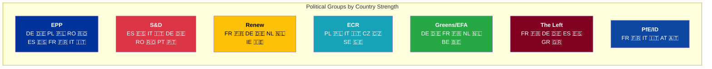
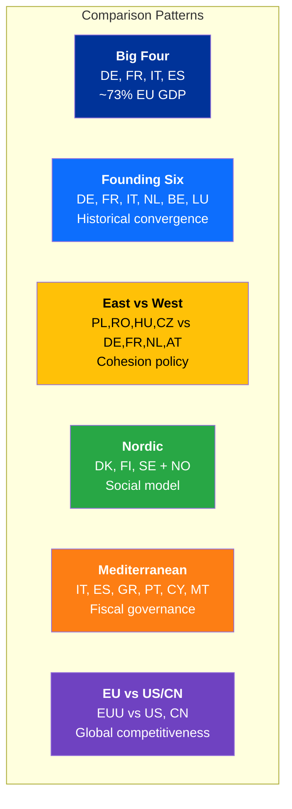

# 🇪🇺 EU-27 → World Bank Country Code Mapping

> **Purpose**: Maps all 27 EU member states plus comparison country groups to World Bank codes, with EP political entity mapping for cross-referencing parliamentary data with economic indicators.

**📅 Last Updated:** 2026-04-12 | **🏷️ Classification:** Public

---

## EU-27 Member States

| # | Country | WB Code | WB Region | Income Level | EP Seats | Capital |
|---|---------|---------|-----------|-------------|----------|---------|
| 1 | 🇦🇹 Austria | `AT` | Europe & Central Asia | High income | 20 | Vienna |
| 2 | 🇧🇪 Belgium | `BE` | Europe & Central Asia | High income | 22 | Brussels |
| 3 | 🇧🇬 Bulgaria | `BG` | Europe & Central Asia | Upper middle income | 17 | Sofia |
| 4 | 🇭🇷 Croatia | `HR` | Europe & Central Asia | High income | 12 | Zagreb |
| 5 | 🇨🇾 Cyprus | `CY` | Europe & Central Asia | High income | 6 | Nicosia |
| 6 | 🇨🇿 Czechia | `CZ` | Europe & Central Asia | High income | 21 | Prague |
| 7 | 🇩🇰 Denmark | `DK` | Europe & Central Asia | High income | 15 | Copenhagen |
| 8 | 🇪🇪 Estonia | `EE` | Europe & Central Asia | High income | 7 | Tallinn |
| 9 | 🇫🇮 Finland | `FI` | Europe & Central Asia | High income | 15 | Helsinki |
| 10 | 🇫🇷 France | `FR` | Europe & Central Asia | High income | 81 | Paris |
| 11 | 🇩🇪 Germany | `DE` | Europe & Central Asia | High income | 96 | Berlin |
| 12 | 🇬🇷 Greece | `GR` | Europe & Central Asia | High income | 21 | Athens |
| 13 | 🇭🇺 Hungary | `HU` | Europe & Central Asia | High income | 21 | Budapest |
| 14 | 🇮🇪 Ireland | `IE` | Europe & Central Asia | High income | 14 | Dublin |
| 15 | 🇮🇹 Italy | `IT` | Europe & Central Asia | High income | 76 | Rome |
| 16 | 🇱🇻 Latvia | `LV` | Europe & Central Asia | High income | 9 | Riga |
| 17 | 🇱🇹 Lithuania | `LT` | Europe & Central Asia | High income | 11 | Vilnius |
| 18 | 🇱🇺 Luxembourg | `LU` | Europe & Central Asia | High income | 6 | Luxembourg |
| 19 | 🇲🇹 Malta | `MT` | Middle East & North Africa | High income | 6 | Valletta |
| 20 | 🇳🇱 Netherlands | `NL` | Europe & Central Asia | High income | 31 | Amsterdam |
| 21 | 🇵🇱 Poland | `PL` | Europe & Central Asia | High income | 53 | Warsaw |
| 22 | 🇵🇹 Portugal | `PT` | Europe & Central Asia | High income | 21 | Lisbon |
| 23 | 🇷🇴 Romania | `RO` | Europe & Central Asia | High income | 33 | Bucharest |
| 24 | 🇸🇰 Slovakia | `SK` | Europe & Central Asia | High income | 15 | Bratislava |
| 25 | 🇸🇮 Slovenia | `SI` | Europe & Central Asia | High income | 9 | Ljubljana |
| 26 | 🇪🇸 Spain | `ES` | Europe & Central Asia | High income | 61 | Madrid |
| 27 | 🇸🇪 Sweden | `SE` | Europe & Central Asia | High income | 21 | Stockholm |

**Total EP seats**: 720

---

## 🌍 Comparison Country Groups

### G7 Non-EU (Global Competitiveness Benchmark)

| Country | WB Code | GDP Rank | Use Case |
|---------|---------|----------|----------|
| 🇺🇸 United States | `US` | 1st | Trade, technology, defence, economic benchmark |
| 🇬🇧 United Kingdom | `GB` | 6th | Post-Brexit comparison; regulatory divergence |
| 🇯🇵 Japan | `JP` | 4th | Aging society, technology, trade partner |
| 🇨🇦 Canada | `CA` | 9th | Trade partner (CETA); regulatory alignment |

### BRICS+ (Geopolitical Counterweights)

| Country | WB Code | GDP Rank | Use Case |
|---------|---------|----------|----------|
| 🇨🇳 China | `CN` | 2nd | Strategic autonomy; supply chains; trade balance |
| 🇮🇳 India | `IN` | 5th | Trade negotiations; climate; development |
| 🇧🇷 Brazil | `BR` | 8th | Mercosur trade; deforestation; agriculture |
| 🇷🇺 Russia | `RU` | 11th | Sanctions impact; energy dependency; security |
| 🇿🇦 South Africa | `ZA` | 33rd | Development; trade; minerals |

### EU Candidate States (Enlargement Monitoring)

| Country | WB Code | Status | Use Case |
|---------|---------|--------|----------|
| 🇺🇦 Ukraine | `UA` | Candidate (2022) | Reconstruction; accession progress; defence |
| 🇹🇷 Türkiye | `TR` | Candidate (1999) | Migration; customs union; geopolitics |
| 🇷🇸 Serbia | `RS` | Candidate (2012) | Western Balkans; rule of law |
| 🇲🇪 Montenegro | `ME` | Candidate (2010) | Frontrunner accession |
| 🇦🇱 Albania | `AL` | Candidate (2014) | Western Balkans stability |
| 🇲🇰 North Macedonia | `MK` | Candidate (2005) | Bilateral issues; rule of law |
| 🇲🇩 Moldova | `MD` | Candidate (2022) | Eastern Partnership; security |
| 🇧🇦 Bosnia & Herzegovina | `BA` | Candidate (2022) | State-building; EU accession path |
| 🇬🇪 Georgia | `GE` | Candidate (2023) | Democracy; Eastern Partnership |

### Key Trade Partners & Neighbours

| Country | WB Code | Relationship | Use Case |
|---------|---------|-------------|----------|
| 🇰🇷 South Korea | `KR` | FTA partner | Trade; technology; IP |
| 🇦🇺 Australia | `AU` | FTA negotiations | Trade; minerals; climate |
| 🇳🇴 Norway | `NO` | EEA member | Single market; energy; fisheries |
| 🇨🇭 Switzerland | `CH` | Bilateral agreements | Financial services; research; Schengen |
| 🇮🇱 Israel | `IL` | Association agreement | Trade; technology; geopolitics |

---

## 📊 Aggregate & Regional Codes

| Code | Description | Use Case |
|------|-------------|----------|
| `EUU` | European Union aggregate | EU-wide indicators (GDP, inflation, unemployment) |
| `EMU` | Euro area | Eurozone-specific monetary indicators |
| `OED` | OECD members | High-income country benchmark |
| `WLD` | World | Global average benchmark |
| `ECS` | Europe & Central Asia (WB region) | Broader European comparison |
| `NAC` | North America | US/Canada transatlantic comparison |
| `EAS` | East Asia & Pacific | Asia-Pacific trade benchmark |
| `SSF` | Sub-Saharan Africa | Development cooperation context |

---

## 🏛️ EP Political Group → Country Presence

| Political Group | Strongest Countries (by seats) | Key Economic Indicators |
|----------------|-------------------------------|------------------------|
| **EPP** | DE, PL, RO, ES, FR, IT | GDP, Unemployment, Trade |
| **S&D** | ES, IT, DE, RO, PT | Unemployment, GINI, Health Expenditure |
| **Renew** | FR, DE, NL, IE | GDP Growth, FDI, R&D Expenditure |
| **ECR** | PL, IT, CZ, SE | Military Expenditure, Trade, GDP Growth |
| **Greens/EFA** | DE, FR, NL, BE | CO₂ Emissions, Renewable Energy, Forest Area |
| **The Left** | FR, DE, ES, GR | Unemployment, GINI, Health Expenditure |
| **PfE/ID** | FR, IT, AT | Military Expenditure, Net Migration, GDP |

---

## 🗺️ Economic Clusters for Analysis

### High GDP (>$1T GDP)
Germany (DE), France (FR), Italy (IT), Spain (ES), Netherlands (NL), Poland (PL)

**Best indicators**: GDP Growth, Trade, FDI, R&D Expenditure, Military Expenditure

### Convergence States (GDP per capita < EU average)
Bulgaria (BG), Romania (RO), Croatia (HR), Poland (PL), Hungary (HU), Latvia (LV), Lithuania (LT), Slovakia (SK), Greece (GR)

**Best indicators**: GDP per Capita, GDP Growth, Unemployment, Youth Unemployment, FDI

### Nordic/High-Income
Denmark (DK), Finland (FI), Sweden (SE), Luxembourg (LU), Ireland (IE), Netherlands (NL), Austria (AT)

**Best indicators**: R&D Expenditure, Renewable Energy, Education Expenditure, Internet Users

### Eurozone Core
Germany (DE), France (FR), Italy (IT), Spain (ES), Netherlands (NL), Belgium (BE), Austria (AT)

**Best indicators**: Inflation, GDP Growth, Unemployment, Government Expenditure, Tax Revenue

---

## 📊 Recommended Country Comparisons

| Comparison | Countries | Use For |
|-----------|-----------|---------|
| **Big Four** | DE, FR, IT, ES | Macro-economic articles; fiscal governance |
| **Founding Six** | DE, FR, IT, NL, BE, LU | Historical convergence; integration depth |
| **East vs West** | PL/RO/HU/CZ vs DE/FR/NL/AT | Cohesion policy; convergence debates |
| **Nordic** | DK, FI, SE + NO | Social policy; renewable energy; digital |
| **Mediterranean** | IT, ES, GR, PT, CY, MT | Tourism; agriculture; fiscal; youth jobs |
| **EU vs G7** | EUU vs US, GB, JP, CA | Global competitiveness; technology |
| **EU vs BRICS** | EUU vs CN, IN, BR, RU | Geopolitics; strategic autonomy |
| **EU vs Candidates** | EUU vs UA, TR, RS | Enlargement readiness; convergence |

---

## ⚠️ Data Notes

1. **Malta**: WB region is "Middle East & North Africa" (geographic, not political)
2. **EU aggregate (EUU)**: Not all indicators available at EU level
3. **Data lag**: Most indicators 1-2 years behind current date
4. **Comparison countries**: All work with WB MCP tools using ISO2 codes
5. **Russia (RU)**: Some indicators may have reduced availability post-2022
6. **Candidate states**: Some indicators (GINI, health) have gaps
7. **Annual data only**: All WB indicators are annual time series
