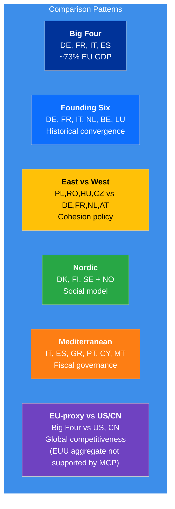

# 🇪🇺 EU-27 → World Bank Country Code Mapping

> **Purpose**: Maps all 27 EU member states plus comparison country groups to World Bank codes, with EP political entity mapping for cross-referencing parliamentary data with economic indicators.

**📅 Last Updated:** 2026-04-22 | **🏷️ Classification:** Public

---

## ⚡ Policy: WB = non-economic only · IMF = economic

Since Wave 2 (April 2026), **all economic context (GDP, inflation,
unemployment, FDI, trade, fiscal balance, debt, monetary) is sourced from
IMF** via `src/mcp/imf-mcp-client.ts` — see
[`analysis/imf/eu-country-mapping.md`](../imf/eu-country-mapping.md) and
[`analysis/imf/indicator-catalog.md`](../imf/indicator-catalog.md). World
Bank is retained for **health, education, social, environment,
demographics, defence, agriculture, innovation, and governance**
indicators only. This document enumerates the WB country codes that the
`worldbank-mcp@1.0.1` server actually accepts for those non-economic
domains.

---

## EU-27 Member States

> **⚠️ Country Code Note**: The `worldbank-mcp` tool's `countryCode` parameter
> accepts **both** ISO 3166-1 alpha-2 codes (e.g., `DE`) and World Bank
> alpha-3 codes (e.g., `DEU`) — **for individual countries only**. Aggregate
> codes (`EUU`, `EMU`, `ECS`, `OED`, `WLD`, …) are **rejected** by the MCP
> server with `Error: Country not found` — see § "Aggregate & Regional
> Codes" below. Use IMF `EU`/`EA`/`G7`/`G20` aggregates for any EU-level
> context. The TypeScript utility `EU_COUNTRY_CODES` in
> `src/utils/world-bank-data.ts` maps ISO2 → WB alpha-3 for internal use,
> and `isMCPSupportedWBCountryCode()` (same module) guards against the
> aggregate-code trap.

| # | Country | ISO2 | WB Alpha-3 | WB Region | Income Level | EP Seats | Capital |
|---|---------|------|-----------|-----------|-------------|----------|---------|
| 1 | 🇦🇹 Austria | `AT` | `AUT` | Europe & Central Asia | High income | 20 | Vienna |
| 2 | 🇧🇪 Belgium | `BE` | `BEL` | Europe & Central Asia | High income | 22 | Brussels |
| 3 | 🇧🇬 Bulgaria | `BG` | `BGR` | Europe & Central Asia | Upper middle income | 17 | Sofia |
| 4 | 🇭🇷 Croatia | `HR` | `HRV` | Europe & Central Asia | High income | 12 | Zagreb |
| 5 | 🇨🇾 Cyprus | `CY` | `CYP` | Europe & Central Asia | High income | 6 | Nicosia |
| 6 | 🇨🇿 Czechia | `CZ` | `CZE` | Europe & Central Asia | High income | 21 | Prague |
| 7 | 🇩🇰 Denmark | `DK` | `DNK` | Europe & Central Asia | High income | 15 | Copenhagen |
| 8 | 🇪🇪 Estonia | `EE` | `EST` | Europe & Central Asia | High income | 7 | Tallinn |
| 9 | 🇫🇮 Finland | `FI` | `FIN` | Europe & Central Asia | High income | 15 | Helsinki |
| 10 | 🇫🇷 France | `FR` | `FRA` | Europe & Central Asia | High income | 81 | Paris |
| 11 | 🇩🇪 Germany | `DE` | `DEU` | Europe & Central Asia | High income | 96 | Berlin |
| 12 | 🇬🇷 Greece | `GR` | `GRC` | Europe & Central Asia | High income | 21 | Athens |
| 13 | 🇭🇺 Hungary | `HU` | `HUN` | Europe & Central Asia | High income | 21 | Budapest |
| 14 | 🇮🇪 Ireland | `IE` | `IRL` | Europe & Central Asia | High income | 14 | Dublin |
| 15 | 🇮🇹 Italy | `IT` | `ITA` | Europe & Central Asia | High income | 76 | Rome |
| 16 | 🇱🇻 Latvia | `LV` | `LVA` | Europe & Central Asia | High income | 9 | Riga |
| 17 | 🇱🇹 Lithuania | `LT` | `LTU` | Europe & Central Asia | High income | 11 | Vilnius |
| 18 | 🇱🇺 Luxembourg | `LU` | `LUX` | Europe & Central Asia | High income | 6 | Luxembourg |
| 19 | 🇲🇹 Malta | `MT` | `MLT` | Middle East, North Africa, Afghanistan & Pakistan | High income | 6 | Valletta |
| 20 | 🇳🇱 Netherlands | `NL` | `NLD` | Europe & Central Asia | High income | 31 | Amsterdam |
| 21 | 🇵🇱 Poland | `PL` | `POL` | Europe & Central Asia | High income | 53 | Warsaw |
| 22 | 🇵🇹 Portugal | `PT` | `PRT` | Europe & Central Asia | High income | 21 | Lisbon |
| 23 | 🇷🇴 Romania | `RO` | `ROU` | Europe & Central Asia | High income | 33 | Bucharest |
| 24 | 🇸🇰 Slovakia | `SK` | `SVK` | Europe & Central Asia | High income | 15 | Bratislava |
| 25 | 🇸🇮 Slovenia | `SI` | `SVN` | Europe & Central Asia | High income | 9 | Ljubljana |
| 26 | 🇪🇸 Spain | `ES` | `ESP` | Europe & Central Asia | High income | 61 | Madrid |
| 27 | 🇸🇪 Sweden | `SE` | `SWE` | Europe & Central Asia | High income | 21 | Stockholm |

**Total EP seats**: 720

---

## 🌍 Comparison Country Groups

### G7 Non-EU (Global Competitiveness Benchmark)

| Country | ISO2 | WB Alpha-3 | GDP Rank | Use Case |
|---------|------|-----------|----------|----------|
| 🇺🇸 United States | `US` | `USA` | 1st | Trade, technology, defence, economic benchmark |
| 🇬🇧 United Kingdom | `GB` | `GBR` | 6th | Post-Brexit comparison; regulatory divergence |
| 🇯🇵 Japan | `JP` | `JPN` | 4th | Aging society, technology, trade partner |
| 🇨🇦 Canada | `CA` | `CAN` | 9th | Trade partner (CETA); regulatory alignment |

### BRICS+ (Geopolitical Counterweights)

| Country | ISO2 | WB Alpha-3 | GDP Rank | Use Case |
|---------|------|-----------|----------|----------|
| 🇨🇳 China | `CN` | `CHN` | 2nd | Strategic autonomy; supply chains; trade balance |
| 🇮🇳 India | `IN` | `IND` | 5th | Trade negotiations; climate; development |
| 🇧🇷 Brazil | `BR` | `BRA` | 8th | Mercosur trade; deforestation; agriculture |
| 🇷🇺 Russia | `RU` | `RUS` | 11th | Sanctions impact; energy dependency; security |
| 🇿🇦 South Africa | `ZA` | `ZAF` | 33rd | Development; trade; minerals |

### EU Candidate States (Enlargement Monitoring)

| Country | ISO2 | WB Alpha-3 | Status | Use Case |
|---------|------|-----------|--------|----------|
| 🇺🇦 Ukraine | `UA` | `UKR` | Candidate (2022) | Reconstruction; accession progress; defence |
| 🇹🇷 Türkiye | `TR` | `TUR` | Candidate (1999) | Migration; customs union; geopolitics |
| 🇷🇸 Serbia | `RS` | `SRB` | Candidate (2012) | Western Balkans; rule of law |
| 🇲🇪 Montenegro | `ME` | `MNE` | Candidate (2010) | Frontrunner accession |
| 🇦🇱 Albania | `AL` | `ALB` | Candidate (2014) | Western Balkans stability |
| 🇲🇰 North Macedonia | `MK` | `MKD` | Candidate (2005) | Bilateral issues; rule of law |
| 🇲🇩 Moldova | `MD` | `MDA` | Candidate (2022) | Eastern Partnership; security |
| 🇧🇦 Bosnia & Herzegovina | `BA` | `BIH` | Candidate (2022) | State-building; EU accession path |
| 🇬🇪 Georgia | `GE` | `GEO` | Candidate (2023) | Democracy; Eastern Partnership |
| 🇽🇰 Kosovo | `XK` | `XKX` | Potential candidate | Western Balkans; statehood recognition. **Note**: IMF uses `UVK` for Kosovo on some legacy datasets — see [`../imf/eu-country-mapping.md §4`](../imf/eu-country-mapping.md#4-codelist-drift-vs-world-bank). |

### Key Trade Partners & Neighbours

| Country | ISO2 | WB Alpha-3 | Relationship | Use Case |
|---------|------|-----------|-------------|----------|
| 🇰🇷 South Korea | `KR` | `KOR` | FTA partner | Trade; technology; IP |
| 🇦🇺 Australia | `AU` | `AUS` | FTA negotiations | Trade; minerals; climate |
| 🇳🇴 Norway | `NO` | `NOR` | EEA member | Single market; energy; fisheries |
| 🇨🇭 Switzerland | `CH` | `CHE` | Bilateral agreements | Financial services; research; Schengen |
| 🇮🇱 Israel | `IL` | `ISR` | Association agreement | Trade; technology; geopolitics |

---

## 📊 Aggregate & Regional Codes

> ### ⛔ Not supported by `worldbank-mcp@1.0.1`
>
> The following aggregate codes are **rejected** by the `worldbank-mcp`
> server's `get-country-info`, `get-economic-data`, `get-social-data`,
> `get-health-data`, and `get-education-data` tools with the error
> `Country not found`. They are valid against the raw World Bank REST
> API (`https://api.worldbank.org/v2/country/{code}/indicator/...`) only.
>
> | Raw-REST code | Intended meaning | MCP status | Use instead |
> |---|---|---|---|
> | `EUU` | European Union aggregate | ❌ rejected | IMF `EU` via `imf-fetch-data` (WEO) |
> | `EMU` | Euro area | ❌ rejected | IMF `EA` via `imf-fetch-data` |
> | `OED` | OECD members | ❌ rejected | IMF G7/G20 aggregate or manual country list |
> | `WLD` | World | ❌ rejected | IMF global aggregate or individual comparators |
> | `ECS` | Europe & Central Asia (WB region) | ❌ rejected | Explicit country list (Big Four + convergence proxy) |
> | `NAC` | North America | ❌ rejected | Individual `US` + `CA` calls |
> | `EAS` | East Asia & Pacific | ❌ rejected | Individual `CN` + `JP` + `KR` calls |
> | `SSF` | Sub-Saharan Africa | ❌ rejected | Individual country calls |
>
> **For AI agents / agentic workflows:** do **NOT** pass these codes to
> any `worldbank-mcp` tool — the call fails silently through the
> fallback envelope and returns empty data. For EU-level economic
> context, use the IMF client and aggregates documented in
> [`analysis/imf/eu-country-mapping.md § 2`](../imf/eu-country-mapping.md#2-eu-and-euro-area-aggregates). For non-economic EU-level
> context (health, education, environment, demographics), build a
> weighted average from the Big Four + Convergence proxy country list
> instead — see § "Recommended Country Comparisons" below.
>
> The TypeScript constants `WB_AGGREGATE_LABELS` and `EU_AGGREGATE_CODE`
> in `src/utils/world-bank-data.ts` are retained for back-compatibility
> with raw-REST call paths (e.g., `committee-indicator-map.ts`) but are
> **not safe** to pass to the MCP client. Call
> `isMCPSupportedWBCountryCode(code)` before any MCP invocation.

---

## 🏛️ EP Political Group → Country Presence

```mermaid
%%{init: {"theme":"dark","themeVariables":{"primaryColor":"#1565C0","primaryTextColor":"#ffffff","primaryBorderColor":"#0A3F7F","lineColor":"#90CAF9","secondaryColor":"#2E7D32","secondaryTextColor":"#ffffff","secondaryBorderColor":"#0F3F00","tertiaryColor":"#FF9800","tertiaryTextColor":"#000000","tertiaryBorderColor":"#7F4F00","mainBkg":"#1565C0","secondBkg":"#2E7D32","tertiaryBkg":"#FF9800","noteBkgColor":"#FFC107","noteTextColor":"#000000","noteBorderColor":"#7F6000","errorBkgColor":"#D32F2F","errorTextColor":"#ffffff","fontFamily":"Inter, Helvetica, Arial, sans-serif","pie1":"#1565C0","pie2":"#2E7D32","pie3":"#FF9800","pie4":"#D32F2F","pie5":"#FFC107","pie6":"#7B1FA2","pie7":"#9E9E9E","pie8":"#0288D1","pie9":"#388E3C","pie10":"#F57C00","pie11":"#C62828","pie12":"#FBC02D","pieTitleTextSize":"18px","pieSectionTextSize":"14px","pieLegendTextSize":"13px","pieStrokeColor":"#1e1e1e","pieOuterStrokeColor":"#1e1e1e","git0":"#1565C0","git1":"#2E7D32","git2":"#FF9800","git3":"#D32F2F","gitBranchLabel0":"#ffffff","gitBranchLabel1":"#ffffff","gitBranchLabel2":"#000000","gitBranchLabel3":"#ffffff","cScale0":"#1565C0","cScale1":"#2E7D32","cScale2":"#FF9800","cScale3":"#D32F2F","cScale4":"#FFC107","cScale5":"#7B1FA2","cScale6":"#9E9E9E","cScale7":"#0288D1","xyChart":{"backgroundColor":"#1e1e1e","plotColorPalette":"#1565C0,#2E7D32,#FF9800,#D32F2F,#FFC107,#7B1FA2,#9E9E9E"}}}}%%
graph LR
    subgraph "Political Groups by Country Strength"
        EPP["<b>EPP</b><br/>DE 🇩🇪 PL 🇵🇱 RO 🇷🇴<br/>ES 🇪🇸 FR 🇫🇷 IT 🇮🇹"]
        SD["<b>S&D</b><br/>ES 🇪🇸 IT 🇮🇹 DE 🇩🇪<br/>RO 🇷🇴 PT 🇵🇹"]
        REN["<b>Renew</b><br/>FR 🇫🇷 DE 🇩🇪 NL 🇳🇱<br/>IE 🇮🇪"]
        ECR["<b>ECR</b><br/>PL 🇵🇱 IT 🇮🇹 CZ 🇨🇿<br/>SE 🇸🇪"]
        GREEN["<b>Greens/EFA</b><br/>DE 🇩🇪 FR 🇫🇷 NL 🇳🇱<br/>BE 🇧🇪"]
        LEFT["<b>The Left</b><br/>FR 🇫🇷 DE 🇩🇪 ES 🇪🇸<br/>GR 🇬🇷"]
        PFE["<b>PfE/ID</b><br/>FR 🇫🇷 IT 🇮🇹 AT 🇦🇹"]
    end

    style EPP fill:#003399,color:#fff
    style SD fill:#dc3545,color:#fff
    style REN fill:#ffc107,color:#000
    style ECR fill:#17a2b8,color:#fff
    style GREEN fill:#28a745,color:#fff
    style LEFT fill:#800020,color:#fff
    style PFE fill:#0d47a1,color:#fff
```

| Political Group | Strongest Countries (by seats) | Key Economic Indicators |
|----------------|-------------------------------|------------------------|
| **EPP** | DE, PL, RO, ES, FR, IT | GDP, Unemployment, Trade |
| **S&D** | ES, IT, DE, RO, PT | Unemployment, GINI, Health Expenditure |
| **Renew** | FR, DE, NL, IE | GDP Growth, FDI, R&D Expenditure |
| **ECR** | PL, IT, CZ, SE | Military Expenditure, Trade, GDP Growth |
| **Greens/EFA** | DE, FR, NL, BE | CO₂ Emissions, Renewable Energy, Forest Area |
| **The Left** | FR, DE, ES, GR | Unemployment, GINI, Health Expenditure |
| **PfE/ID** | FR, IT, AT | Military Expenditure, Net Migration, GDP |

---

## 🗺️ Economic Clusters for Analysis

### High GDP (>$1T GDP)
Germany (DE), France (FR), Italy (IT), Spain (ES), Netherlands (NL), Poland (PL)

**Best indicators**: GDP Growth, Trade, FDI, R&D Expenditure, Military Expenditure

### Convergence States (GDP per capita < EU average)
Bulgaria (BG), Romania (RO), Croatia (HR), Hungary (HU), Latvia (LV), Lithuania (LT), Slovakia (SK), Greece (GR)

**Note**: Poland (PL), Czechia (CZ), and Slovakia (SK) are all now WB-classified as **High income**; Poland in particular is no longer below EU-average GDP per capita and has moved out of the convergence cluster. Keep SK and CZ here when the policy framing is cohesion-fund eligibility rather than income level.

**Best indicators** (non-economic only per Wave-2 policy): Youth Unemployment (`SL.UEM.1524.ZS` via WB — labour/social, not macro-economic), Health Expenditure, Education Expenditure, Internet Users. For GDP per capita / GDP growth use IMF `NGDPDPC` / `NGDP_RPCH`.

### Nordic/High-Income
Denmark (DK), Finland (FI), Sweden (SE), Luxembourg (LU), Ireland (IE), Netherlands (NL), Austria (AT)

**Best indicators**: R&D Expenditure, Renewable Energy, Education Expenditure, Internet Users

### Eurozone Core
Germany (DE), France (FR), Italy (IT), Spain (ES), Netherlands (NL), Belgium (BE), Austria (AT)

**Best indicators**: Inflation, GDP Growth, Unemployment, Government Expenditure, Tax Revenue

---

## 📊 Recommended Country Comparisons

| Comparison | Countries | Use For |
|-----------|-----------|---------|
| **Big Four** | DE, FR, IT, ES | Macro-economic articles (→ IMF); fiscal governance |
| **Founding Six** | DE, FR, IT, NL, BE, LU | Historical convergence; integration depth |
| **East vs West** | PL/RO/HU/CZ vs DE/FR/NL/AT | Cohesion policy; convergence debates |
| **Nordic** | DK, FI, SE + NO | Social policy; renewable energy; digital |
| **Mediterranean** | IT, ES, GR, PT, CY, MT | Tourism; agriculture; fiscal; youth jobs |
| **EU-proxy vs G7** | DE + FR + IT + ES vs US, GB, JP, CA | Global competitiveness; technology. **Note**: WB MCP rejects the `EUU` aggregate — use the Big Four as an EU-GDP proxy, or query IMF `EU` aggregate for true EU-wide economic context. |
| **EU-proxy vs BRICS** | DE + FR + IT + ES vs CN, IN, BR, RU | Geopolitics; strategic autonomy. See note above re: `EUU`. |
| **EU vs Candidates** | Big Four vs UA, TR, RS (individual) | Enlargement readiness; convergence. Aggregate `EUU` not supported by MCP. |

---

## ⚠️ Data Notes

1. **Malta**: WB region is "Middle East, North Africa, Afghanistan & Pakistan" (geographic, not political)
2. **EU aggregate (EUU, EMU, ECS, OED, WLD, NAC, EAS, SSF)**: **Rejected by `worldbank-mcp@1.0.1`** — see § "Aggregate & Regional Codes" above. Use IMF client for EU-level economic context; build explicit country lists for EU-level non-economic context.
3. **Data lag**: Most WB indicators 1-2 years behind current date; IMF WEO refreshes in April/October each year with actuals + 5-year forecasts.
4. **Comparison countries**: Individual ISO2/alpha-3 codes work with WB MCP tools; **aggregate codes do not**. `isMCPSupportedWBCountryCode()` in `src/utils/world-bank-data.ts` is the authoritative guard.
5. **Russia (RU)**: Some indicators may have reduced availability post-2022
6. **Candidate states**: Some indicators (GINI, health) have gaps
7. **Annual data only**: All WB indicators are annual time series
8. **Kosovo (XK/XKX)**: Valid in WB MCP; IMF legacy datasets use `UVK` — see [`../imf/eu-country-mapping.md §4`](../imf/eu-country-mapping.md#4-codelist-drift-vs-world-bank)
9. **UK**: Use ISO2 `GB` (WB MCP rejects the informal `UK` alias)
