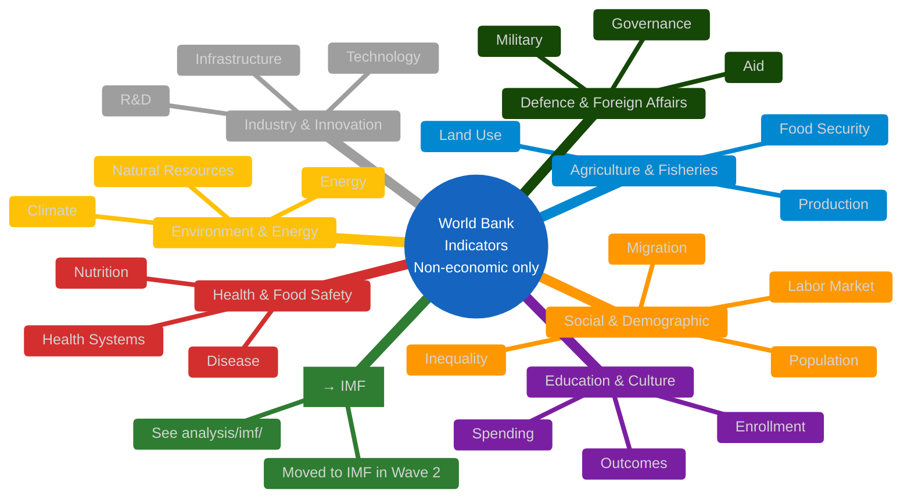
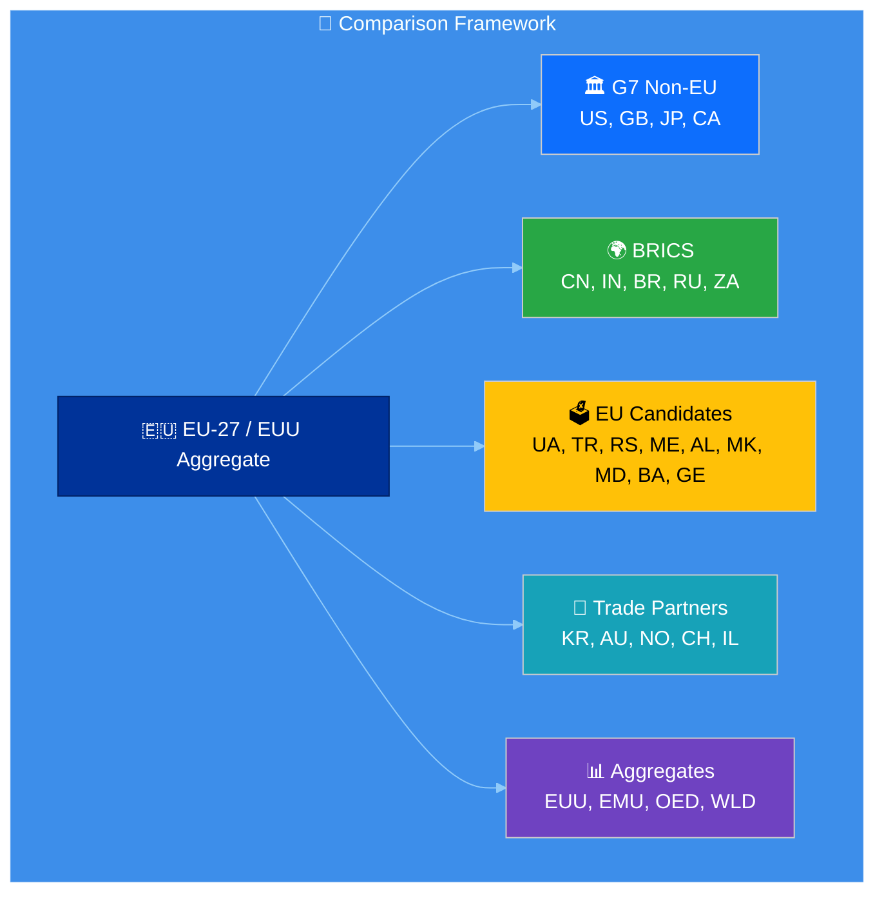

# 📊 World Bank Indicator Catalog — Complete Reference

> **Purpose**: Exhaustive catalog of World Bank indicators available via the `worldbank-mcp` MCP server tools and the broader WB API, organized by EP policy domain. AI workflows MUST reference this catalog when selecting indicators for articles and analysis documents.

**📅 Last Updated:** 2026-04-12 | **🏷️ Classification:** Public | **Indicator Count:** 200+

---

## 🤖 AI Agent / Agentic Workflow Instructions

**Scope:** World Bank is the source for **non-economic**
indicators only — health, education, social, environment, demographics,
defence, agriculture, innovation, governance. **Economic context (GDP,
inflation, unemployment, fiscal, trade, FDI, monetary) comes from
IMF** — see [`analysis/imf/indicator-catalog.md`](../imf/indicator-catalog.md).
Enforced editorially at Stage-C review.

**This catalog is a reference document, NOT a hard limit.** The World Bank has **thousands** of indicators. Follow this process for every article or analysis:

### Step 1: Determine Relevance
Does the article topic involve **health, education, environment, defence, agriculture, demographics, innovation, or governance**? If YES → add World Bank context. If the topic is **economic/monetary/fiscal**, go to `analysis/imf/indicator-catalog.md` instead.

### Step 2: Discover Indicators On Demand
**Always use `search-indicators` first** to find the best match for the specific policy topic:
```
world_bank___search_indicators({ keyword: "renewable energy" })
world_bank___search_indicators({ keyword: "youth unemployment" })
world_bank___search_indicators({ keyword: "military expenditure" })
```
This returns indicators NOT in this catalog — the WB API has thousands more. Use search results to find the **most specific** indicator for your topic.

### Step 3: Cross-Reference This Catalog
After searching, check this catalog for:
- **Priority ranking** (🔴🟡🟢⚪) — which indicators are most impactful
- **EP committee relevance** — which committee's mandate the indicator maps to
- **Comparison country groups** — see `eu-country-mapping.md` (⚠️ aggregate codes like `EUU` / `EMU` are **rejected by the MCP server** — use only ISO-3166 country codes from `eu-country-mapping.md` at Stage A)

### Step 4: Fetch Data (Within Budget)
Each workflow has a `maxWBCalls` limit (1-3 calls). Pick the highest-impact indicators.
- Use `get-social-data`, `get-health-data`, `get-education-data` for named keys
- ⚠️ `get-economic-data` is **deprecated for new articles** — use IMF `imf-fetch-data` instead
- Use `years: 5` for articles, `years: 10` for trend analysis

### Step 5: Visualize
- **HTML articles**: Chart.js via `buildDashboardSection` — see `chart-integration-guide.md`
- **Analysis.md files**: Mermaid `xychart-beta`, `quadrantChart`, or `pie` — see `chart-integration-guide.md`

---

## 🔑 How to Read This Catalog

- **Tool column**: Which WB MCP tool fetches this indicator (or `API` for direct WB API indicators mapped in `committee-indicator-map.ts`)
- **Indicator Key**: The string passed to the MCP tool's `indicator` parameter
- **WB ID**: World Bank indicator code for reference and `search-indicators` lookups
- **Priority**: 🔴 Critical (always include) | 🟡 High (include when relevant) | 🟢 Medium (optional context) | ⚪ Specialized
- **Annual data only** — all indicators are time series with annual frequency
- **Years parameter**: Default 10 years; use 5 for articles, 10-20 for trend analysis

---

## 📐 Indicator Organization by EP Policy Domain



---

## 1️⃣ ECONOMIC & MONETARY — ⚡ Moved to IMF

> ### ⛔ Do NOT use World Bank for economic context
>
> Since ** (April 2026)**, **all economic & monetary context**
> (GDP, inflation, unemployment, fiscal balance, debt, trade, FDI,
> monetary aggregates, exchange rates) for EU Parliament articles and
> analysis artefacts is sourced from **IMF** via the native TypeScript
> client in [`src/mcp/imf-mcp-client.ts`](../../src/mcp/imf-mcp-client.ts).
>
> **Authoritative sources:**
>
> - [`analysis/imf/indicator-catalog.md`](../imf/indicator-catalog.md)
>   ~80 IMF indicators across WEO / IFS / FM / BOP / ER / PCPS with
>   SDMX codes, frequency, and forecast horizon
> - [`analysis/imf/eu-country-mapping.md`](../imf/eu-country-mapping.md)
>   IMF EU-27 + `EU`, `EA`, `G7`, `G20` aggregates (**all accepted**
>   by the IMF API, unlike the WB MCP aggregates which are rejected)
> - [`analysis/methodologies/imf-indicator-mapping.md`](../methodologies/imf-indicator-mapping.md)
>   committee-level mapping and migration sequence
>
> **Why IMF, not WB, for economic context:**
>
> 1. **Fresher cadence** — IMF WEO publishes April + October each year
>    with full actuals + 5-year forecasts for every EU-27 country;
>    the WB WDI biannual batch still shows `null` for most recent
>    years at publication time.
> 2. **Aggregate codes work** — IMF `EU` / `EA` return real data;
>    `worldbank-mcp@1.0.1` rejects `EUU` / `EMU` with
>    `Error: Country not found`.
> 3. **Native forecasts** — WEO ships 2026–2030 projections; WB WDI
>    is actuals-only.
> 4. **Single provenance line** — *"IMF, World Economic Outlook,
>    April 2026"* is sufficient for attribution; no vintage patching.
>
> **Enforced by** the Stage-C editorial review of
> `intelligence/economic-context.md` per
> [`.github/prompts/04-article-generation.md §5`](../../.github/prompts/04-article-generation.md).

### ⚠️ Legacy WB economic IDs (use IMF instead)

> **Retained for reverse-compatibility only.** The indicator IDs below
> are valid raw-WB-REST identifiers and may appear in historical
> articles written before the  flip. **Do not cite them in new
> articles.** Use the IMF counterpart from
> [`analysis/imf/indicator-catalog.md`](../imf/indicator-catalog.md).

<details>
<summary><b>Legacy WB GDP &amp; National Accounts</b> (expand)</summary>

| Tool | Key | WB ID | Full Name | Unit | IMF replacement |
|------|-----|-------|-----------|------|-----------------|
| `get-economic-data` ⚠️ | `GDP` | NY.GDP.MKTP.CD | GDP (current US$) | US$ | WEO `NGDPD` |
| `get-economic-data` ⚠️ | `GDP_GROWTH` | NY.GDP.MKTP.KD.ZG | GDP growth (annual %) | % | WEO `NGDP_RPCH` |
| `get-economic-data` ⚠️ | `GDP_PER_CAPITA` | NY.GDP.PCAP.CD | GDP per capita (current US$) | US$ | WEO `NGDPDPC` |
| `get-economic-data` ⚠️ | `GNI` | NY.GNP.MKTP.CD | GNI (current US$) | US$ | WEO / IFS |
| `get-economic-data` ⚠️ | `GNI_PER_CAPITA` | NY.GNP.PCAP.CD | GNI per capita, Atlas (US$) | US$ | WEO |
| raw-REST | — | NY.GDP.MKTP.KD | GDP (constant 2015 US$) | US$ | WEO |
| raw-REST | — | NY.GDP.MKTP.PP.CD | GDP, PPP (current intl $) | Intl$ | WEO `PPPGDP` |
| raw-REST | — | NY.GDP.PCAP.PP.CD | GDP per capita, PPP | Intl$ | WEO `PPPPC` |
| raw-REST | — | NY.GDP.DEFL.KD.ZG | GDP deflator (annual %) | % | WEO `NGDP_D` |

</details>

<details>
<summary><b>Legacy WB Inflation / Employment / Trade / Fiscal / Monetary</b> (expand)</summary>

| Tool | Key | WB ID | Full Name | IMF replacement |
|------|-----|-------|-----------|-----------------|
| `get-economic-data` ⚠️ | `INFLATION` | FP.CPI.TOTL.ZG | Inflation (annual %) | WEO `PCPIPCH` |
| `get-economic-data` ⚠️ | `UNEMPLOYMENT` | SL.UEM.TOTL.ZS | Unemployment (%) | WEO `LUR` |
| `get-economic-data` ⚠️ | `EXPORTS_GDP` | NE.EXP.GNFS.ZS | Exports (% GDP) | WEO / BOP |
| `get-economic-data` ⚠️ | `FDI_NET` | BN.KLT.DINV.CD | FDI net inflows | BOP `BFD_BP6_USD` |
| raw-REST | — | GC.TAX.TOTL.GD.ZS | Tax revenue (% GDP) | FM `GGR_NGDP` |
| raw-REST | — | NE.CON.GOVT.ZS | Gov consumption (% GDP) | FM / WEO |
| raw-REST | — | GC.DOD.TOTL.GD.ZS | Central gov debt (% GDP) | WEO `GGXWDG_NGDP` |
| raw-REST | — | GC.BAL.CASH.GD.ZS | Cash surplus/deficit (% GDP) | WEO `GGXONLB_NGDP` |
| raw-REST | — | FP.CPI.TOTL | CPI (2010 = 100) | IFS `PCPI_IX` |
| raw-REST | — | PA.NUS.FCRF | Official exchange rate | ER `ENDA_XDC_USD_RATE` |
| raw-REST | — | PA.NUS.PPP | PPP conversion factor | WEO `PPPEX` |
| raw-REST | — | FI.RES.TOTL.CD | Total reserves | IFS |

*Note*: Word-boundary-matched WB indicator codes still read as valid
World Bank evidence to Stage-C reviewers, so pre
green — but **new articles must cite the IMF replacement** per the
 editorial IMF-primary policy.

</details>

**Youth Unemployment (`SL.UEM.1524.ZS`)** and related labour-market
breakdowns remain in § 2 (Social Policy) since they are
labour/social indicators, not macro-economic. See § 2.3 below.

---

## 2️⃣ SOCIAL POLICY & DEMOGRAPHICS (EMPL/LIBE/FEMM)

### 2.1 Population & Demographics

| Tool | Key | WB ID | Full Name | Unit | EP Relevance | Priority |
|------|-----|-------|-----------|------|-------------|----------|
| `get-social-data` | `POPULATION` | SP.POP.TOTL | Population, total | Count | EP seat allocation; degressive proportionality | 🔴 |
| `get-social-data` | `LIFE_EXPECTANCY` | SP.DYN.LE00.IN | Life expectancy at birth (years) | Years | Health policy outcomes; SDGs | 🟡 |
| `get-social-data` | `BIRTH_RATE` | SP.DYN.CBRT.IN | Birth rate (per 1,000) | Rate | Demographic challenges; pension policy | 🟢 |
| `get-social-data` | `DEATH_RATE` | SP.DYN.CDRT.IN | Death rate (per 1,000) | Rate | Public health; aging population | 🟢 |
| API | — | SP.POP.GROW | Population growth (annual %) | % | Rural depopulation; territorial cohesion | 🟡 |
| API | — | SP.POP.65UP.TO.ZS | Population ages 65+ (% of total) | % | Aging society; pension sustainability | 🔴 |
| API | — | SP.POP.0014.TO.ZS | Population ages 0-14 (% total) | % | Youth dependency; education demand | 🟢 |
| API | — | SP.POP.1564.TO.ZS | Population ages 15-64 (% total) | % | Working-age population | 🟢 |
| API | — | SP.URB.TOTL.IN.ZS | Urban population (% of total) | % | Urbanization; territorial cohesion | 🟡 |
| API | — | SP.DYN.TFRT.IN | Fertility rate (births per woman) | Rate | Long-term demographic trajectory | 🟢 |
| API | — | SP.DYN.LE00.FE.IN | Life expectancy, female (years) | Years | Gender health gap | 🟢 |
| API | — | SP.DYN.LE00.MA.IN | Life expectancy, male (years) | Years | Gender health gap | 🟢 |
| API | — | SP.DYN.IMRT.IN | Infant mortality (per 1,000 live births) | Rate | Health system quality indicator | 🟢 |
| API | — | SP.ADO.TFRT | Adolescent fertility rate | Rate | Gender equality; youth policy | ⚪ |
| API | — | SP.POP.DPND.OL | Old-age dependency ratio | Ratio | Pension system stress | 🟡 |
| API | — | SP.POP.DPND.YG | Age dependency ratio, young | Ratio | Youth support needs | ⚪ |

### 2.2 Migration

| Tool | Key | WB ID | Full Name | Unit | EP Relevance | Priority |
|------|-----|-------|-----------|------|-------------|----------|
| API | — | SM.POP.NETM | Net migration | Count | Migration policy; asylum reform; burden-sharing | 🔴 |
| API | — | SM.POP.REFG | Refugee population by country of asylum | Count | Asylum policy; burden-sharing | 🟡 |
| API | — | SM.POP.REFG.OR | Refugee population by origin | Count | Foreign policy implications | 🟢 |
| API | — | SM.POP.TOTL.ZS | International migrant stock (% pop) | % | Integration policy | 🟡 |
| API | — | BX.TRF.PWKR.DT.GD.ZS | Personal remittances (% GDP) | % | Diaspora economics | ⚪ |

### 2.3 Inequality & Poverty

| Tool | Key | WB ID | Full Name | Unit | EP Relevance | Priority |
|------|-----|-------|-----------|------|-------------|----------|
| API | — | SI.POV.GINI | GINI index | Index | Income inequality; social pillar | 🔴 |
| API | — | SI.POV.NAHC | Poverty headcount (national line, %) | % | National poverty; cohesion policy | 🟡 |
| API | — | SI.DST.10TH.10 | Income share held by highest 10% | % | Wealth concentration | 🟡 |
| API | — | SI.DST.FRST.10 | Income share held by lowest 10% | % | Bottom-decile wellbeing | 🟡 |
| API | — | SI.SPR.PCAP.ZG | Annualized growth, bottom 40% | % | Shared prosperity; inclusive growth | 🟢 |
| API | — | SI.POV.DDAY | Poverty headcount ($2.15/day) | % | Extreme poverty (development context) | ⚪ |

### 2.4 Gender Equality (FEMM)

| Tool | Key | WB ID | Full Name | Unit | EP Relevance | Priority |
|------|-----|-------|-----------|------|-------------|----------|
| API | — | SL.TLF.CACT.FE.ZS | Female labor force participation (%) | % | Gender equality; pay gap debates | 🔴 |
| API | — | SL.UEM.TOTL.FE.ZS | Female unemployment (%) | % | Gender employment gap | 🟡 |
| API | — | SE.ENR.TERT.FM.ZS | School enrollment, tertiary (female %) | % | Women in higher education | 🟢 |
| API | — | SG.GEN.PARL.ZS | Women in national parliaments (%) | % | Political representation | 🔴 |
| API | — | SL.EMP.TOTL.SP.FE.ZS | Employment ratio, female (%) | % | Women's economic activity | 🟢 |

---

## 3️⃣ HEALTH & FOOD SAFETY (ENVI — health dimension)

### 3.1 Health Systems

| Tool | Key | WB ID | Full Name | Unit | EP Relevance | Priority |
|------|-----|-------|-----------|------|-------------|----------|
| `get-health-data` | `HEALTH_EXPENDITURE` | SH.XPD.CHEX.GD.ZS | Health expenditure (% GDP) | % | EU4Health; pandemic preparedness | 🟡 |
| `get-health-data` | `PHYSICIANS` | SH.MED.PHYS.ZS | Physicians (per 1,000 people) | Per 1k | Healthcare capacity; cross-border health | 🟢 |
| `get-health-data` | `HOSPITAL_BEDS` | SH.MED.BEDS.ZS | Hospital beds (per 1,000 people) | Per 1k | Health infrastructure; pandemic resilience | 🟢 |
| `get-health-data` | `IMMUNIZATION` | SH.IMM.MEAS | Immunization, measles (% children) | % | Vaccine coordination; public health | 🟢 |
| API | — | SH.XPD.CHEX.PC.CD | Health expenditure per capita (US$) | US$ | Absolute spending comparison | 🟢 |
| API | — | SH.XPD.GHED.GD.ZS | Government health expenditure (% GDP) | % | Public health investment | 🟡 |
| API | — | SH.XPD.OOPC.CH.ZS | Out-of-pocket expenditure (% health) | % | Healthcare access equity | 🟢 |
| API | — | SH.MED.NUMW.P3 | Nurses and midwives (per 1,000) | Per 1k | Healthcare staffing | ⚪ |
| API | — | SH.DYN.NCOM.ZS | Mortality from NCDs (% total deaths) | % | Non-communicable disease burden | ⚪ |
| API | — | SP.DYN.IMRT.IN | Infant mortality (per 1,000 births) | Per 1k | Health system quality | 🟢 |
| API | — | SH.STA.MMRT | Maternal mortality ratio (per 100k) | Per 100k | Women's health; SDG target | 🟢 |

### 3.2 Disease & Public Health

| Tool | Key | WB ID | Full Name | Unit | EP Relevance | Priority |
|------|-----|-------|-----------|------|-------------|----------|
| `get-health-data` | `HIV_PREVALENCE` | SH.DYN.AIDS.ZS | HIV prevalence (% pop 15-49) | % | Cross-border health policy | ⚪ |
| `get-health-data` | `TUBERCULOSIS` | SH.TBS.INCD | TB incidence (per 100,000) | Per 100k | Cross-border health threats | ⚪ |
| `get-health-data` | `MALNUTRITION` | SH.STA.MALN.ZS | Undernourishment (% pop) | % | Food security; CAP reform | 🟢 |
| API | — | SH.STA.STNT.ZS | Stunting prevalence (% under-5) | % | Child nutrition; development | ⚪ |
| API | — | SH.STA.OWGH.ZS | Overweight prevalence (% under-5) | % | Nutrition policy | ⚪ |
| API | — | SH.PRV.SMOK | Smoking prevalence (% pop 15+) | % | Public health regulation; tobacco directive | 🟢 |
| API | — | SH.ALC.PCAP.LI | Alcohol consumption per capita (L) | Liters | Public health; excise harmonization | ⚪ |

### 3.3 Water & Sanitation

| Tool | Key | WB ID | Full Name | Unit | EP Relevance | Priority |
|------|-----|-------|-----------|------|-------------|----------|
| API | — | SH.H2O.SMDW.ZS | Safely managed drinking water (%) | % | Water Framework Directive | 🟡 |
| API | — | SH.STA.SMSS.ZS | Safely managed sanitation (%) | % | Urban waste water directive | 🟡 |
| API | — | SH.H2O.BASW.ZS | Basic drinking water services (%) | % | Development context | ⚪ |

---

## 4️⃣ ENVIRONMENT, ENERGY & CLIMATE (ENVI/ITRE)

### 4.1 Climate & Emissions

| Tool | Key | WB ID | Full Name | Unit | EP Relevance | Priority |
|------|-----|-------|-----------|------|-------------|----------|
| API | — | EN.ATM.CO2E.PC | CO₂ emissions per capita (metric tons) | t/cap | Green Deal; 55% reduction target; net-zero 2050 | 🔴 |
| API | — | EN.ATM.CO2E.KT | CO₂ emissions total (kt) | kt | National emissions comparison | 🟡 |
| API | — | EN.ATM.CO2E.PP.GD | CO₂ emissions/GDP (kg per PPP $) | kg/$ | Carbon intensity of economy | 🟡 |
| API | — | EN.ATM.GHGO.KT.CE | Other GHG emissions (kt CO₂ equiv) | kt CO₂e | Broader climate impact | 🟢 |
| API | — | EN.ATM.METH.KT.CE | Methane emissions (kt CO₂ equiv) | kt CO₂e | Agriculture; waste sector emissions | 🟢 |
| API | — | EN.ATM.NOXE.KT.CE | Nitrous oxide emissions (kt CO₂ equiv) | kt CO₂e | Agriculture; industrial emissions | ⚪ |
| API | — | EN.ATM.PM25.MC.ZS | PM2.5 exposure (% pop > WHO limit) | % | Air quality directive; health | 🟡 |

### 4.2 Energy

| Tool | Key | WB ID | Full Name | Unit | EP Relevance | Priority |
|------|-----|-------|-----------|------|-------------|----------|
| API | — | EG.FEC.RNEW.ZS | Renewable energy (% total consumption) | % | REPowerEU; energy transition | 🔴 |
| API | — | EG.USE.PCAP.KG.OE | Energy use per capita (kg oil equiv) | kg OE | Energy efficiency directive | 🟡 |
| API | — | EG.USE.ELEC.KH.PC | Electric power consumption (kWh/cap) | kWh | Electricity access; digitalization load | 🟢 |
| API | — | EG.ELC.RNEW.ZS | Renewable electricity output (% total) | % | Electricity sector decarbonization | 🔴 |
| API | — | EG.ELC.NUCL.ZS | Electricity from nuclear (%) | % | Energy mix; nuclear taxonomy debate | 🟡 |
| API | — | EG.ELC.FOSL.ZS | Electricity from fossil fuels (%) | % | Fossil fuel phase-out tracking | 🟡 |
| API | — | EG.ELC.HYRO.ZS | Electricity from hydroelectric (%) | % | Renewable mix detail | 🟢 |
| API | — | EG.IMP.CONS.ZS | Energy imports, net (% energy use) | % | Energy security; dependence | 🔴 |
| API | — | EG.GDP.PUSE.KO.PP.KD | GDP per unit of energy use | $ per kg OE | Energy efficiency of economy | 🟢 |

### 4.3 Natural Resources & Land Use

| Tool | Key | WB ID | Full Name | Unit | EP Relevance | Priority |
|------|-----|-------|-----------|------|-------------|----------|
| API | — | AG.LND.FRST.ZS | Forest area (% of land area) | % | Biodiversity strategy; deforestation regulation | 🟡 |
| API | — | AG.LND.ARBL.ZS | Arable land (% of land area) | % | Land use policy; CAP conditionality | 🟢 |
| API | — | ER.PTD.TOTL.ZS | Terrestrial protected areas (%) | % | Nature Restoration Law; Natura 2000 | 🟡 |
| API | — | ER.MRN.PTMR.ZS | Marine protected areas (%) | % | Ocean governance; PECH committee | 🟡 |
| API | — | ER.H2O.FWTL.ZS | Annual freshwater withdrawals (% total) | % | Water stress; Water Framework Directive | 🟢 |
| API | — | AG.LND.TOTL.K2 | Land area (sq km) | km² | Country size reference | ⚪ |
| API | — | EN.POP.DNST | Population density (per sq km) | Per km² | Territorial planning | ⚪ |

---

## 5️⃣ EDUCATION & CULTURE (CULT/EMPL)

### 5.1 Education Spending & Access

| Tool | Key | WB ID | Full Name | Unit | EP Relevance | Priority |
|------|-----|-------|-----------|------|-------------|----------|
| `get-education-data` | `EDUCATION_EXPENDITURE` | SE.XPD.TOTL.GD.ZS | Education expenditure (% GDP) | % | Erasmus+; European Education Area | 🟡 |
| `get-education-data` | `SCHOOL_ENROLLMENT` | SE.PRM.ENRR | Primary enrollment (% gross) | % | Education access; SDG 4 | ⚪ |
| `get-education-data` | `SCHOOL_COMPLETION` | SE.PRM.CMPT.ZS | Primary completion rate | % | Education outcomes | ⚪ |
| `get-education-data` | `TEACHERS_PRIMARY` | SE.PRM.TCHR | Teachers in primary education | Count | Education investment | ⚪ |
| `get-education-data` | `LITERACY_RATE` | SE.ADT.LITR.ZS | Adult literacy rate (% 15+) | % | Digital literacy; media literacy | ⚪ |
| API | — | SE.TER.ENRR | Tertiary enrollment (% gross) | % | Higher education; EEA | 🟡 |
| API | — | SE.SEC.ENRR | Secondary enrollment (% gross) | % | Secondary education outcomes | 🟢 |
| API | — | SE.XPD.TERT.ZS | Expenditure on tertiary (% gov education) | % | University funding | 🟢 |
| API | — | SE.COM.DURS | Compulsory education duration (years) | Years | Education system structure | ⚪ |
| API | — | SE.PRM.UNER | Out-of-school children, primary | Count | Education access gaps | ⚪ |
| API | — | UIS.NERA.2 | Adjusted net enrollment, secondary | % | Secondary access quality | ⚪ |

### 5.2 Digital Skills & Connectivity

| Tool | Key | WB ID | Full Name | Unit | EP Relevance | Priority |
|------|-----|-------|-----------|------|-------------|----------|
| `get-social-data` | `INTERNET_USERS` | IT.NET.USER.ZS | Internet users (% of population) | % | Digital single market; digital divide | 🟡 |
| API | — | IT.CEL.SETS.P2 | Mobile subscriptions (per 100 people) | Per 100 | Connectivity; telecom regulation | 🟢 |
| API | — | IT.NET.BBND.P2 | Fixed broadband subscriptions (per 100) | Per 100 | Broadband targets; digital decade | 🟡 |
| API | — | IT.NET.SECR.P6 | Secure Internet servers (per 1M) | Per 1M | Digital infrastructure security | 🟢 |

---

## 6️⃣ INDUSTRY, RESEARCH & ENERGY (ITRE)

### 6.1 Research & Innovation

| Tool | Key | WB ID | Full Name | Unit | EP Relevance | Priority |
|------|-----|-------|-----------|------|-------------|----------|
| API | — | GB.XPD.RSDV.GD.ZS | R&D expenditure (% of GDP) | % | Horizon Europe; 3% GDP R&D target | 🔴 |
| API | — | TX.VAL.TECH.MF.ZS | High-tech exports (% manufactured) | % | Strategic autonomy; tech sovereignty | 🟡 |
| API | — | IP.PAT.RESD | Patent applications, residents | Count | Innovation output | 🟡 |
| API | — | IP.PAT.NRES | Patent applications, non-residents | Count | International innovation attractiveness | 🟢 |
| API | — | IP.TMK.TOTL | Trademark applications | Count | IP activity; brand economy | ⚪ |
| API | — | SP.POP.SCIE.RD.P6 | Researchers in R&D (per million) | Per 1M | Research workforce; brain drain | 🟡 |

### 6.2 Industry & Manufacturing

| Tool | Key | WB ID | Full Name | Unit | EP Relevance | Priority |
|------|-----|-------|-----------|------|-------------|----------|
| API | — | NV.IND.TOTL.ZS | Industry (incl. construction, % GDP) | % | Industrial policy; reindustrialization | 🟡 |
| API | — | NV.IND.MANF.ZS | Manufacturing (% of GDP) | % | Manufacturing base; reshoring | 🟡 |
| API | — | NV.SRV.TOTL.ZS | Services (% of GDP) | % | Services economy transition | 🟢 |
| API | — | IS.VEH.NVEH.P3 | Motor vehicles (per 1,000 people) | Per 1k | Automotive sector; EV transition | 🟢 |
| API | — | IS.AIR.PSGR | Air transport passengers carried | Count | Aviation sector; ETS aviation | ⚪ |
| API | — | IS.RRS.TOTL.KM | Rail lines (total route-km) | km | Transport infrastructure; TEN-T | 🟢 |

### 6.3 Infrastructure & Transport (TRAN)

| Tool | Key | WB ID | Full Name | Unit | EP Relevance | Priority |
|------|-----|-------|-----------|------|-------------|----------|
| API | — | IS.ROD.PSGR.K6 | Railways passengers carried (mil pass-km) | M pass-km | Modal shift; Green Deal transport | 🟢 |
| API | — | IS.SHP.GOOD.TU | Container port traffic (TEU) | TEU | Maritime trade; port infrastructure | 🟢 |
| API | — | IS.AIR.GOOD.MT.K1 | Air freight (million ton-km) | M t-km | Air cargo; logistics | ⚪ |

---

## 7️⃣ AGRICULTURE & FISHERIES (AGRI/PECH)

### 7.1 Agricultural Production

| Tool | Key | WB ID | Full Name | Unit | EP Relevance | Priority |
|------|-----|-------|-----------|------|-------------|----------|
| API | — | NV.AGR.TOTL.ZS | Agriculture, forestry, fishing (% GDP) | % | CAP budget; agricultural sector weight | 🔴 |
| API | — | AG.YLD.CREL.KG | Cereal yield (kg per hectare) | kg/ha | Food security; agricultural productivity | 🟡 |
| API | — | AG.LND.ARBL.ZS | Arable land (% of land area) | % | Land use; CAP conditionality | 🟢 |
| API | — | AG.LND.AGRI.ZS | Agricultural land (% of land area) | % | Total agricultural footprint | 🟢 |
| API | — | AG.PRD.FOOD.XD | Food production index | Index | Food output trends | 🟢 |
| API | — | AG.PRD.LVSK.XD | Livestock production index | Index | Livestock sector; methane | 🟢 |
| API | — | AG.PRD.CREL.MT | Cereal production (metric tons) | MT | Food security | ⚪ |
| API | — | AG.CON.FERT.ZS | Fertilizer consumption (kg/ha arable) | kg/ha | Sustainable farming; nitrate directive | 🟢 |

### 7.2 Food Security

| Tool | Key | WB ID | Full Name | Unit | EP Relevance | Priority |
|------|-----|-------|-----------|------|-------------|----------|
| API | — | SN.ITK.DEFC.ZS | Prevalence of undernourishment (%) | % | Food security; development cooperation | 🟢 |
| API | — | AG.PRD.FOOD.XD | Food production index (2014-16=100) | Index | Food output trends | 🟢 |

---

## 8️⃣ DEFENCE & FOREIGN AFFAIRS (AFET/SEDE/DEVE)

### 8.1 Military & Security

| Tool | Key | WB ID | Full Name | Unit | EP Relevance | Priority |
|------|-----|-------|-----------|------|-------------|----------|
| API | — | MS.MIL.XPND.GD.ZS | Military expenditure (% of GDP) | % | NATO 2% target; EU defence fund; CSDP | 🔴 |
| API | — | MS.MIL.XPND.CD | Military expenditure (current US$) | US$ | Absolute defence spending | 🟡 |
| API | — | MS.MIL.TOTL.P1 | Armed forces personnel (total) | Count | Defence capacity | 🟢 |
| API | — | MS.MIL.TOTL.TF.ZS | Armed forces personnel (% labor force) | % | Defence sector employment | ⚪ |

### 8.2 Development & Aid (DEVE)

| Tool | Key | WB ID | Full Name | Unit | EP Relevance | Priority |
|------|-----|-------|-----------|------|-------------|----------|
| API | — | DT.ODA.ODAT.GN.ZS | Net ODA received (% of GNI) | % | Aid recipient perspective | 🟡 |
| API | — | DT.ODA.ALLD.CD | Net ODA provided (current US$) | US$ | EU donor commitments | 🟡 |
| API | — | DC.DAC.TOTL.CD | Net ODA from DAC donors (US$) | US$ | Total OECD aid comparison | 🟢 |

### 8.3 Governance & Institutions

| Tool | Key | WB ID | Full Name | Unit | EP Relevance | Priority |
|------|-----|-------|-----------|------|-------------|----------|
| API | — | IQ.CPA.GNDR.XQ | CPIA gender equality rating | Rating | EU accession; rule of law | 🟢 |
| API | — | SE.ENR.PRSC.FM.ZS | School enrollment, primary (gender parity) | Ratio | Gender equality benchmark | ⚪ |
| API | — | SG.GEN.PARL.ZS | Women in national parliament (%) | % | Political representation; democracy | 🔴 |
| API | — | VC.IHR.PSRC.P5 | Intentional homicides (per 100k) | Per 100k | Security; rule of law assessment | 🟢 |

---

## 9️⃣ INTERNAL MARKET & CONSUMER (IMCO)

| Tool | Key | WB ID | Full Name | Unit | EP Relevance | Priority |
|------|-----|-------|-----------|------|-------------|----------|
| API | — | IC.BUS.EASE.XQ | Ease of doing business score | Score | Single market; regulatory burden | 🟡 |
| API | — | IC.REG.DURS | Time to start a business (days) | Days | Business environment; SME policy | 🟡 |
| API | — | IC.TAX.TOTL.CP.ZS | Total tax and contribution rate (% profit) | % | Tax burden on business | 🟢 |
| API | — | IC.TAX.DURS | Time to prepare and pay taxes (hours) | Hours | Tax compliance burden | 🟢 |
| API | — | IC.IMP.DURS | Time to import (days) | Days | Trade facilitation | ⚪ |
| API | — | IC.EXP.DURS | Time to export (days) | Days | Trade facilitation | ⚪ |

---

## 🔟 REGIONAL DEVELOPMENT (REGI)

| Tool | Key | WB ID | Full Name | Unit | EP Relevance | Priority |
|------|-----|-------|-----------|------|-------------|----------|
| API | — | NY.GDP.PCAP.PP.CD | GDP per capita, PPP | Intl$ | Regional convergence; cohesion fund | 🔴 |
| API | — | SP.URB.TOTL.IN.ZS | Urban population (%) | % | Urban-rural divide; territorial cohesion | 🟡 |
| API | — | SP.RUR.TOTL.ZS | Rural population (% total) | % | Rural development; CAP Pillar II | 🟡 |
| API | — | EN.POP.DNST | Population density | Per km² | Spatial planning; infrastructure needs | 🟢 |
| API | — | IT.NET.BBND.P2 | Fixed broadband per 100 | Per 100 | Digital divide; connectivity targets | 🟡 |

---

## Comparison Country Groups

For each indicator, AI workflows should compare the relevant EU member state(s) against appropriate benchmark groups:



### When to Use Each Group

| Comparison Group | Use Case | Example |
|-----------------|----------|---------|
| **Big Four** (DE, FR, IT, ES) | Macro-economic articles; fiscal governance | GDP Growth, Inflation, Debt |
| **G7 Non-EU** (US, GB, JP, CA) | Global competitiveness; trade policy | R&D, High-tech exports, FDI |
| **BRICS** (CN, IN, BR, RU, ZA) | Geopolitics; development; strategic autonomy | GDP Growth, Military, Trade |
| **EU Candidates** (UA, TR, RS...) | Enlargement; accession progress | GDP per capita, Rule of law, Inflation |
| **Nordic** (DK, FI, SE + NO) | Social policy; green transition | Renewable energy, Education, Equality |
| **Eurozone Core** (DE, FR, NL, BE, AT) | Monetary policy; fiscal discipline | Inflation, Debt, Unemployment |
| **Convergence** (BG, RO, HR, PL, HU) | Cohesion policy; catching-up | GDP per capita growth, FDI, Infrastructure |
| **Mediterranean** (IT, ES, GR, PT) | Fiscal governance; youth unemployment | Youth unemployment, Debt, Tourism |
| **EEA/EFTA** (NO, CH) | Single market alignment | Trade, FDI, Regulatory comparison |
| **World/OECD aggregates** | Global benchmarking | Any indicator vs. OED or WLD average |

---

## 📈 Data Availability Notes

1. **Most recent year**: 2024 for economic (GDP, inflation); 2023-2024 for social/health
2. **EU aggregate (EUU)**: Available for most macro indicators; gaps in health/education
3. **Data lag**: Health/education indicators typically 1-3 years behind
4. **Military expenditure**: Available for most countries; critical post-2022
5. **GINI index**: Sporadic availability; not annual for all EU states
6. **Annual data only**: All indicators are annual time series
7. **Years parameter**: Use 5 for articles, 10 for trend analysis, 20 for long-term structural analysis

---

## 🎯 Indicator Priority Guide for AI Workflows

### 🔴 Always Include (when article covers related policy)
GDP Growth, Inflation, Unemployment, Population, Military Expenditure (defence), Tax Revenue (fiscal), CO₂ Emissions (climate), GINI (inequality), Net Migration (migration)

### 🟡 Include When Relevant
GDP per Capita, Health Expenditure, Education Expenditure, R&D Expenditure, Renewable Energy, Internet Users, Life Expectancy, Gov Debt, Youth Unemployment, Women in Parliament, Urban Population, Broadband, Energy Imports

### 🟢 Optional Context
Trade, FDI, Birth/Death Rates, Hospital Beds, Physicians, Forest Area, Arable Land, Manufacturing %, Cereal Yield, PM2.5, Old-age Dependency

### ⚪ Specialized (committee-specific only)
TB incidence, HIV prevalence, Livestock index, Fertilizer consumption, Compulsory education duration, Rail line km, Container port TEU

---

## 🧮 Total Indicator Count by Domain

| EP Policy Domain | MCP Tool Indicators | Extended (API) Indicators | Total |
|-----------------|:-------------------:|:------------------------:|:-----:|
| Economic & Monetary | 9 | 30+ | ~40 |
| Social & Demographics | 5 | 25+ | ~30 |
| Health & Food Safety | 7 | 15+ | ~22 |
| Environment & Energy | 0 | 18+ | ~18 |
| Education & Culture | 5 | 10+ | ~15 |
| Industry & Innovation | 0 | 12+ | ~12 |
| Agriculture & Fisheries | 0 | 10+ | ~10 |
| Defence & Foreign Affairs | 0 | 8+ | ~8 |
| Internal Market | 0 | 6+ | ~6 |
| Regional Development | 0 | 5+ | ~5 |
| **Total** | **26** | **140+** | **~200** |

> **Note**: The 26 MCP tool indicators are directly fetchable via named keys. The 140+ extended indicators use WB API indicator IDs and are mapped in `committee-indicator-map.ts` or can be queried via `search-indicators`.
