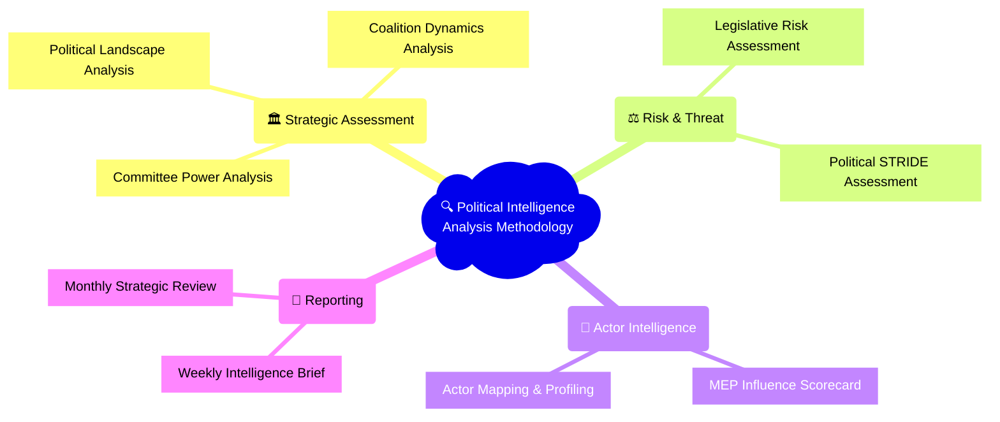
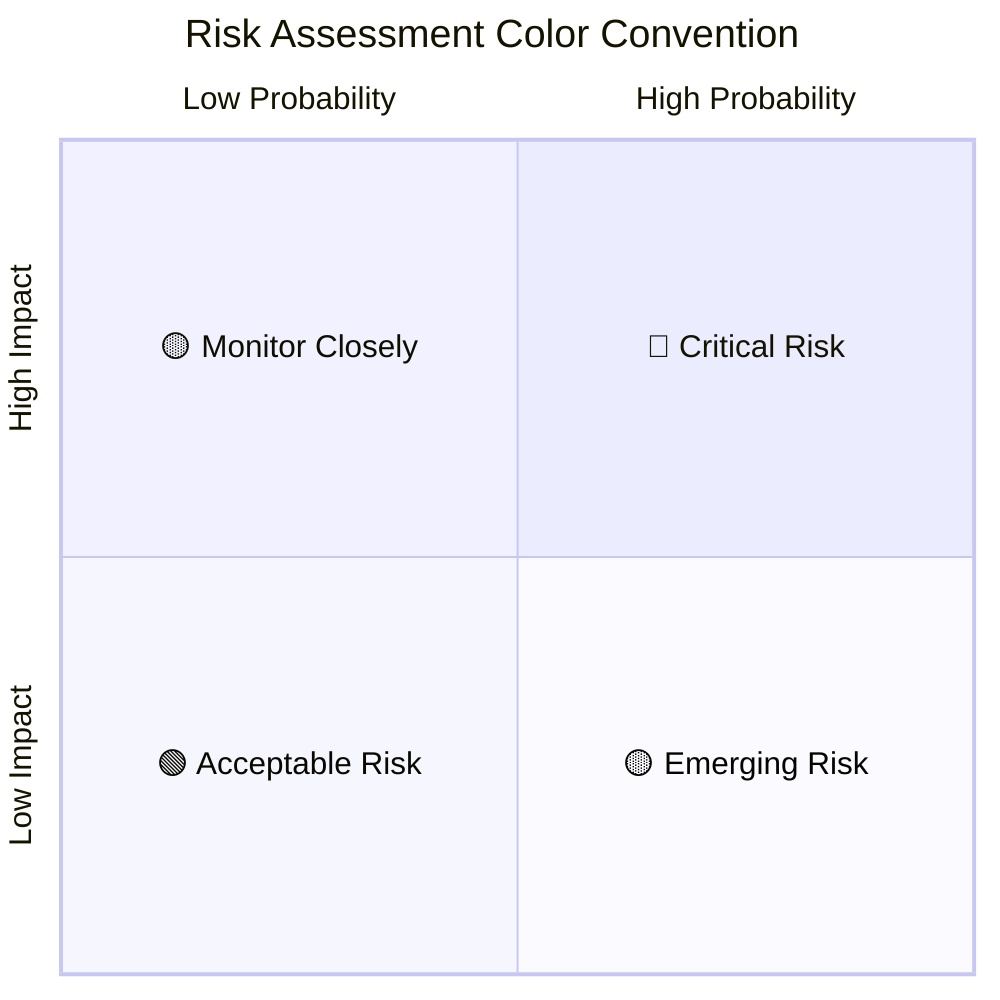
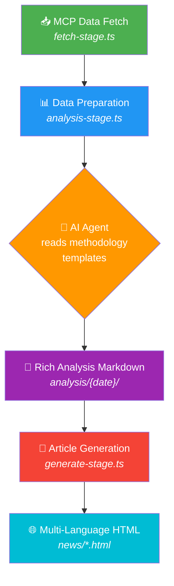

  

<h1 align="center">🔍 EU Parliament Monitor — Political Intelligence Analysis Methodology</h1>

  <strong>📊 Structured Analytical Frameworks for European Parliament Intelligence</strong> 
  <em>🎯 Templates • Mermaid Diagrams • Color-Coded Assessments • Multi-Language Output</em>

  
  
  
  

**📋 Document Owner:** Intelligence Operative | **📄 Version:** 1.0 | **📅 Last Updated:** 2026-03-28 (UTC)
**🔄 Review Cycle:** Monthly | **⏰ Next Review:** 2026-04-28
**🏷️ Classification:** Public — Political Intelligence Methodology Reference

---

## 🎯 Purpose

This directory contains **structured analytical methodology templates** that guide AI agents in producing high-quality political intelligence analysis of European Parliament data. Each template defines:

- **Analytical framework** — The structured methodology (ACH, PESTLE, STRIDE, SWOT, etc.)
- **Expected output format** — Professional markdown with Mermaid diagrams, color-coded assessments, and structured tables
- **Quality standards** — Confidence levels, source attribution, and evidence requirements
- **MCP data sources** — Which European Parliament MCP tools to query for each analysis type

These templates are referenced by agentic workflow files (`.github/workflows/news-*.md`) to ensure the AI produces **extensive, publication-quality analysis** rather than thin data scaffolding.

---

## 📚 Analysis Methodology Templates

### Template Catalog

| Template | Focus | Key Frameworks | Primary MCP Tools | Output Length |
|----------|-------|----------------|-------------------|--------------|
| **[Political Landscape Analysis](political-landscape-analysis.md)** | 🏛️ Power dynamics & fragmentation | Effective Number of Parties, Seat-Share Analysis | `get_current_meps`, `generate_political_landscape`, `compare_political_groups` | 800–1,500 lines |
| **[Coalition Dynamics Analysis](coalition-dynamics-analysis.md)** | 🤝 Voting alliances & fractures | Alliance Detection, Cohesion Metrics, ACH | `analyze_coalition_dynamics`, `get_voting_records`, `detect_voting_anomalies` | 600–1,200 lines |
| **[Legislative Risk Assessment](legislative-risk-assessment.md)** | ⚖️ Passage probability & pipeline health | PESTLE, Risk Matrix, Monte Carlo-style | `monitor_legislative_pipeline`, `track_legislation`, `get_procedures` | 600–1,000 lines |
| **[MEP Influence Scorecard](mep-influence-scorecard.md)** | 👤 MEP performance & power mapping | 5-Dimension Model, Network Centrality | `assess_mep_influence`, `analyze_voting_patterns`, `network_analysis` | 400–800 lines |
| **[Weekly Intelligence Brief](weekly-intelligence-brief.md)** | 📰 Weekly situational awareness | Early Warning System, Trend Analysis | `early_warning_system`, `get_events_feed`, `get_adopted_texts_feed` | 500–1,000 lines |
| **[Committee Power Analysis](committee-power-analysis.md)** | 🏢 Committee workload & influence | Productivity Scoring, Policy Impact | `analyze_committee_activity`, `get_committee_info`, `analyze_legislative_effectiveness` | 500–900 lines |

---

## 🎨 Visual Quality Standards

All analysis output MUST follow these visual standards (matching the quality of [SWOT.md](../../SWOT.md) and [THREAT_MODEL.md](../../THREAT_MODEL.md)):

### Required Elements

1. **Professional Header** — Centered title with emoji, subtitle, date/confidence badges
2. **Executive Summary** — Key findings table with color-coded risk/impact levels
3. **Mermaid Diagrams** — At minimum 3 per analysis document:
   - One **overview diagram** (mindmap, quadrant chart, or pie chart)
   - One **relationship diagram** (flowchart, sequence, or network graph)
   - One **assessment diagram** (quadrant chart, risk matrix, or radar/spider)
4. **Color-Coded Assessments** — Using badge shields:
   - 🟢 `` / High Confidence / Strong
   - 🟡 `` / Medium Confidence / Moderate
   - 🔴 `` / Low Confidence / Weak
   - 🔵 `` / Background / Neutral
5. **Structured Tables** — For comparisons, rankings, and multi-dimensional assessments
6. **Source Attribution** — Every claim linked to specific EP MCP data with dates
7. **Confidence Levels** — Explicit on every analytical judgment

### Mermaid Color Coding Convention

### Badge Color Reference

| Level | Badge | Usage |
|-------|-------|-------|
| Critical / Very High |  | Immediate action required |
| High |  | Significant concern |
| Medium |  | Monitor and plan |
| Low |  | Acceptable level |
| Info |  | Background context |

---

## 🔄 Integration with Agentic Workflows

### How Templates Are Used

### Workflow Integration Points

Each news workflow `.md` file references these templates:

1. **Data Download Phase** — Scripts fetch EP MCP data (keep existing `fetch-stage.ts`)
2. **AI Analysis Phase** — Agent reads methodology templates + fetched data → produces rich markdown analysis
3. **Article Generation Phase** — Agent uses analysis markdown to write news articles

### Template Selection by Article Type

| Article Type | Primary Template | Supporting Templates |
|-------------|-----------------|---------------------|
| `week-ahead` | Weekly Intelligence Brief | Political Landscape, Coalition Dynamics |
| `month-ahead` | Political Landscape Analysis | Legislative Risk, Committee Power |
| `week-in-review` | Weekly Intelligence Brief | Coalition Dynamics, MEP Scorecard |
| `month-in-review` | Political Landscape Analysis | All templates |
| `committee-reports` | Committee Power Analysis | Legislative Risk |
| `propositions` | Legislative Risk Assessment | Coalition Dynamics |
| `motions` | Coalition Dynamics Analysis | MEP Scorecard |
| `breaking` | Weekly Intelligence Brief | Political Landscape |

---

## 📏 Quality Metrics

### Minimum Output Requirements

| Metric | Minimum | Target |
|--------|---------|--------|
| Total lines | 400 | 800+ |
| Mermaid diagrams | 3 | 5–8 |
| Structured tables | 2 | 4–6 |
| Confidence assessments | 5 | 10+ |
| Source citations | 10 | 20+ |
| Stakeholder perspectives | 3 | 5–6 |
| Color-coded badges | 5 | 10+ |
| Forward-looking scenarios | 2 | 3–4 |

### Anti-Patterns to Avoid

| ❌ Anti-Pattern | ✅ Correct Approach |
|----------------|-------------------|
| "0 procedures tracked" | "No new procedures detected in the monitoring window — this may indicate a parliamentary recess or data lag" |
| Empty risk matrix | "Risk assessment deferred — insufficient data for the current period. Priority monitoring items identified for next cycle." |
| Generic STRIDE with all "Low" | Context-specific threat assessment with explanations of WHY the level is what it is |
| Tables with only headers | Narrative analysis explaining data gaps and their implications |
| Hardcoded synthetic IDs | Real EP document references with dates and URLs |

---

## 🔒 GDPR & Data Ethics

All analysis templates enforce:

- **Public data only** — European Parliament MCP provides only publicly available data
- **No personal profiling** — MEP analysis covers public roles and voting records only
- **Political neutrality** — No partisan conclusions; present evidence and let citizens decide
- **Methodology transparency** — All analytical frameworks are documented and reproducible
- **Temporal accuracy** — All data citations include specific dates

---

**Last Updated:** 2026-03-28 | **Version:** 1.0 | **Next Review:** 2026-04-28
