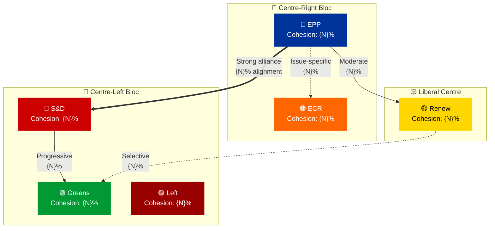
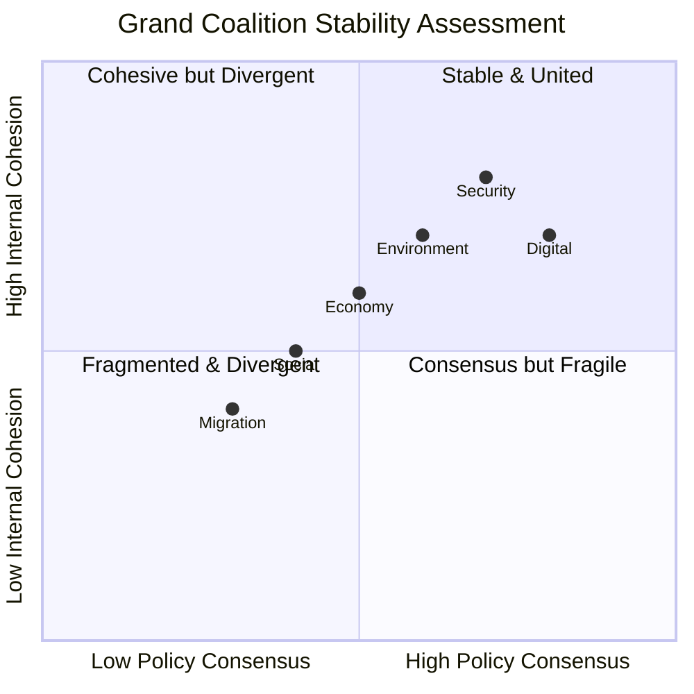

<p align="center">
  
</p>

<h1 align="center">🤝 Coalition Dynamics Analysis — Methodology Template</h1>

<p align="center">
  <strong>📊 Voting Alliances, Cross-Party Networks & Grand Coalition Viability</strong><br>
  <em>🎯 Alliance Detection • Cohesion Metrics • Defection Tracking • ACH Framework</em>
</p>

<p align="center">
  <a href="#"></a>
  <a href="#"></a>
  <a href="#"></a>
</p>

---

## 🎯 Purpose

This template guides the AI agent in producing a comprehensive **Coalition Dynamics Analysis** that maps voting alliances, detects emerging cross-party alignments, and assesses the stability of coalition formations in the European Parliament.

**When to use:** Weekly reviews, motion analysis, any article requiring understanding of how groups vote together or apart.

**Key Analytical Framework:** Analysis of Competing Hypotheses (ACH) — evaluate multiple explanations for observed coalition patterns.

---

## 📥 Required MCP Data Sources

| MCP Tool | Purpose | Key Parameters |
|----------|---------|---------------|
| `analyze_coalition_dynamics` | Cohesion rates, cross-party alliances, defection rates | `dateFrom`, `dateTo`, `groupIds` |
| `get_voting_records` | Individual vote breakdowns | `dateFrom`, `dateTo`, `topic` |
| `detect_voting_anomalies` | Unusual patterns, defections, abstention spikes | `dateFrom`, `dateTo`, `sensitivityThreshold` |
| `compare_political_groups` | Multi-dimensional group comparison | `groupIds`, `dimensions` |
| `correlate_intelligence` | Cross-tool intelligence correlation | `mepIds`, `groups` |

---

## 📝 Expected Output Structure

### 1. Document Header

```markdown
# 🤝 Coalition Dynamics Analysis — European Parliament

**📅 Analysis Date:** {YYYY-MM-DD} | **📊 Confidence:** {High/Medium/Low}
**🔍 Period:** {date range} | **🗳️ Votes Analyzed:** {N}

---
```

### 2. Executive Summary

```markdown
## 📋 Executive Summary

| Coalition Metric | Value | Status | Trend |
|-----------------|-------|--------|-------|
| **Grand Coalition Cohesion** | {N}% |  | {↑↗→↘↓} |
| **EPP-S&D Alignment** | {N}% |  | {↑↗→↘↓} |
| **Cross-Party Defection Rate** | {N}% |  | {↑↗→↘↓} |
| **Fragmentation Index** | {N.NN} |  | {↑↗→↘↓} |
| **Key Stress Point** | {topic} |  | — |
```

### 3. Coalition Network Visualization (Required)



> **Line thickness convention:**
> - `==>` (thick arrow): Strong alliance (>75% voting alignment)
> - `-->` (normal arrow): Moderate alliance (50-75% alignment)
> - `-.->` (dashed arrow): Weak/issue-specific alignment (<50%)

### 4. Voting Alignment Heatmap (Required)

Present pairwise alignment scores:

| | EPP | S&D | Renew | ECR | Greens | Left | PfE | ESN |
|---|---|---|---|---|---|---|---|---|
| **EPP** | — | {N}% | {N}% | {N}% | {N}% | {N}% | {N}% | {N}% |
| **S&D** | {N}% | — | {N}% | {N}% | {N}% | {N}% | {N}% | {N}% |
| **Renew** | {N}% | {N}% | — | {N}% | {N}% | {N}% | {N}% | {N}% |
| **ECR** | {N}% | {N}% | {N}% | — | {N}% | {N}% | {N}% | {N}% |
| **Greens** | {N}% | {N}% | {N}% | {N}% | — | {N}% | {N}% | {N}% |
| **Left** | {N}% | {N}% | {N}% | {N}% | {N}% | — | {N}% | {N}% |

> **Color coding in narrative:** 🟢 >75% alignment | 🟡 50-75% | 🔴 <50%

### 5. Analysis of Competing Hypotheses (ACH) — Coalition Shifts

For each significant coalition shift detected, apply ACH:

```markdown
### 🔍 ACH: {Observed Pattern — e.g., "EPP-ECR alignment increase on migration votes"}

| Hypothesis | Consistency with Evidence | Assessment |
|-----------|-------------------------|------------|
| H1: Strategic rapprochement on shared policy priorities | {Supporting evidence from votes} |  |
| H2: Temporary tactical alliance for specific legislation | {Evidence} |  |
| H3: Structural realignment reflecting national election outcomes | {Evidence} |  |
| H4: Leadership-driven initiative without broad group support | {Evidence} |  |

**Key Diagnostic Evidence:** {What specific vote or event best distinguishes between hypotheses}
**Recommended Monitoring:** {What to watch to confirm/disconfirm the leading hypothesis}
```

### 6. Defection & Anomaly Analysis (Required)


For each significant anomaly:

| Anomaly | Group | Severity | Description | Implications |
|---------|-------|----------|-------------|-------------|
| {Type} | {Group} |  | {What happened} | {What it means for coalition stability} |

### 7. Policy-Area Coalition Patterns (Required)

```mermaid
mindmap
  root)🗳️ Coalition Patterns<br/>by Policy Area(
    (🌍 Environment & Climate)
      [EPP + S&D + Greens + Renew]
      [Cohesion: {N}%]
      [Key votes: {N}]
    (💰 Economic & Trade)
      [EPP + Renew + ECR]
      [Cohesion: {N}%]
      [Key votes: {N}]
    (🔒 Security & Defense)
      [EPP + S&D + Renew + ECR]
      [Cohesion: {N}%]
      [Key votes: {N}]
    (👥 Migration & Asylum)
      [Variable coalitions]
      [Most contentious area]
      [Key votes: {N}]
    (🖥️ Digital & Technology)
      [Broad consensus typical]
      [Cohesion: {N}%]
      [Key votes: {N}]
```

### 8. Grand Coalition Stress Test (Required)



### 9. Early Warning Indicators (Required)

| Indicator | Current Level | Threshold | Status |
|-----------|--------------|-----------|--------|
| Grand coalition alignment rate | {N}% | <60% = alert |  |
| Cross-party defection frequency | {N}/week | >5/week = watch |  |
| Abstention rate (major votes) | {N}% | >15% = concern |  |
| New alliance formation signals | {description} | Any = monitor |  |

### 10. Strategic Outlook

| Scenario | Probability | Impact | Description |
|----------|-------------|--------|-------------|
| **Continuity** |  | Medium | Grand coalition holds on most dossiers |
| **Selective fracture** |  | High | Migration/climate splits force alternative majorities |
| **Realignment** |  | Very High | Major group shift fundamentally changes coalition math |

---

## 🔒 Methodology Notes

- **Alliance detection threshold:** Groups voting together >60% of the time on >10 votes
- **Defection definition:** MEP voting against >70% of their group on a given vote
- **Abstention spike:** Group abstention rate >2× their average
- **Confidence depends on:** Number of votes analyzed, data completeness, temporal coverage

---

**Last Updated:** 2026-03-28 | **Template Version:** 1.0
