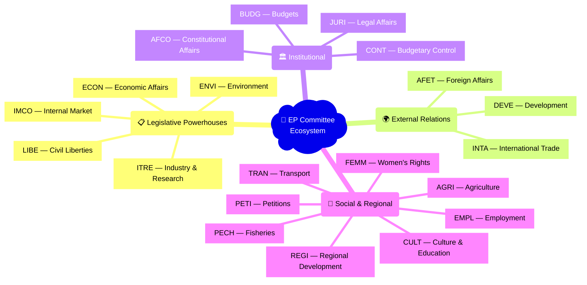
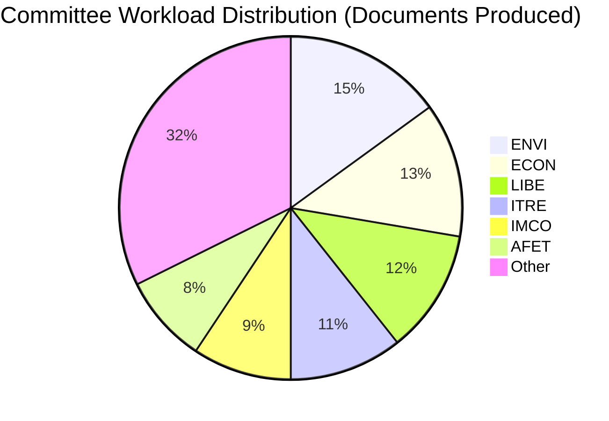
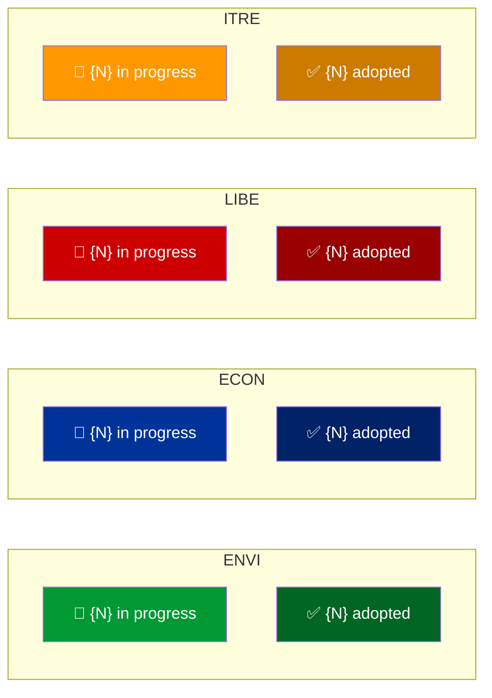
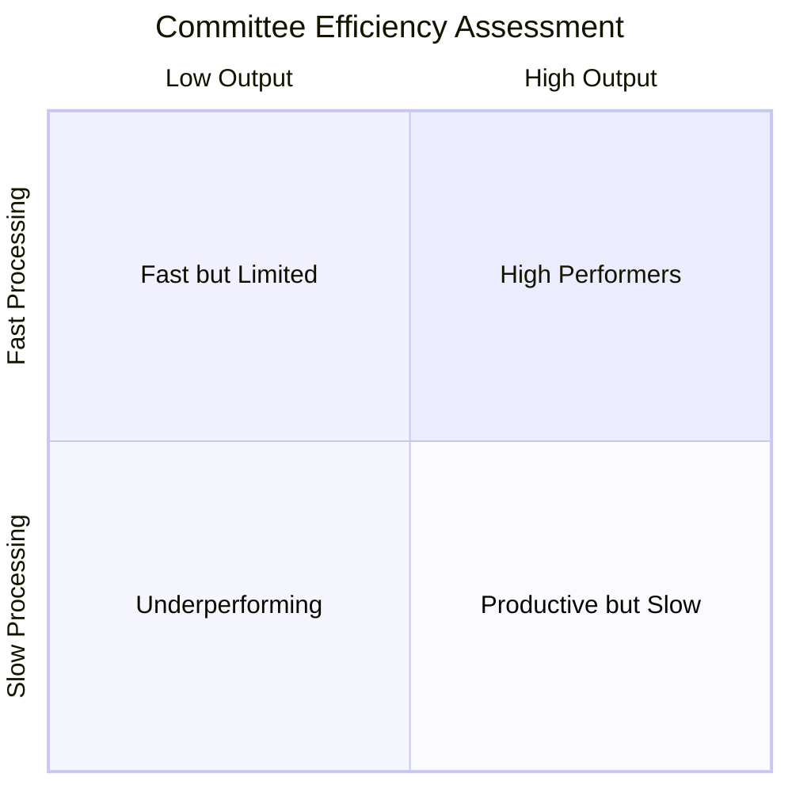

<p align="center">
  
</p>

<h1 align="center">🏢 Committee Power Analysis — Methodology Template</h1>

<p align="center">
  <strong>📊 Workload Assessment, Legislative Pipeline & Policy Influence Mapping</strong><br>
  <em>🎯 Productivity Scoring • Cross-Committee Dynamics • Rapporteur Influence • Policy Impact</em>
</p>

<p align="center">
  <a href="#"></a>
  <a href="#"></a>
  <a href="#"></a>
</p>

---

## 🎯 Purpose

This template guides the AI agent in producing a comprehensive **Committee Power Analysis** that assesses European Parliament committee workloads, legislative pipelines, member engagement, and policy influence. Committees are where the real legislative work happens — this analysis reveals the power dynamics behind the plenary votes.

**When to use:** Committee report articles, monthly reviews, legislative pipeline analysis, and any content requiring understanding of committee dynamics.

---

## 📥 Required MCP Data Sources

| MCP Tool | Purpose | Key Parameters |
|----------|---------|---------------|
| `analyze_committee_activity` | Workload, meetings, document production | `committeeId`, `dateFrom`, `dateTo` |
| `get_committee_info` | Composition, chair, vice-chairs, members | `abbreviation` or `showCurrent: true` |
| `analyze_legislative_effectiveness` | Committee productivity and quality | `subjectType: "COMMITTEE"`, `subjectId` |
| `get_committee_documents_feed` | Recent committee documents | `timeframe` |
| `search_documents` | Committee-specific reports and opinions | `committee`, `documentType` |
| `monitor_legislative_pipeline` | Procedures in committee stage | `committee`, `status` |

---

## 📝 Expected Output Structure

### 1. Document Header

```markdown
# 🏢 Committee Power Analysis — European Parliament

**📅 Analysis Date:** {YYYY-MM-DD} | **📊 Confidence:** {High/Medium/Low}
**🔍 Period:** {date range} | **🏢 Committees Analyzed:** {N}

---
```

### 2. Committee Power Ranking (Required)

```markdown
## 📊 Committee Power Ranking

| Rank | Committee | Abbreviation | Productivity | Pipeline | Influence | Overall |
|------|-----------|-------------|-------------|----------|-----------|---------|
| 1 | {Name} | {ABBR} |  |  |  |  |
| 2 | {Name} | {ABBR} | ... | ... | ... | ... |
```

### 3. Committee Ecosystem Visualization (Required)



### 4. Workload Distribution (Required)



> **AI Agent Note:** Replace with actual document counts from MCP data.

### 5. Committee Deep-Dive Profiles (Required for top 5)

For each key committee:

```markdown
### 🏢 {Committee Full Name} ({ABBREVIATION})

**Chair:** {Name} ({Group}, {Country}) | **Vice-Chairs:** {names}

| Metric | Value | EP Average | Comparison |
|--------|-------|-----------|------------|
| **Members** | {N} | {N} | — |
| **Documents produced** | {N} | {N} |  |
| **Meetings held** | {N} | {N} |  |
| **Reports adopted** | {N} | {N} |  |
| **Active procedures** | {N} | {N} |  |
| **Avg. time to report** | {N} days | {N} days |  |

**Key Dossiers:**
1. {Dossier title} — {stage} — 
2. {Dossier title} — {stage} — 

**Political Dynamics:** {Which groups dominate this committee and why it matters}

**Policy Impact Assessment:** {How this committee's work affects EU citizens and markets}
```

### 6. Committee Pipeline Flow (Required)



### 7. Cross-Committee Dynamics (Required)

```markdown
### 🔄 Cross-Committee Relationships

| Committee Pair | Relationship | Frequency | Key Issue Area |
|---------------|-------------|-----------|---------------|
| ENVI ↔ ITRE | Joint procedure/opinion | {frequency} | Green transition / industrial policy |
| ECON ↔ LIBE | Competing jurisdiction | {frequency} | Financial data regulation |
| AFET ↔ INTA | Complementary mandates | {frequency} | Trade and foreign policy alignment |
| LIBE ↔ JURI | Legal framework overlap | {frequency} | Fundamental rights in legislation |
```

### 8. Rapporteur Influence Mapping (Required)

| Rapporteur | Committee | Dossier | Group | Influence Score |
|-----------|-----------|---------|-------|----------------|
| {Name} | {ABBR} | {Title} | {Group} |  |

### 9. Committee Bottleneck Analysis (Required)



| Committee | Bottleneck | Impact | Recommendation |
|-----------|-----------|--------|---------------|
| {ABBR} | {Description} |  | {Recommendation} |

### 10. Strategic Assessment

```markdown
## 🔍 Strategic Assessment

**Most Influential Committee This Period:** {committee} — {why}

**Emerging Trends:**
- {Trend 1 with evidence}
- {Trend 2 with evidence}

**Committees to Watch:**
- {Committee and why it's gaining/losing influence}

**Policy Implications:**
- {How committee dynamics affect policy outcomes}
```

---

## 🎨 Committee Color Coding

| Category | Committees | Color |
|----------|-----------|-------|
| Legislative Core | ECON, ENVI, ITRE, LIBE, IMCO | Blue/Green tones |
| External | AFET, INTA, DEVE | Red/Orange tones |
| Institutional | JURI, BUDG, CONT, AFCO | Purple tones |
| Social/Regional | EMPL, AGRI, CULT, etc. | Teal/Gold tones |

---

**Last Updated:** 2026-03-28 | **Template Version:** 1.0
