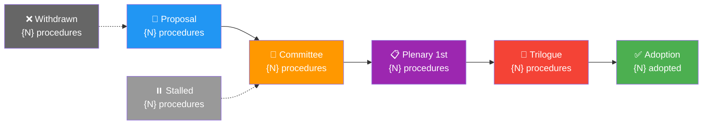
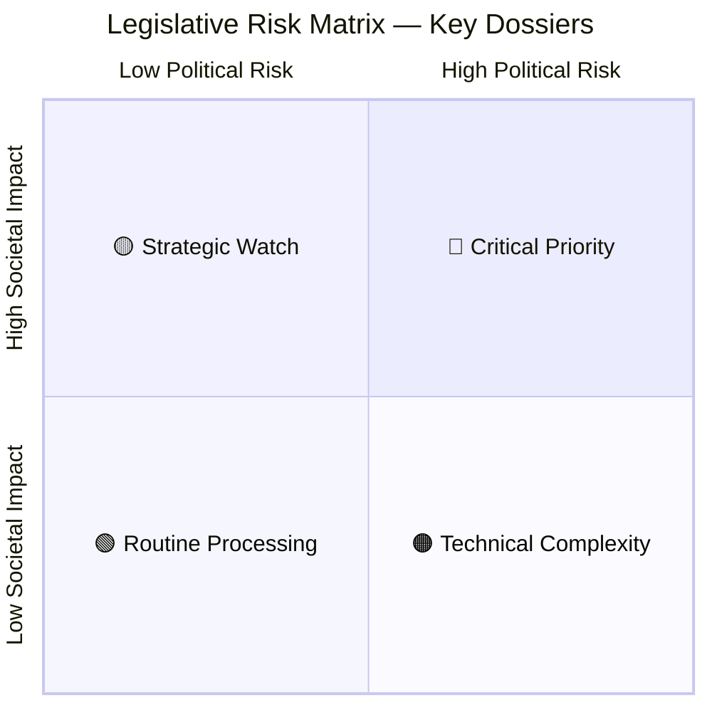
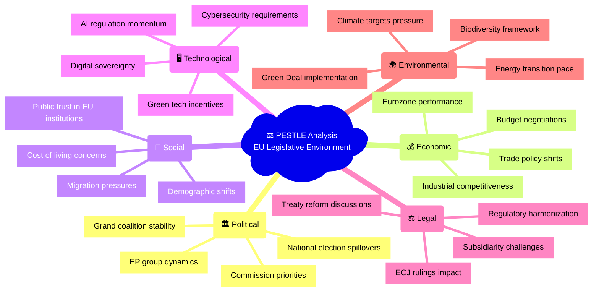
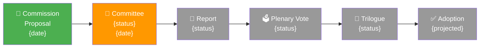
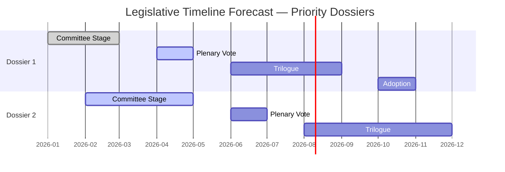

<p align="center">
  
</p>

<h1 align="center">⚖️ Legislative Risk Assessment — Methodology Template</h1>

<p align="center">
  <strong>📊 Passage Probability, Pipeline Health & PESTLE Impact Analysis</strong><br>
  <em>🎯 Risk Matrix • Amendment Tracking • Timeline Forecasting • Stakeholder Impact</em>
</p>

<p align="center">
  <a href="#"></a>
  <a href="#"></a>
  <a href="#"></a>
</p>

---

## 🎯 Purpose

This template guides the AI agent in producing a comprehensive **Legislative Risk Assessment** that evaluates the passage probability, political risk dimensions, and policy impact of active legislative procedures in the European Parliament.

**When to use:** Proposition tracking, month-ahead outlooks, committee reports, and any analysis of legislative pipeline health.

**Key Analytical Frameworks:**
- **PESTLE** — Political, Economic, Social, Technological, Legal, Environmental factor analysis
- **Risk Matrix** — Probability × Impact scoring
- **Stakeholder Mapping** — Interest, influence, and position assessment

---

## 📥 Required MCP Data Sources

| MCP Tool | Purpose | Key Parameters |
|----------|---------|---------------|
| `monitor_legislative_pipeline` | Pipeline health, bottlenecks, stalled procedures | `status`, `committee`, `dateFrom` |
| `track_legislation` | Individual procedure progress and timeline | `procedureId` |
| `get_procedures` | Active legislative procedures | `year`, `limit` |
| `get_procedures_feed` | Recently updated procedures | `timeframe` |
| `search_documents` | Committee reports, opinions, amendments | `keyword`, `documentType`, `committee` |
| `analyze_legislative_effectiveness` | Committee/MEP legislative output quality | `subjectType`, `subjectId` |

---

## 📝 Expected Output Structure

### 1. Document Header

```markdown
# ⚖️ Legislative Risk Assessment — European Parliament

**📅 Analysis Date:** {YYYY-MM-DD} | **📊 Confidence:** {High/Medium/Low}
**🔍 Period:** {date range} | **📋 Procedures Analyzed:** {N}

---
```

### 2. Executive Summary — Pipeline Health Dashboard

```markdown
## 📋 Pipeline Health Dashboard

| Metric | Value | Status | Benchmark |
|--------|-------|--------|-----------|
| **Active Procedures** | {N} |  | vs. {N} same period last year |
| **Pipeline Throughput** | {N}/month |  | Target: {N}/month |
| **Stalled Procedures** | {N} ({N}%) |  | Alert threshold: >20% |
| **Average Time-to-Adoption** | {N} months |  | EP average: {N} months |
| **Bottleneck Stage** | {stage} |  | {explanation} |
```

### 3. Legislative Pipeline Flow (Required)



### 4. Risk Matrix — Top Legislative Dossiers (Required)



For the top 5-10 legislative dossiers:

| # | Procedure | Stage | Political Risk | Societal Impact | Passage Probability | Timeline |
|---|-----------|-------|---------------|-----------------|-------------------|----------|
| 1 | {Title} ({reference}) | {Committee/Plenary/Trilogue} |  |  | {N}% | Q{N} {YYYY} |
| 2 | {Title} ({reference}) | {stage} |  |  | {N}% | Q{N} {YYYY} |

### 5. PESTLE Analysis — Legislative Environment (Required)



For each PESTLE dimension, provide:

```markdown
### 🏛️ Political Factors

| Factor | Assessment | Impact on Pipeline | Confidence |
|--------|-----------|-------------------|------------|
| {Factor} |  | {How it affects legislation} | 🟢/🟡/🔴 |

**Analysis:** {2-3 paragraph narrative assessment of political factors affecting the legislative pipeline}
```

### 6. Dossier Deep-Dive (Required for top 3 dossiers)

For each top-priority dossier:

```markdown
### 📋 {Dossier Title} — {Reference Number}

**Stage:** {Current stage} | **Lead Committee:** {committee} | **Rapporteur:** {name, group}



**Passage Probability:** {N}% — 

**Key Risks:**
1. {Risk with impact description}
2. {Risk with impact description}

**Stakeholder Positions:**

| Stakeholder | Position | Influence | Key Concern |
|-------------|----------|-----------|-------------|
| {Group/Actor} |  | High | {concern} |
| {Group/Actor} |  | Medium | {concern} |
| {Group/Actor} |  | High | {concern} |
```

### 7. Bottleneck Identification (Required)

| Bottleneck | Stage | Procedures Affected | Cause | Recommended Action |
|-----------|-------|-------------------|-------|-------------------|
| {Description} | {Pipeline stage} | {N} | {Root cause analysis} | {What would unblock it} |

### 8. Timeline Risk Assessment (Required)



> **AI Agent Note:** Replace with actual dossier timelines from `track_legislation`. Color code stages: done=green, active=blue, future=grey.

### 9. Passage Probability Methodology

```markdown
## 🔢 Passage Probability Scoring

Composite score from 5 dimensions (each 0-20 points):

| Dimension | Weight | Scoring Criteria |
|-----------|--------|-----------------|
| **Political Group Alignment** | 20% | How many groups' positions are known and supportive |
| **Committee Stage Progress** | 20% | How far through the committee stage |
| **Amendment Density** | 20% | Fewer contested amendments = higher probability |
| **Historical Precedent** | 20% | Similar legislation passage rates |
| **External Pressure** | 20% | Commission priority level, public attention, deadline pressure |

**Score Interpretation:**
- 80-100%:  — Strong consensus, advanced stage
- 60-79%:  — Good momentum, manageable opposition
- 40-59%:  — Significant political risks
- 20-39%:  — Major opposition or structural barriers
- 0-19%:  — Stalled, withdrawn, or fundamentally blocked
```

### 10. Strategic Recommendations

| Priority | Recommendation | Rationale | Timeline |
|----------|---------------|-----------|----------|
|  | {Recommendation} | {Why} | {When} |
|  | {Recommendation} | {Why} | {When} |
|  | {Recommendation} | {Why} | {When} |

---

**Last Updated:** 2026-03-28 | **Template Version:** 1.0
