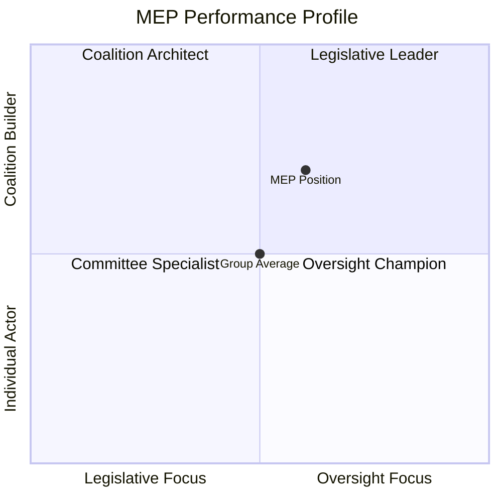
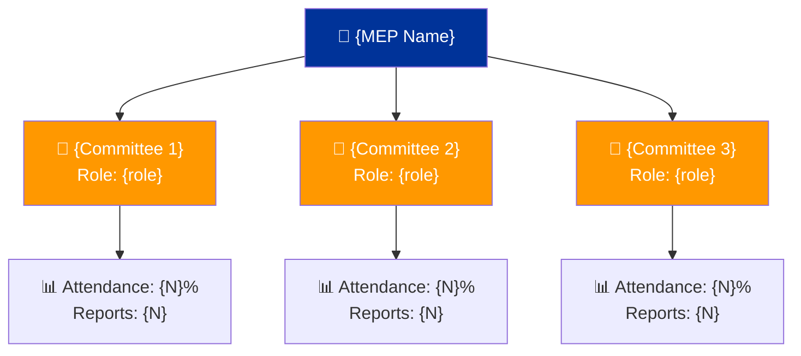

<p align="center">
  
</p>

<h1 align="center">👤 MEP Influence Scorecard — Methodology Template</h1>

<p align="center">
  <strong>📊 Multi-Dimensional MEP Performance, Influence & Network Analysis</strong><br>
  <em>🎯 5-Dimension Model • Voting Patterns • Committee Engagement • Network Centrality</em>
</p>

<p align="center">
  <a href="#"></a>
  <a href="#"></a>
  <a href="#"></a>
</p>

---

## 🎯 Purpose

This template guides the AI agent in producing comprehensive **MEP Influence Scorecards** that assess individual Members of European Parliament across multiple performance dimensions. The analysis uses only public data and maintains strict political neutrality.

**When to use:** MEP profiling for article context, committee reports, national delegation analysis, and any content requiring understanding of individual MEP influence.

**GDPR Compliance:** All data is from public European Parliament records. Analysis covers public roles and voting records only — no personal profiling.

---

## 📥 Required MCP Data Sources

| MCP Tool | Purpose | Key Parameters |
|----------|---------|---------------|
| `assess_mep_influence` | 5-dimension influence score | `mepId`, `includeDetails: true` |
| `analyze_voting_patterns` | Voting behavior and group alignment | `mepId`, `dateFrom`, `dateTo` |
| `get_mep_details` | Biography, committees, contact info | `id` |
| `network_analysis` | Committee co-membership centrality | `mepId` |
| `comparative_intelligence` | Cross-MEP comparison | `mepIds` (2-10 MEPs) |
| `track_mep_attendance` | Attendance patterns and trends | `mepId` |
| `analyze_legislative_effectiveness` | Legislative output quality | `subjectType: "MEP"`, `subjectId` |

---

## 📝 Expected Output Structure

### 1. Document Header

```markdown
# 👤 MEP Influence Scorecard — {MEP Name}

**📅 Analysis Date:** {YYYY-MM-DD} | **📊 Confidence:** {High/Medium/Low}
**🏛️ Political Group:** {group} | **🇪🇺 Country:** {country} | **📋 Committees:** {list}

---
```

### 2. Influence Score Overview (Required)

```markdown
## 📊 Influence Score Summary

**Overall Score:** {N}/100 — 
**Rank:** #{N} of {total} MEPs | **Percentile:** Top {N}%

| Dimension | Weight | Score | Rating | Trend |
|-----------|--------|-------|--------|-------|
| 🗳️ **Voting Activity** | 25% | {N}/100 |  | {↑↗→↘↓} |
| 📝 **Legislative Output** | 25% | {N}/100 |  | {↑↗→↘↓} |
| 🏢 **Committee Engagement** | 20% | {N}/100 |  | {↑↗→↘↓} |
| 🔍 **Parliamentary Oversight** | 15% | {N}/100 |  | {↑↗→↘↓} |
| 🤝 **Coalition Building** | 15% | {N}/100 |  | {↑↗→↘↓} |
```

### 3. Performance Radar Visualization (Required)

> **Note:** Mermaid does not natively support radar/spider charts. Use a quadrant chart as a proxy or describe the radar dimensions narratively.



### 4. Voting Behavior Analysis (Required)

```markdown
### 🗳️ Voting Behavior Profile

| Metric | Value | Group Average | Comparison |
|--------|-------|--------------|------------|
| **Participation Rate** | {N}% | {N}% |  |
| **Group Loyalty** | {N}% | {N}% |  |
| **Cross-Party Voting** | {N}% | {N}% |  |
| **Abstention Rate** | {N}% | {N}% |  |
```

### 5. Voting Pattern Visualization (Required)


> **⚠️ AI Agent**: Replace all `{N}` placeholders above with actual computed values from `analyze_voting_patterns` MCP data. Do NOT use the template defaults.

### 6. Legislative Output Assessment (Required)

| Output Type | Count | Period | Quality Score |
|------------|-------|--------|--------------|
| Reports authored | {N} | {period} |  |
| Opinions drafted | {N} | {period} |  |
| Amendments tabled | {N} | {period} |  |
| Amendments adopted | {N} ({N}%) | {period} |  |
| Parliamentary questions | {N} | {period} |  |

### 7. Committee Engagement Profile (Required)



### 8. Network Centrality (Required)

```markdown
### 🤝 Network Position

| Network Metric | Score | Interpretation |
|---------------|-------|---------------|
| **Centrality Score** | {N.NN} | {How connected within EP} |
| **Bridging Index** | {N.NN} | {Cross-group connection ability} |
| **Cluster Position** | {description} | {Where in the network} |
| **Key Connections** | {N} committees | {Breadth of influence} |
```

### 9. Comparative Context (Required)

When comparing multiple MEPs:

```markdown
### 📊 Peer Comparison

| Dimension | {MEP 1} | {MEP 2} | {MEP 3} | Group Avg |
|-----------|---------|---------|---------|-----------|
| Overall Score | {N}/100 | {N}/100 | {N}/100 | {N}/100 |
| Voting Activity | {N} | {N} | {N} | {N} |
| Legislative Output | {N} | {N} | {N} | {N} |
| Committee Engagement | {N} | {N} | {N} | {N} |
| Oversight | {N} | {N} | {N} | {N} |
| Coalition Building | {N} | {N} | {N} | {N} |
```

### 10. Assessment & Outlook

```markdown
## 🔍 Assessment

**Strengths:**
- {Key strength with evidence}
- {Key strength with evidence}

**Areas of Lower Activity:**
- {Area with context — NOT a value judgment, just factual comparison}

**Notable Patterns:**
- {Pattern with analytical interpretation}

**Confidence Statement:** This scorecard is based on {N} data points from European Parliament MCP public records. All metrics reflect public parliamentary activity only.
```

---

## ⚠️ Important Constraints

- **NO personal judgments** — Present data and let readers draw conclusions
- **NO ranking as "best" or "worst"** — Use comparative metrics without value labels
- **Political neutrality** — Equal analytical rigor regardless of political group
- **Context matters** — A committee chair naturally has higher engagement than a backbencher; always note role context
- **GDPR compliance** — Public parliamentary data only; no personal life information

---

**Last Updated:** 2026-03-28 | **Template Version:** 1.0
