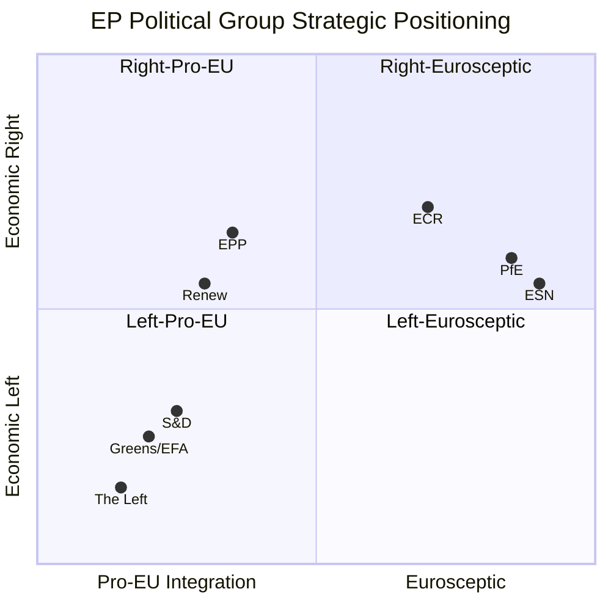
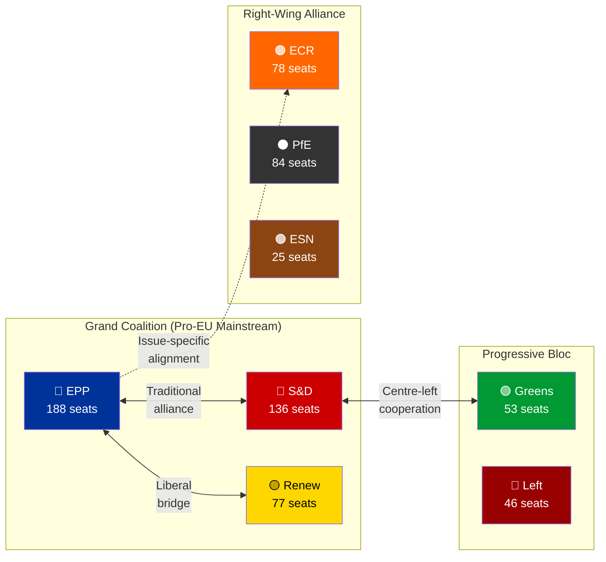

<p align="center">
  
</p>

<h1 align="center">🏛️ Political Landscape Analysis — Methodology Template</h1>

<p align="center">
  <strong>📊 European Parliament Power Dynamics, Fragmentation & Strategic Positioning</strong><br>
  <em>🎯 Group Composition • Seat Distribution • Coalition Viability • Fragmentation Index</em>
</p>

<p align="center">
  <a href="#"></a>
  <a href="#"></a>
  <a href="#"></a>
</p>

---

## 🎯 Purpose

This template guides the AI agent in producing a comprehensive **Political Landscape Analysis** of the European Parliament. The output should be a rich, publication-quality markdown document with color-coded Mermaid diagrams, structured assessment tables, and evidence-based strategic intelligence.

**When to use:** Monthly strategic reviews, month-ahead outlooks, and any analysis requiring understanding of the current EP power balance.

---

## 📥 Required MCP Data Sources

Query these European Parliament MCP tools **before** beginning analysis:

| MCP Tool | Purpose | Required Parameters |
|----------|---------|-------------------|
| `generate_political_landscape` | Group sizes, seat shares, bloc analysis | `dateFrom`, `dateTo` |
| `get_current_meps` | Active MEP roster with group affiliations | `limit: 100` (paginate) |
| `compare_political_groups` | Cross-group performance comparison | `groupIds` (all major groups) |
| `analyze_coalition_dynamics` | Coalition viability and cohesion | `dateFrom`, `dateTo` |
| `get_all_generated_stats` | Historical context and trends | `category: "political_groups"` |

---

## 📝 Expected Output Structure

The AI agent MUST produce a markdown document following this structure. Each section includes the expected content and Mermaid diagram type.

### 1. Document Header

```markdown
# 🏛️ European Parliament Political Landscape Analysis

**📅 Analysis Date:** {YYYY-MM-DD} | **📊 Confidence:** {High/Medium/Low}
**🔍 Period Covered:** {date range} | **📋 Data Sources:** {N} MCP queries

---
```

### 2. Executive Summary (Required)

A structured key findings table with color-coded assessment:

```markdown
## 📋 Executive Summary

| Dimension | Assessment | Key Finding |
|-----------|-----------|-------------|
| **Parliamentary Balance** |  | Centre-right EPP maintains largest group with {N} seats |
| **Fragmentation** |  | Effective number of parties: {N}, indicating {interpretation} |
| **Grand Coalition** |  | EPP+S&D+Renew command {N}% of seats |
| **Opposition Strength** |  | Right-wing groups gained {N} seats since last analysis |
| **Emerging Trend** |  | {key emerging dynamic} |
```

### 3. Seat Distribution Visualization (Required)


> **AI Agent Note:** Replace the numbers above with ACTUAL data from `generate_political_landscape`. The pie chart MUST reflect current seat counts.

### 4. Power Balance Quadrant (Required)



> **AI Agent Note:** Position values should reflect actual political positioning based on voting behavior data from MCP.

### 5. Group-by-Group Analysis (Required)

For EACH major political group, provide:

```markdown
### 🔵 {Group Name} ({Abbreviation}) — {N} Seats ({N}%)

**Strategic Position:** 

| Dimension | Score | Trend |
|-----------|-------|-------|
| Internal Cohesion | {N}/10 | {↑↗→↘↓} |
| Legislative Output | {N}/10 | {↑↗→↘↓} |
| Coalition Centrality | {N}/10 | {↑↗→↘↓} |
| Committee Influence | {N}/10 | {↑↗→↘↓} |

**Key Developments:**
- {Specific development with date and source}
- {Second development}

**Strategic Outlook:** {2-3 sentence forward-looking assessment}
```

### 6. Coalition Possibility Matrix (Required)



> **AI Agent Note:** Update seat counts with real data. Add/remove coalition arrows based on actual voting alignment from `analyze_coalition_dynamics`.

### 7. Fragmentation Analysis (Required)

Compute and explain:

| Metric | Value | Interpretation |
|--------|-------|---------------|
| **Effective Number of Parties (ENP)** | {N.NN} | {comparison to EP9, trend} |
| **Herfindahl-Hirschman Index (HHI)** | {N.NNNN} | {concentration level} |
| **Grand Coalition Majority** | {N}% | {above/below 50% threshold} |
| **Minimum Winning Coalition Size** | {N} groups | {fragility assessment} |
| **Opposition Bloc Potential** | {N}% | {ability to block legislation} |

### 8. Country Delegation Spotlight (Optional)

Highlight 2-3 notable national delegations:


### 9. Strategic Outlook & Scenarios (Required)

Provide 3 forward-looking scenarios:

| Scenario | Probability | Description | Indicators to Watch |
|----------|-------------|-------------|-------------------|
| **Baseline** |  | {Description of most probable trajectory} | {What signals confirm this} |
| **Realignment** |  | {Description of alternative path} | {What signals would indicate this} |
| **Disruption** |  | {Description of high-impact scenario} | {What early warnings to monitor} |

### 10. Confidence Assessment & Methodology (Required)

```markdown
## 🔒 Methodology & Confidence

**Overall Confidence:** {High/Medium/Low} — {justification}

| Data Source | Records | Quality | Confidence |
|-------------|---------|---------|------------|
| `generate_political_landscape` | {N} | {Complete/Partial/Sparse} | 🟢/🟡/🔴 |
| `get_current_meps` | {N} | {Complete/Partial/Sparse} | 🟢/🟡/🔴 |
| `compare_political_groups` | {N} | {Complete/Partial/Sparse} | 🟢/🟡/🔴 |

**Analytical Limitations:**
- {Limitation 1 with impact on conclusions}
- {Limitation 2}

**Next Analysis Scheduled:** {date}
```

---

## 🎨 Diagram Style Guide

### Color Palette for Political Groups

| Group | Primary Color | Hex | Mermaid Fill |
|-------|--------------|-----|-------------|
| EPP | Blue | `#003399` | `fill:#003399,color:#fff` |
| S&D | Red | `#cc0000` | `fill:#cc0000,color:#fff` |
| Renew | Yellow/Gold | `#FFD700` | `fill:#FFD700,color:#000` |
| ECR | Orange | `#FF6600` | `fill:#FF6600,color:#fff` |
| Greens/EFA | Green | `#009933` | `fill:#009933,color:#fff` |
| The Left | Dark Red | `#990000` | `fill:#990000,color:#fff` |
| PfE | Dark Grey | `#333333` | `fill:#333333,color:#fff` |
| ESN | Brown | `#8B4513` | `fill:#8B4513,color:#fff` |
| Non-attached | Light Grey | `#999999` | `fill:#999999,color:#fff` |

> **CRITICAL:** Always use these consistent colors across all diagrams for political group identification.

---

**Last Updated:** 2026-03-28 | **Template Version:** 1.0
