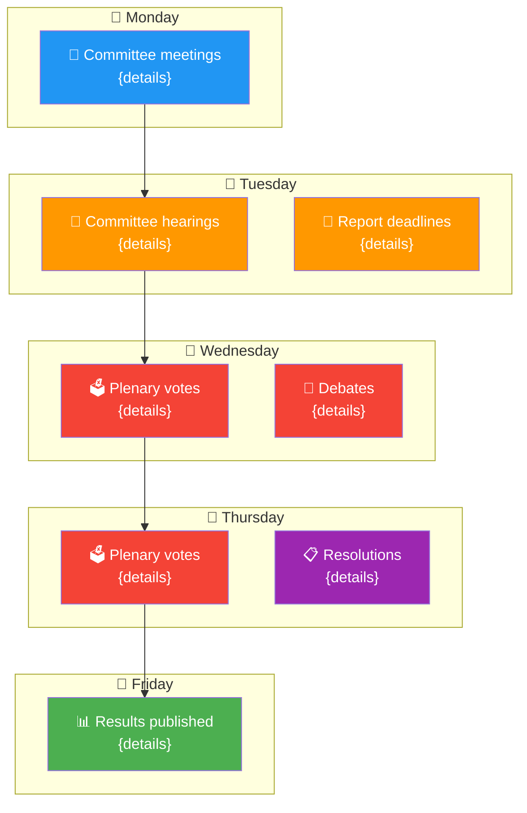

<p align="center">
  
</p>

<h1 align="center">📰 Weekly Intelligence Brief — Methodology Template</h1>

<p align="center">
  <strong>📊 Situational Awareness, Early Warnings & Strategic Outlook</strong><br>
  <em>🎯 Key Developments • Trend Detection • Risk Signals • Forward-Looking Scenarios</em>
</p>

<p align="center">
  <a href="#"></a>
  <a href="#"></a>
  <a href="#"></a>
</p>

---

## 🎯 Purpose

This template guides the AI agent in producing a comprehensive **Weekly Intelligence Brief** that provides situational awareness of European Parliament activities. The output combines event reporting with structured analytical intelligence, early warning indicators, and forward-looking assessments.

**When to use:** Week-ahead articles, week-in-review articles, breaking news context, and any weekly situational awareness product.

**Analytical Approach:**
- **Event Layer:** What happened / what's scheduled (factual)
- **Analysis Layer:** What it means (interpreted, with confidence levels)
- **Warning Layer:** What signals to watch (predictive, with indicators)
- **Context Layer:** How it fits the broader picture (strategic)

---

## 📥 Required MCP Data Sources

| MCP Tool | Purpose | Priority |
|----------|---------|----------|
| `get_events_feed` | Recent/upcoming events | 🔴 Critical |
| `get_procedures_feed` | Legislative procedure updates | 🔴 Critical |
| `get_adopted_texts_feed` | Recently adopted legislation | 🔴 Critical |
| `get_plenary_documents_feed` | Plenary session documents | 🟡 Important |
| `get_plenary_session_documents_feed` | Session agendas and minutes | 🟡 Important |
| `get_parliamentary_questions_feed` | Parliamentary questions filed | 🟡 Important |
| `get_meps_feed` | MEP roster changes | 🟢 Background |
| `early_warning_system` | Political shift detection | 🔴 Critical |
| `get_plenary_sessions` | Upcoming plenary dates | 🟡 Important |
| `get_all_generated_stats` | Historical context | 🟢 Background |

---

## 📝 Expected Output Structure

### 1. Document Header

```markdown
# 📰 Weekly Intelligence Brief — European Parliament

**📅 Week of:** {YYYY-MM-DD} to {YYYY-MM-DD}
**📊 Overall Assessment:** 
**🔍 Items Tracked:** {N} events | {N} procedures | {N} adopted texts

---
```

### 2. Situation Overview Dashboard (Required)

```markdown
## 🎯 Situation Overview

| Domain | Activity Level | Key Signal | Alert Status |
|--------|---------------|------------|-------------|
| **Plenary Activity** | {High/Medium/Low} | {Key item} |  |
| **Legislative Pipeline** | {High/Medium/Low} | {Key item} |  |
| **Committee Work** | {High/Medium/Low} | {Key item} |  |
| **Political Dynamics** | {High/Medium/Low} | {Key item} |  |
| **External Context** | {High/Medium/Low} | {Key item} |  |
```

### 3. Weekly Activity Flow (Required)



> **AI Agent Note:** Replace with actual weekly schedule from EP events data. Remove days without significant activity.

### 4. Top Developments (Required — minimum 3, target 5-7)

For each major development:

```markdown
### 📌 Development #{N}: {Title}

**Category:** {Legislative/Political/Institutional} | **Significance:** 
**Date:** {YYYY-MM-DD} | **Source:** {MCP tool and reference}

**What happened:** {Factual description with specific dates, document references, and actors}

**Why it matters:** {Analytical interpretation — what this means for EU politics/policy}

**Stakeholder impact:**
- **Political groups:** {Which groups benefit/lose and why}
- **Citizens:** {Direct or indirect impact on EU citizens}
- **Industry/Civil society:** {Regulatory or social implications}

**Confidence:** 🟢 High / 🟡 Medium / 🔴 Low — {justification}
```

### 5. Legislative Pipeline Snapshot (Required)

| Status | Count | Key Dossier | Next Action |
|--------|-------|-------------|-------------|
| **New proposals** | {N} | {Title} | {Next step} |
| **Committee stage** | {N} | {Title} | {Next step} |
| **Plenary vote scheduled** | {N} | {Title} | {Date} |
| **Trilogue ongoing** | {N} | {Title} | {Status} |
| **Recently adopted** | {N} | {Title} | {Entry into force} |

### 6. Early Warning Indicators (Required)

```mermaid
mindmap
  root)⚠️ Early Warning<br/>Indicators(
    (🔴 Elevated Alerts)
      [{alert description}]
      [{alert description}]
    (🟡 Monitoring)
      [{indicator being watched}]
      [{indicator being watched}]
    (🟢 Stable Signals)
      [{what confirms stability}]
      [{what confirms stability}]
```

| Indicator | Status | Trigger Level | Current Reading | Trend |
|-----------|--------|--------------|----------------|-------|
| Coalition stability |  | {threshold} | {current} | {↑↗→↘↓} |
| Legislative throughput |  | {threshold} | {current} | {↑↗→↘↓} |
| Attendance patterns |  | {threshold} | {current} | {↑↗→↘↓} |
| Cross-party defections |  | {threshold} | {current} | {↑↗→↘↓} |
| External pressure events |  | {threshold} | {current} | {↑↗→↘↓} |

### 7. Trend Analysis (Required)


> **⚠️ AI Agent**: Replace all `{N}` placeholders above with actual computed values from this week's MCP data. Do NOT use the template defaults.

**Trend Assessment:**
- {Trend 1: description with comparison to recent weeks}
- {Trend 2: emerging pattern identification}
- {Trend 3: deviation from normal pattern, if any}

### 8. Strategic Outlook — Next Week (Required)

| Priority | Item | Expected Impact | What to Watch |
|----------|------|----------------|--------------|
|  | {Item} | {Expected impact} | {Key indicator} |
|  | {Item} | {Expected impact} | {Key indicator} |
|  | {Item} | {Expected impact} | {Key indicator} |

### 9. Scenarios for the Coming Period (Required)

| Scenario | Probability | Description | Key Trigger |
|----------|-------------|-------------|------------|
| **Baseline** |  | {Most probable outcome for the week} | {Default trajectory} |
| **Upside** |  | {Positive surprise scenario} | {What would trigger this} |
| **Risk** |  | {Negative scenario to prepare for} | {Warning signs} |

### 10. Data Quality & Methodology

```markdown
## 🔒 Methodology & Source Quality

**MCP Queries Executed:** {N} | **Data Freshness:** {timestamp of latest data}

| Data Source | Records Retrieved | Quality Assessment |
|-------------|------------------|-------------------|
| Events feed | {N} | 🟢/🟡/🔴 |
| Procedures feed | {N} | 🟢/🟡/🔴 |
| Adopted texts feed | {N} | 🟢/🟡/🔴 |
| Plenary documents | {N} | 🟢/🟡/🔴 |
| Early warning system | {status} | 🟢/🟡/🔴 |

**Analytical Caveats:**
- {Any data gaps or quality issues}
- {Limitations on forward-looking assessments}
```

---

## ⚡ Quick Reference: Significance Scoring

| Level | Criteria | Badge |
|-------|---------|-------|
| **Critical** | Institutional crisis, treaty implications, unprecedented action |  |
| **Significant** | Major legislation adopted, coalition shift, key appointment |  |
| **Notable** | Important committee report, significant debate, policy signal |  |
| **Routine** | Standard legislative process, scheduled activities |  |

---

**Last Updated:** 2026-03-28 | **Template Version:** 1.0
