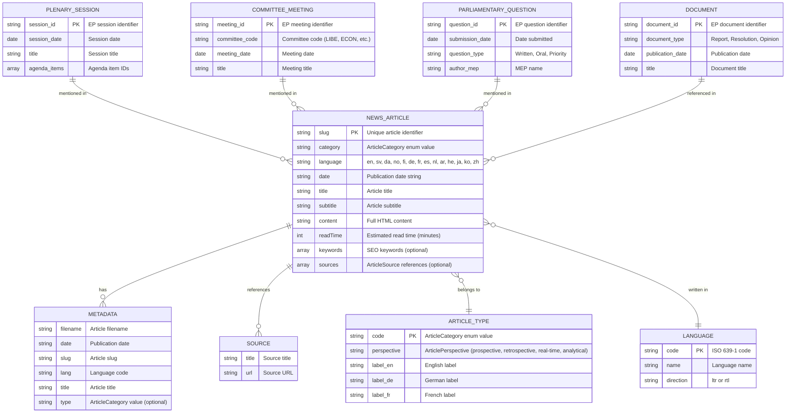

<p align="center">
  
</p>

<h1 align="center">📊 EU Parliament Monitor — Data Model</h1>

<p align="center">
  <strong>Data Structures & Relationships for European Parliament Intelligence</strong><br>
  <em>📊 Entity Models • 🔗 Data Relationships • 📋 Schema Documentation</em>
</p>

<p align="center">
  <a href="#"></a>
  <a href="#"></a>
  <a href="#"></a>
  <a href="#"></a>
</p>

**📋 Document Owner:** CEO | **📄 Version:** 1.0 | **📅 Last Updated:**
2026-02-20 (UTC)  
**🔄 Review Cycle:** Quarterly | **⏰ Next Review:** 2026-05-24

---

## 📋 Overview

This document defines the data structures and relationships used in the EU
Parliament Monitor platform for news generation, storage, and delivery.

## 🎯 Data Model Principles

1. **Simplicity**: Flat file structure, no databases
2. **Immutability**: Generated articles never modified after creation
3. **Traceability**: Generation metadata tracks provenance
4. **Multi-language**: Language-specific content with shared structure
5. **Public Data**: All data from European Parliament open sources

---

## 📚 Architecture Documentation Map

<div class="documentation-map">

| Document                                                            | Focus           | Description                                    | Documentation Link                                                                                     |
| ------------------------------------------------------------------- | --------------- | ---------------------------------------------- | ------------------------------------------------------------------------------------------------------ |
| **[Architecture](ARCHITECTURE.md)**                                 | 🏛️ Architecture | C4 model showing current system structure      | [View Source](https://github.com/Hack23/euparliamentmonitor/blob/main/ARCHITECTURE.md)                 |
| **[Future Architecture](FUTURE_ARCHITECTURE.md)**                   | 🏛️ Architecture | C4 model showing future system structure       | [View Source](https://github.com/Hack23/euparliamentmonitor/blob/main/FUTURE_ARCHITECTURE.md)          |
| **[Mindmaps](MINDMAP.md)**                                          | 🧠 Concept      | Current system component relationships         | [View Source](https://github.com/Hack23/euparliamentmonitor/blob/main/MINDMAP.md)                      |
| **[Future Mindmaps](FUTURE_MINDMAP.md)**                            | 🧠 Concept      | Future capability evolution                    | [View Source](https://github.com/Hack23/euparliamentmonitor/blob/main/FUTURE_MINDMAP.md)               |
| **[SWOT Analysis](SWOT.md)**                                        | 💼 Business     | Current strategic assessment                   | [View Source](https://github.com/Hack23/euparliamentmonitor/blob/main/SWOT.md)                         |
| **[Future SWOT Analysis](FUTURE_SWOT.md)**                          | 💼 Business     | Future strategic opportunities                 | [View Source](https://github.com/Hack23/euparliamentmonitor/blob/main/FUTURE_SWOT.md)                  |
| **[Data Model](DATA_MODEL.md)**                                     | 📊 Data         | Current data structures and relationships      | [View Source](https://github.com/Hack23/euparliamentmonitor/blob/main/DATA_MODEL.md)                   |
| **[Future Data Model](FUTURE_DATA_MODEL.md)**                       | 📊 Data         | Enhanced European Parliament data architecture | [View Source](https://github.com/Hack23/euparliamentmonitor/blob/main/FUTURE_DATA_MODEL.md)            |
| **[Flowcharts](FLOWCHART.md)**                                      | 🔄 Process      | Current data processing workflows              | [View Source](https://github.com/Hack23/euparliamentmonitor/blob/main/FLOWCHART.md)                    |
| **[Future Flowcharts](FUTURE_FLOWCHART.md)**                        | 🔄 Process      | Enhanced AI-driven workflows                   | [View Source](https://github.com/Hack23/euparliamentmonitor/blob/main/FUTURE_FLOWCHART.md)             |
| **[State Diagrams](STATEDIAGRAM.md)**                               | 🔄 Behavior     | Current system state transitions               | [View Source](https://github.com/Hack23/euparliamentmonitor/blob/main/STATEDIAGRAM.md)                 |
| **[Future State Diagrams](FUTURE_STATEDIAGRAM.md)**                 | 🔄 Behavior     | Enhanced adaptive state transitions            | [View Source](https://github.com/Hack23/euparliamentmonitor/blob/main/FUTURE_STATEDIAGRAM.md)          |
| **[Security Architecture](SECURITY_ARCHITECTURE.md)**               | 🛡️ Security     | Current security implementation                | [View Source](https://github.com/Hack23/euparliamentmonitor/blob/main/SECURITY_ARCHITECTURE.md)        |
| **[Future Security Architecture](FUTURE_SECURITY_ARCHITECTURE.md)** | 🛡️ Security     | Security enhancement roadmap                   | [View Source](https://github.com/Hack23/euparliamentmonitor/blob/main/FUTURE_SECURITY_ARCHITECTURE.md) |
| **[Threat Model](THREAT_MODEL.md)**                                 | 🎯 Security     | STRIDE threat analysis                         | [View Source](https://github.com/Hack23/euparliamentmonitor/blob/main/THREAT_MODEL.md)                 |
| **[Classification](CLASSIFICATION.md)**                             | 🏷️ Governance   | CIA classification & BCP                       | [View Source](https://github.com/Hack23/euparliamentmonitor/blob/main/CLASSIFICATION.md)               |
| **[CRA Assessment](CRA-ASSESSMENT.md)**                             | 🛡️ Compliance   | Cyber Resilience Act                           | [View Source](https://github.com/Hack23/euparliamentmonitor/blob/main/CRA-ASSESSMENT.md)               |
| **[Workflows](WORKFLOWS.md)**                                       | ⚙️ DevOps       | CI/CD documentation                            | [View Source](https://github.com/Hack23/euparliamentmonitor/blob/main/WORKFLOWS.md)                    |
| **[Future Workflows](FUTURE_WORKFLOWS.md)**                         | 🚀 DevOps       | Planned CI/CD enhancements                     | [View Source](https://github.com/Hack23/euparliamentmonitor/blob/main/FUTURE_WORKFLOWS.md)             |
| **[Business Continuity Plan](BCPPlan.md)**                          | 🔄 Resilience   | Recovery planning                              | [View Source](https://github.com/Hack23/euparliamentmonitor/blob/main/BCPPlan.md)                      |
| **[Financial Security Plan](FinancialSecurityPlan.md)**             | 💰 Financial    | Cost & security analysis                       | [View Source](https://github.com/Hack23/euparliamentmonitor/blob/main/FinancialSecurityPlan.md)        |
| **[End-of-Life Strategy](End-of-Life-Strategy.md)**                 | 📦 Lifecycle    | Technology EOL planning                        | [View Source](https://github.com/Hack23/euparliamentmonitor/blob/main/End-of-Life-Strategy.md)         |
| **[Unit Test Plan](UnitTestPlan.md)**                               | 🧪 Testing      | Unit testing strategy                          | [View Source](https://github.com/Hack23/euparliamentmonitor/blob/main/UnitTestPlan.md)                 |
| **[E2E Test Plan](E2ETestPlan.md)**                                 | 🔍 Testing      | End-to-end testing                             | [View Source](https://github.com/Hack23/euparliamentmonitor/blob/main/E2ETestPlan.md)                  |
| **[Performance Testing](performance-testing.md)**                   | ⚡ Performance  | Performance benchmarks                         | [View Source](https://github.com/Hack23/euparliamentmonitor/blob/main/performance-testing.md)          |
| **[Security Policy](SECURITY.md)**                                  | 🔒 Security     | Vulnerability reporting & security policy      | [View Source](https://github.com/Hack23/euparliamentmonitor/blob/main/SECURITY.md)                     |

</div>

---

## 🛡️ ISMS Policy Alignment

This data model aligns with Hack23 ISMS policies to ensure secure data handling, classification, and development practices:

### 📋 Relevant ISMS Policies

| Policy | Relevance | Implementation in Data Model |
|--------|-----------|------------------------------|
| **[Data Classification Policy](https://github.com/Hack23/ISMS-PUBLIC/blob/main/Classification_Policy.md)** | High | All data classified as **Public (Level 1)** per [CLASSIFICATION.md](CLASSIFICATION.md). European Parliament data is publicly available open data. No PII or sensitive information processed. |
| **[Cryptography Policy](https://github.com/Hack23/ISMS-PUBLIC/blob/main/Cryptography_Policy.md)** | Medium | TLS 1.3 for data in transit from European Parliament API. At-rest encryption via GitHub repository storage. Planned SHA-256 hashes for data integrity verification in future generator updates. |
| **[Secure Development Policy](https://github.com/Hack23/ISMS-PUBLIC/blob/main/Secure_Development_Policy.md)** | High | Planned schema validation for EP API responses and planned HTML sanitization (e.g., DOMPurify) in future generator/client updates. Input validation for external data where implemented. Git-based audit trail for all changes. |

### 🎯 Compliance Framework Mapping

**ISO 27001:2022 Controls:**
- **A.5.12**: Classification of information — Public data classification documented
- **A.8.3**: Management of technical vulnerabilities — Planned schema validation to prevent malformed data in future iterations
- **A.8.24**: Use of cryptography — TLS 1.3 for API communication
- **A.8.28**: Secure coding — Planned enhancements for input validation and HTML sanitization in the generator/client code

**GDPR Compliance:**
- **Article 5(1)(c)**: Data minimization — No personal data collected beyond publicly available MEP information
- **Article 5(1)(e)**: Storage limitation — Articles immutable, no unnecessary data retention
- **Article 5(1)(f)**: Integrity and confidentiality — SHA-256 checksums, TLS 1.3 encryption

**NIST CSF 2.0:**
- **ID.AM-5**: Resources are prioritized based on classification — Public data classification
- **PR.DS-2**: Data-in-transit is protected — TLS 1.3 encryption
- **PR.DS-5**: Protections against data leaks — No sensitive data to leak (public data only)

---

## 📐 Entity Relationship Diagram



---

## 📄 Data Structures

### 1. News Article

**File Location**: `news/YYYY-MM-DD-{slug}-{lang}.html`

**HTML Structure**:

```html
<!DOCTYPE html>
<html lang="en" dir="ltr">
  <head>
    <meta charset="UTF-8" />
    <meta name="viewport" content="width=device-width, initial-scale=1.0" />
    <title>Article Title - EU Parliament Monitor</title>

    <!-- SEO Meta Tags -->
    <meta name="description" content="Article subtitle" />
    <meta name="keywords" content="european parliament, keyword1, keyword2" />
    <meta name="author" content="EU Parliament Monitor" />
    <meta name="publication-date" content="2026-03-01" />
    <meta name="article-type" content="prospective" />
    <meta name="language" content="en" />

    <!-- Open Graph -->
    <meta property="og:title" content="Article Title" />
    <meta property="og:description" content="Article subtitle" />
    <meta property="og:type" content="article" />
    <meta
      property="og:url"
      content="https://euparliamentmonitor.com/news/2026-week-ahead-en.html"
    />

    <!-- Schema.org structured data -->
    <script type="application/ld+json">
      {
        "@context": "https://schema.org",
        "@type": "NewsArticle",
        "headline": "Article Title",
        "description": "Article subtitle",
        "datePublished": "2026-03-01T06:15:32Z",
        "author": {
          "@type": "Organization",
          "name": "EU Parliament Monitor"
        },
        "publisher": {
          "@type": "Organization",
          "name": "EU Parliament Monitor",
          "logo": {
            "@type": "ImageObject",
            "url": "https://euparliamentmonitor.com/logo.png"
          }
        }
      }
    </script>

    <link rel="stylesheet" href="../styles.css" />
  </head>
  <body>
    <article class="news-article">
      <header>
        <span class="article-type">Week Ahead</span>
        <h1>Article Title</h1>
        <p class="subtitle">Article subtitle</p>
        <div class="meta">
          <time datetime="2026-03-01">March 1, 2026</time>
          <span class="read-time">5 min read</span>
        </div>
      </header>

      <main class="content">
        <!-- Generated HTML content -->
      </main>

      <footer>
        <section class="sources">
          <h3>Sources</h3>
          <ul>
            <li>
              <a href="https://data.europarl.europa.eu/...">EP Source 1</a>
            </li>
            <li>
              <a href="https://data.europarl.europa.eu/...">EP Source 2</a>
            </li>
          </ul>
        </section>

        <section class="languages">
          <h3>Available Languages</h3>
          <ul>
            <li><a href="2026-week-ahead-de.html">Deutsch</a></li>
            <li><a href="2026-week-ahead-fr.html">Français</a></li>
          </ul>
        </section>
      </footer>
    </article>
  </body>
</html>
```

### 2. News Metadata Database

**File Location**: `articles-metadata.json`

**TypeScript Interface** (`NewsMetadataDatabase`):

```json
{
  "lastUpdated": "2026-03-01T06:15:32Z",
  "articles": [
    {
      "filename": "2026-03-01-week-ahead-en.html",
      "date": "2026-03-01",
      "slug": "week-ahead",
      "lang": "en",
      "title": "Week Ahead: European Parliament March Session",
      "type": "week-ahead"
    },
    {
      "filename": "2026-03-01-week-ahead-de.html",
      "date": "2026-03-01",
      "slug": "week-ahead",
      "lang": "de",
      "title": "Woche Voraus: Europäisches Parlament Märzsitzung",
      "type": "week-ahead"
    }
  ]
}
```

### 3. Article Type Definitions

**File Location**: `src/types/index.ts` (ArticleCategory enum)

```json
{
  "article_types": [
    {
      "code": "week-ahead",
      "perspective": "prospective",
      "labels": {
        "en": "Week Ahead",
        "sv": "Vecka Framåt",
        "da": "Ugen Fremover",
        "no": "Uken Fremover",
        "fi": "Viikko Eteenpäin",
        "de": "Woche Voraus",
        "fr": "Semaine à Venir",
        "es": "Semana Próxima",
        "nl": "Week Vooruit",
        "ar": "الأسبوع القادم",
        "he": "השבוע הקרוב",
        "ja": "今週の展望",
        "ko": "주간 전망",
        "zh": "一周展望"
      },
      "description": "Preview of upcoming parliamentary events and committee meetings"
    },
    {
      "code": "committee-reports",
      "perspective": "retrospective",
      "labels": {
        "en": "Committee Reports",
        "de": "Ausschussberichte",
        "fr": "Rapports de Commission"
      },
      "description": "Analysis of committee activities and decisions"
    },
    {
      "code": "breaking",
      "perspective": "real-time",
      "labels": {
        "en": "Breaking News",
        "de": "Eilmeldung",
        "fr": "Dernières Nouvelles"
      },
      "description": "Rapid-response coverage of significant developments"
    },
    {
      "code": "deep-analysis",
      "perspective": "analytical",
      "labels": {
        "en": "Deep Analysis",
        "de": "Tiefenanalyse",
        "fr": "Analyse Approfondie"
      },
      "description": "Multi-perspective deep dive analysis"
    }
  ]
}
```

### 4. Language Configuration

**File Location**: `src/constants/languages.ts`

```json
{
  "languages": [
    {
      "code": "en",
      "name": "English",
      "native_name": "English",
      "direction": "ltr",
      "flag": "🇬🇧"
    },
    {
      "code": "sv",
      "name": "Swedish",
      "native_name": "Svenska",
      "direction": "ltr",
      "flag": "🇸🇪"
    },
    {
      "code": "de",
      "name": "German",
      "native_name": "Deutsch",
      "direction": "ltr",
      "flag": "🇩🇪"
    },
    {
      "code": "fr",
      "name": "French",
      "native_name": "Français",
      "direction": "ltr",
      "flag": "🇫🇷"
    },
    {
      "code": "ar",
      "name": "Arabic",
      "native_name": "العربية",
      "direction": "rtl",
      "flag": "🇸🇦"
    },
    {
      "code": "he",
      "name": "Hebrew",
      "native_name": "עברית",
      "direction": "rtl",
      "flag": "🇮🇱"
    }
  ],
  "language_groups": {
    "eu-core": ["en", "de", "fr", "es", "nl"],
    "nordic": ["en", "sv", "da", "no", "fi"],
    "all": [
      "en", "sv", "da", "no", "fi",
      "de", "fr", "es", "nl",
      "ar", "he", "ja", "ko", "zh"
    ]
  }
}
```

---

## 🔗 European Parliament Data Structures

### Plenary Session

**EP API Endpoint**:
`https://data.europarl.europa.eu/api/v2/sessions/{session_id}`

```json
{
  "session_id": "PS-2026-03-01",
  "session_date": "2026-03-01",
  "session_type": "Plenary",
  "title": "March 2026 Plenary Session I",
  "location": "Strasbourg",
  "agenda": [
    {
      "item_id": "AGI-2026-03-001",
      "order": 1,
      "title": "Commission statement: European Green Deal progress",
      "speaker": "European Commission",
      "duration_minutes": 60,
      "voting_required": false
    },
    {
      "item_id": "AGI-2026-03-002",
      "order": 2,
      "title": "Vote: Digital Services Act amendments",
      "rapporteur": "MEP Name",
      "duration_minutes": 30,
      "voting_required": true
    }
  ],
  "attendees": 705,
  "status": "scheduled"
}
```

### Committee Meeting

**EP API Endpoint**:
`https://data.europarl.europa.eu/api/v2/committees/{committee_code}/meetings/{meeting_id}`

```json
{
  "meeting_id": "LIBE-2026-02-25",
  "committee_code": "LIBE",
  "committee_name": "Committee on Civil Liberties, Justice and Home Affairs",
  "meeting_date": "2026-02-25",
  "meeting_time": "14:00:00",
  "location": "Brussels",
  "agenda": [
    {
      "item_id": "LIBE-AGI-001",
      "title": "Artificial Intelligence Act implementation review",
      "type": "Discussion",
      "documents": ["DOC-2026-001", "DOC-2026-002"]
    }
  ],
  "chair": "MEP Name",
  "status": "completed"
}
```

### Parliamentary Question

**EP API Endpoint**:
`https://data.europarl.europa.eu/api/v2/questions/{question_id}`

```json
{
  "question_id": "PQ-2026-000123",
  "question_type": "Written",
  "priority": false,
  "submission_date": "2026-02-20",
  "author": {
    "mep_id": "MEP-12345",
    "name": "MEP Name",
    "political_group": "EPP",
    "country": "Germany"
  },
  "addressee": "European Commission",
  "subject": "Implementation of GDPR enforcement",
  "question_text": "What measures is the Commission taking to...",
  "answer": {
    "answer_date": "2026-03-05",
    "answer_text": "The Commission has undertaken the following actions...",
    "answered_by": "Commissioner Name"
  },
  "languages": ["en", "de"]
}
```

### Document

**EP API Endpoint**:
`https://data.europarl.europa.eu/api/v2/documents/{document_id}`

```json
{
  "document_id": "DOC-2026-001",
  "document_type": "Report",
  "title": "Report on the implementation of the Digital Services Act",
  "publication_date": "2026-02-15",
  "rapporteur": {
    "mep_id": "MEP-67890",
    "name": "MEP Name",
    "political_group": "S&D"
  },
  "committee": "LIBE",
  "procedure": "INI",
  "languages": ["en", "de", "fr", "es", "it"],
  "documents": [
    {
      "language": "en",
      "format": "PDF",
      "url": "https://data.europarl.europa.eu/documents/DOC-2026-001-EN.pdf"
    }
  ],
  "status": "published"
}
```

---

## 📊 Additional Entity Relationship Diagrams

### MEP Entity Model


### MCP Data Integration Model


### Multi-Language Content Model


### Sitemap & SEO Metadata Model


---

## 🔄 European Parliament Data Flow


---

## 📁 File System Structure

```
euparliamentmonitor/
├── news/                           # Generated articles
│   ├── 2026-01-01-week-ahead-en.html
│   ├── 2026-01-01-week-ahead-de.html
│   ├── 2026-01-01-week-ahead-fr.html
│   └── ...
│
├── articles-metadata.json          # News metadata database
│
├── index-{lang}.html               # Language-specific indexes
│   ├── index.html
│   ├── index-de.html
│   └── index-fr.html
│
├── sitemap.xml                     # SEO sitemap
├── robots.txt                      # Crawler rules
├── styles.css                      # Global styles
└── favicon.ico                     # Site icon
```

---

## 🔄 Data Flow

### Article Generation Data Flow


### Index Generation Data Flow

```mermaid
flowchart LR
    subgraph "Input"
        ARTICLES[Generated Articles<br/>news/*.html]
    end

    subgraph "Scanner"
        SCAN[File Scanner]
        PARSE[Metadata Parser]
    end

    subgraph "Processor"
        GROUP[Group by Language]
        SORT[Sort by Date]
        FILTER[Filter by Type]
    end

    subgraph "Generator"
        TEMPLATE[Index Template]
        HTML[HTML Builder]
    end

    subgraph "Output"
        INDEX[index-{lang}.html]
    end

    ARTICLES --> SCAN
    SCAN --> PARSE
    PARSE --> GROUP
    GROUP --> SORT
    SORT --> FILTER
    FILTER --> TEMPLATE
    TEMPLATE --> HTML
    HTML --> INDEX

    style ARTICLES fill:#f0f0f0
    style SCAN fill:#e8f5e9
    style PARSE fill:#e8f5e9
    style GROUP fill:#e1f5ff
    style SORT fill:#e1f5ff
    style FILTER fill:#e1f5ff
    style TEMPLATE fill:#e8f5e9
    style INDEX fill:#f0f0f0
```

---

## 📊 Data Relationships

### Article → Metadata Relationship

- **Cardinality**: One-to-One
- **Foreign Key**: Article slug
- **Purpose**: Track generation provenance and source data

### Article → Sources Relationship

- **Cardinality**: One-to-Many
- **Foreign Key**: Article slug
- **Purpose**: Link articles to European Parliament data sources

### Article → Language Relationship

- **Cardinality**: Many-to-One
- **Foreign Key**: Language code
- **Purpose**: Multi-language support with shared metadata

---

## 🔐 Data Security

### Data Classification

| Data Type        | Classification | Storage             | Encryption           |
| ---------------- | -------------- | ------------------- | -------------------- |
| News Articles    | Public         | Git repository      | At-rest (GitHub)     |
| Metadata         | Public         | Git repository      | At-rest (GitHub)     |
| EP API Responses | Public         | Ephemeral (runtime) | In-transit (TLS 1.3) |
| Generation Logs  | Internal       | GitHub Actions      | At-rest (GitHub)     |

### Data Integrity

- **Immutability**: Articles never modified after generation
- **Checksums**: SHA-256 hashes for verification (future)
- **Audit Trail**: Git commit history provides complete provenance
- **Validation**: Schema validation on all EP API responses

---

## 🔒 Data Security Considerations

### Data Classification Framework

All data in EU Parliament Monitor is classified according to [CLASSIFICATION.md](CLASSIFICATION.md) and the [Hack23 ISMS Classification Policy](https://github.com/Hack23/ISMS-PUBLIC/blob/main/Classification_Policy.md):

| Data Type | Classification | Confidentiality | Integrity | Availability | Rationale |
|-----------|----------------|-----------------|-----------|--------------|------------|
| **News Articles** | Public (Level 1) | Public | Medium | Medium | Derived from public EP data, accuracy critical for democratic transparency |
| **Generation Metadata** | Public (Level 1) | Public | Medium | Low | Technical provenance data, publicly accessible |
| **EP API Responses** | Public (Level 1) | Public | Medium | Medium | Public European Parliament data, temporary runtime storage |
| **MCP Tool Responses** | Public (Level 1) | Public | Medium | Medium | Cached EP data, integrity critical |
| **GitHub Actions Logs** | Public (Level 1) | Public | Low | Low | Actions logs are visible to anyone with read access to this public repo and contain technical build details but no secrets |

### Personal Identifiable Information (PII) Handling

**PII Status**: **No User/Customer PII Collected**

EU Parliament Monitor processes **publicly available European Parliament data** only. MEP names, affiliations, and official contact details are publicly available personal data about public officials in their official capacity:

- **MEP Information**: Names, political affiliations, committee memberships (publicly available official data)
- **Contact Information**: Official MEP email addresses (publicly available official contact data)
- **No User Data**: No user accounts, no tracking, no analytics
- **No Cookies**: Static HTML site, no client-side tracking
- **No Private Communications**: No private messages, no personal correspondence

> **Note**: Publicly available personal data about public officials (MEP names, affiliations, official emails) processed in their official capacity is handled under GDPR Article 6 lawful basis (e.g., Art. 6(1)(e) public task and/or Art. 6(1)(f) legitimate interests). No special category data under Article 9 is processed. No user or private personal data is collected.

**GDPR Article 5 Alignment:**

| GDPR Principle | Implementation | Status |
|----------------|----------------|--------|
| **Art. 5(1)(a) - Lawfulness** | Processing of publicly available personal data of MEPs from official EP sources under GDPR Art. 6 lawful basis (public task/legitimate interests); no user/customer personal data processed | ✅ Compliant |
| **Art. 5(1)(b) - Purpose Limitation** | Data used only for news generation about parliamentary activities | ✅ Compliant |
| **Art. 5(1)(c) - Data Minimization** | Only necessary public EP data collected, no excessive data | ✅ Compliant |
| **Art. 5(1)(d) - Accuracy** | EP data used as-is from official sources; planned schema validation and HTML sanitization to ensure accurate representation | ✅ Compliant |
| **Art. 5(1)(e) - Storage Limitation** | Articles immutable, no unnecessary retention, git history for audit | ✅ Compliant |
| **Art. 5(1)(f) - Integrity & Confidentiality** | TLS 1.3 encryption, SHA-256 hashes, GitHub encryption at rest | ✅ Compliant |

### ISO 27001:2022 A.5.12 - Classification of Information

**Control Statement**: Information shall be classified in terms of legal requirements, value, criticality, and sensitivity to unauthorized disclosure or modification.

**Implementation**:

1. **Classification Labels**:
   - All data marked as **Public (Level 1)** in metadata
   - No confidential, restricted, or secret information processed
   - Classification documented in [CLASSIFICATION.md](CLASSIFICATION.md)

2. **Handling Requirements**:
   - Public data: No access controls required
   - Repository logs: GitHub Actions and repository logs accessible to all users with repository read access (public repository, logs contain only data classified as Public)
   - No encryption requirements beyond standard TLS 1.3

3. **Review Process**:
   - Quarterly classification review (per document control)
   - Annual ISMS audit includes data classification verification
   - Classification changes trigger security impact assessment

**Evidence**:
- [CLASSIFICATION.md](CLASSIFICATION.md) - Full classification framework
- [SECURITY_ARCHITECTURE.md](SECURITY_ARCHITECTURE.md) - Security controls
- [GitHub Repository Settings](https://github.com/Hack23/euparliamentmonitor/settings) - Access controls

### Data Protection Controls

| Control | Implementation | Purpose |
|---------|----------------|----------|
| **TLS 1.3 Encryption** | All EP API calls use HTTPS | Protect data in transit |
| **At-Rest Encryption** | GitHub repository encryption | Protect stored data |
| **Schema Validation** | Planned: JSON Schema validation for EP API responses | Prevent malformed data |
| **HTML Sanitization** | Planned: DOMPurify-based sanitization for rendered HTML | Prevent XSS attacks |
| **Input Validation** | Planned: Whitelist-based validation for all configurable inputs | Prevent injection attacks |
| **SHA-256 Hashing** | Planned: SHA-256 checksums for source data integrity | Detect data tampering |
| **Git Audit Trail** | Complete commit history | Track all changes |
| **Immutable Articles** | Articles never modified post-generation | Preserve integrity |

---

## 🗓️ Data Model Evolution

The EU Parliament Monitor data model has evolved through multiple phases to support enhanced functionality and multi-language content:


### Version History

| Version | Release Date | Key Changes | Diagrams Added |
|---------|--------------|-------------|----------------|
| **v1.0** | 2026-02-01 | Initial release, basic article generation | 1 (Main ER diagram) |
| **v1.1** | 2026-02-15 | Multi-language support, MCP integration | 2 (Article & Index generation flows) |
| **v1.2** | 2026-02-20 | Enhanced diagrams, ISMS alignment, data security | 4 (MEP, MCP, Multi-language, Sitemap models) + 1 (EP data flow) |
| **v2.0** | 2026-Q3 (Planned) | Real-time updates, database backend | TBD (Real-time state diagrams, DB schema) |

### Breaking Changes Log

No breaking changes to date. All schema changes backward-compatible.

---

## ✅ Data Validation and Integrity

### Schema Validation Rules

#### European Parliament API Response Validation

Planned enhancement: responses from the European Parliament API will be validated against JSON Schemas before processing:

**MEP Data Schema:**
```json
{
  "$schema": "http://json-schema.org/draft-07/schema#",
  "type": "object",
  "required": ["id", "name", "country", "politicalGroup"],
  "properties": {
    "id": { "type": "string", "pattern": "^MEP-[0-9]+$" },
    "name": { "type": "string", "minLength": 1, "maxLength": 200 },
    "country": { "type": "string", "pattern": "^[A-Z]{2}$" },
    "party": { "type": "string", "maxLength": 200 },
    "politicalGroup": { "type": "string", "enum": ["PPE", "S&D", "Renew", "Greens/EFA", "ID", "ECR", "The Left", "NI"] },
    "committees": { "type": "array", "items": { "type": "string" } },
    "email": { "type": "string", "format": "email" },
    "photoUrl": { "type": "string", "format": "uri", "pattern": "^https://" }
  }
}
```

**Plenary Session Schema:**
```json
{
  "$schema": "http://json-schema.org/draft-07/schema#",
  "type": "object",
  "required": ["session_id", "session_date", "title"],
  "properties": {
    "session_id": { "type": "string", "pattern": "^PS-[0-9]{4}-[0-9]{2}-[0-9]{2}$" },
    "session_date": { "type": "string", "format": "date" },
    "title": { "type": "string", "minLength": 5, "maxLength": 500 },
    "location": { "type": "string", "enum": ["Strasbourg", "Brussels"] },
    "agenda": { "type": "array", "items": { "type": "object" } },
    "status": { "type": "string", "enum": ["scheduled", "ongoing", "completed", "cancelled"] }
  }
}
```

**Validation Process (Planned Enhancements):**

1. **Pre-Processing Validation**: Planned JSON Schema–based validation before any data transformation
2. **Type Checking**: Planned strict type enforcement (no implicit coercion) for EP MCP responses
3. **Range Validation**: Planned validation for string length, number ranges, and array size limits
4. **Format Validation**: Planned checks for email, URL, date, and ISO codes
5. **Enum Validation**: Planned fixed vocabularies (political groups, committee codes)
6. **Error Handling (Current Behavior)**: Invalid or missing EP MCP data causes generation to fail or fall back to minimal/placeholder content; JSON Schema validation and cache/manual fallback for EP API responses are planned enhancements

### Article Data Validation Rules

**Generated Article Validation (Planned Enhancements):**

| Field | Validation Rule | Error Handling |
|-------|-----------------|----------------|
| `slug` | Alphanumeric + hyphens, max 100 chars | Planned: generation fails and alert is sent |
| `title` | Min 10 chars, max 200 chars | Planned: generation retries with adjusted prompt |
| `subtitle` | Min 20 chars, max 500 chars | Planned: optional, can be empty |
| `content_html` | Valid HTML5, no `<script>` tags | Planned: HTML sanitization with DOMPurify |
| `language` | ISO 639-1 code, must be in supported list | Planned: generation fails for that language |
| `keywords` | Array of strings, max 10 keywords | Planned: truncated to 10 if exceeded |
| `read_time` | Integer >= 1, <= 60 minutes | Planned: calculated from word count |

### HTML Sanitization Requirements (Planned)

> **Note**: HTML sanitization via DOMPurify is a planned security enhancement. The current generator (`src/templates/article-template.ts`) produces HTML from EP API data. The configuration below documents the intended future implementation.

**Planned DOMPurify Configuration:**

```typescript
const clean = DOMPurify.sanitize(dirtyHtml, {
  ALLOWED_TAGS: ['p', 'h1', 'h2', 'h3', 'h4', 'h5', 'h6', 'ul', 'ol', 'li', 'a', 'strong', 'em', 'blockquote', 'code', 'pre'],
  ALLOWED_ATTR: ['href', 'title', 'class', 'id'],
  ALLOWED_URI_REGEXP: /^https?:\/\/(data\.europarl\.europa\.eu|europarl\.europa\.eu|www\.europarl\.europa\.eu)\/.*/,
  ALLOW_DATA_ATTR: false,
  KEEP_CONTENT: true,
  RETURN_DOM: false,
  RETURN_DOM_FRAGMENT: false
});
```

**Sanitization Rules:**

- **Allowed Tags**: Only semantic HTML5 tags (no styling, no scripting)
- **Allowed Attributes**: Limited to `href`, `title`, `class`, `id`
- **URL Whitelist**: Only European Parliament domains allowed in links
- **No JavaScript**: All `<script>`, `<style>`, `onclick`, etc. removed
- **No Iframes**: No embedded content
- **No Forms**: No user input elements

### Data Integrity Guarantees

#### Immutability

**Policy**: Once generated, articles are **never modified**.

- **Implementation**: Read-only file permissions (conceptual), no update functionality in generator
- **Exceptions**: Security vulnerabilities, factual errors (manual correction with audit trail)
- **Enforcement**: Git commit history provides complete audit trail

#### SHA-256 Integrity Hashes (Planned)

> **Note**: Source data hashing is a planned integrity enhancement. The metadata structure below shows the intended future implementation; SHA-256 hashing of EP/MCP responses is not yet implemented in the current generator code.

**Planned Source Data Hashing Pattern:**

```typescript
const sourceHash = crypto.createHash('sha256')
  .update(JSON.stringify(epApiResponse))
  .digest('hex');
```

**Metadata Storage:**

```json
{
  "sources": [
    {
      "type": "plenary_session",
      "id": "PS-2026-03-01",
      "data_hash": "a1b2c3d4e5f6...",
      "timestamp": "2026-03-01T06:00:00Z"
    }
  ]
}
```

**Integrity Verification** (future):

- Hash comparison to detect data tampering
- Periodic integrity audits via GitHub Actions
- Alert on hash mismatch

#### Git-Based Audit Trail

**Every change tracked:**

- **Commit SHA**: Unique identifier for every generation
- **Author**: GitHub Actions bot (`github-actions[bot]`)
- **Timestamp**: UTC timestamp of commit
- **Diff**: Exact changes made (new files, modified files)
- **Workflow Run ID**: Link to GitHub Actions run for full logs

**Example Metadata:**

```json
{
  "generator": {
    "version": "1.0.0",
    "commit_sha": "abc123def456...",
    "workflow_run_id": "12345678",
    "workflow_url": "https://github.com/Hack23/euparliamentmonitor/actions/runs/12345678"
  }
}
```

**Audit Capabilities:**

- `git log` shows complete history
- `git blame` identifies when each line was added
- `git diff` shows exact changes between versions
- GitHub UI provides web-based audit interface

---

## 📚 References

- [SECURITY_ARCHITECTURE.md](SECURITY_ARCHITECTURE.md)
- [FLOWCHART.md](FLOWCHART.md)
- [European Parliament Open Data Portal](https://data.europarl.europa.eu)
- [MCP Protocol Specification](https://modelcontextprotocol.io)

---

**Document Status**: Active  
**Next Review**: 2026-05-24  
**Owner**: Development Team, Hack23 AB
