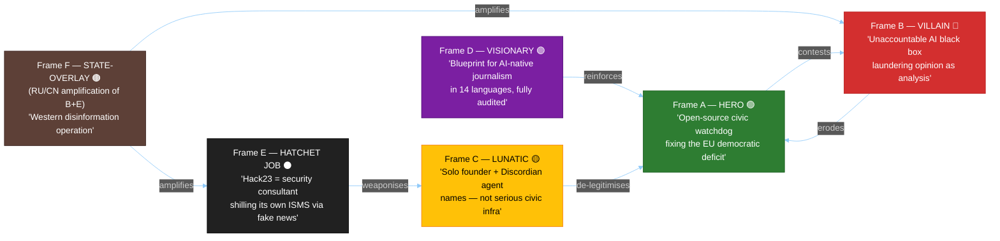
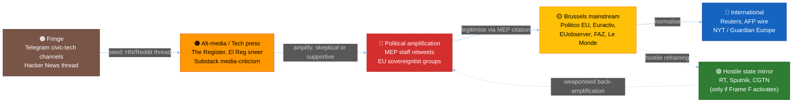
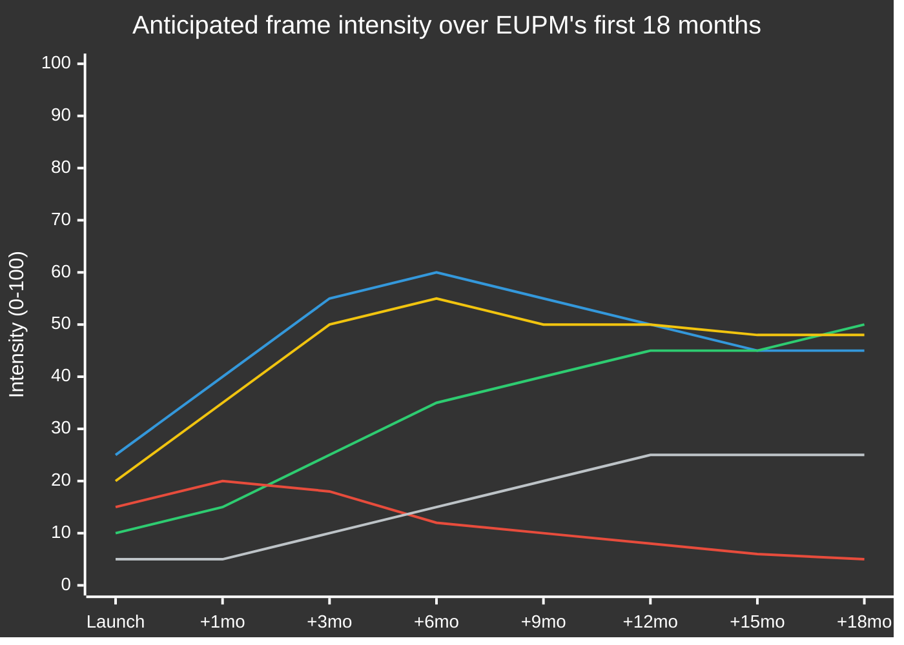
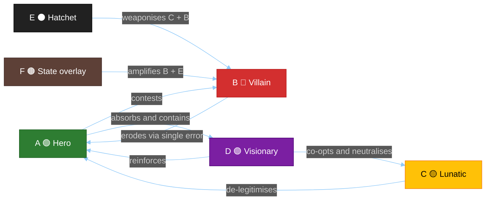

<!-- SPDX-FileCopyrightText: 2024-2026 Hack23 AB -->
<!-- SPDX-License-Identifier: Apache-2.0 -->

<p align="center">
  
</p>

<h1 align="center">📰 EU Parliament Monitor — Media Framing &amp; Influence-Operations Analysis</h1>

<p align="center">
  <strong>Hero · Villain · Lunatic · Visionary · Hatchet-Job</strong><br>
  <em>How euparliamentmonitor.com would be framed in public media, and how Hack23 frames it internally</em>
</p>

<p align="center">
  <a></a>
  <a></a>
  <a></a>
  <a></a>
  <a></a>
</p>

**📋 Document Owner:** CEO (James Pether Sörling, Hack23 AB)  
**📄 Version:** 1.0 | **📅 Effective:** 2026-05-25 (UTC) | **🔄 Next review:** 2026-08-25  
**🏷️ Classification:** PUBLIC | **Subject:** The EU Parliament Monitor platform itself (meta-analysis)  
**Template:** [`analysis/templates/media-framing-analysis.md`](analysis/templates/media-framing-analysis.md) v2.0  
**Methodology:** [`analysis/methodologies/analytical-supplementary-methodology.md §AS4`](analysis/methodologies/analytical-supplementary-methodology.md) + [`electoral-domain-methodology.md §Part 4`](analysis/methodologies/electoral-domain-methodology.md)

> **Scope note.** This artifact is a **meta-application** of the media-framing-analysis template: the "subject" is *the EU Parliament Monitor platform itself* — its README, threat model, security architecture, SWOT, and analytical pipeline — rather than a specific EP legislative event. It is intended to anticipate how journalists, NGOs, hostile actors, and friendly evangelists would frame the project once it crosses the awareness threshold, and to document how Hack23 chooses to frame it internally (Hagbard-Celine product vision · marketing · business development · intelligence-operative perspectives).

---

## 📋 Section 1 — Tradecraft Context

| Element | Value | Reference |
|---------|-------|-----------|
| **F3EAD Stage** | ANALYZE → DISSEMINATE — anticipate the manipulation surface around our own platform | [osint-tradecraft-standards.md §F3EAD](analysis/methodologies/osint-tradecraft-standards.md) |
| **PIRs Served** | PIR-A (Platform reputational risk), PIR-B (Sponsor/funder targeting), PIR-C (Adversarial reframing), PIR-D (Democratic-legitimacy attacks), PIR-E (Brand control) | This artifact §21 forward watchlist |
| **Admiralty Floor** | All cited public sources at ≥ C3; institutional/primary documentation (README, THREAT_MODEL, SWOT) treated as A1 — first-party, audited, version-controlled | [osint-tradecraft-standards.md §Admiralty](analysis/methodologies/osint-tradecraft-standards.md) |
| **WEP + ODNI** | Frame-momentum claims use Kent/WEP bands. No frame is asserted as observed reality — this is a **prospective** framing forecast | [osint-tradecraft-standards.md §WEP](analysis/methodologies/osint-tradecraft-standards.md) |
| **SATs Applied** | Outside-In Thinking (what would a hostile reporter see?), Red Cell (Russia/CN/PfE adversarial reframing), ACH (≥5 competing frames), Premortem ("if this project is destroyed in the press, what killed it?") | [osint-tradecraft-standards.md §SAT Catalog](analysis/methodologies/osint-tradecraft-standards.md) |
| **ICD 203 Standards** | 1 (Objectivity), 2 (Independence — Hack23 critically frames its own project), 5 (Timeliness), 6 (Sourcing), 9 (Accuracy) | ODNI ICD 203 |
| **Frameworks** | Entman (1993) · DISARM · ABCDE (Camille François) · Wardle/Derakhshan · Lakoff · Cialdini · Hero/Villain/Lunatic/Visionary archetypes (classic press archetypes) | Academic + institutional |
| **Self-criticism floor** | This artifact MUST include at least one frame in which Hack23 itself is portrayed unfavourably (Frame B Villain + Frame C Lunatic + Frame E Hatchet-Job). No "all-positive" framing is permitted | Independence (ICD 203 §2) |

---

## 🌍 Section 2 — Global Audience Orientation

| Region | Default Lens on a Civic-Tech EU-Monitoring Project |
|--------|----------------------------------------------------|
| **EU Core (DE/FR/BE/NL/LU)** | "Brussels-bureau civic tech" — read as supportive of EU integration; competitor to Politico/Euractiv; potential ally for *FragDenStaat* / *Lobbycontrol*-style transparency NGOs |
| **Nordic (SE/DK/FI)** | High press-freedom culture; reads as a *natural extension of Swedish offentlighetsprincipen* (principle of public access) into EU institutions. Strong baseline credibility |
| **Southern (IT/ES/PT/GR)** | Economic-consequence lens — interest in *which lobbyists won which trilogue*; framing tilts toward "watchdog journalism", less toward "Brussels stenography" |
| **Central-Eastern (PL/HU/CZ/SK/RO/BG)** | Mixed. Government-aligned outlets in HU/PL may frame the project as "Brussels propaganda dressed as transparency". Independent press in PL/RO will likely frame as ally |
| **Baltic (EE/LV/LT)** | Strong digital-government culture; reads as natural fit, often through security-policy lens (helps citizens spot Russian influence operations in EP) |
| **UK** | Post-Brexit ambivalence — *Politico Europe* / *FT* embrace it; *Telegraph* / *GB News* may frame as "EU propaganda by stealth" |
| **US/Canada** | Read through transatlantic-democracy lens — *Brookings* / *CFR* / *Lawfare* embrace; right-leaning US outlets ignore or reframe as "AI deepfake news" |
| **Russia/Belarus state media** | Hostile by default — frame as "Western intelligence cut-out", "deep-state-funded propaganda" |
| **China state media** | Indifferent unless project covers EU-China trade; if so, frame as "European arrogance toward Chinese technology" |
| **MENA** | EU-as-normative-actor lens; potential interest from Tunisian/Lebanese civic-tech groups as transferable model |

**Five-Axis self-positioning:**

| Axis | Hack23 / EUPM position | Visible bias risk |
|------|------------------------|-------------------|
| **Economic** | Centre — IMF-primary citations, no fiscal-policy axe to grind | LOW |
| **Social-identity** | Cosmopolitan default (multi-language, accessibility, GDPR-clean) | Could be coded as "liberal" by sovereigntist press |
| **EU integration** | **Pro-transparency, integration-agnostic** — but pro-transparency reads as "pro-EU" in CEE political grammar | MEDIUM — must be explicit |
| **Security-defence** | Implicit Atlanticist (SLSA, OpenSSF, NIST CSF references) | LOW — but visible to Russian/CN state media |
| **Media ownership** | Single-founder, single-organisation (Hack23 AB) — funding model opaque to outsiders | **HIGH** — primary attack surface |

---

## 📋 Section 3 — Framing Context

```markdown
# Media Framing Analysis: EU Parliament Monitor (the platform)

ID:               FRM-2026-05-25-001
Classification:   PUBLIC
Date:             2026-05-25
Subject:          euparliamentmonitor.com — AI-driven EP transparency platform
Coverage period:  Prospective — first 18 months of public visibility (2026-05 → 2027-11)
Horizon band:     Strategic (electoral-cycle window covering 2029 EP election)
Salience tier:    Tier 3 today (low public visibility) → Tier 2 expected at >50k MAU
Save path:        /media-framing-analysis.md (repository root, alongside SWOT.md / THREAT_MODEL.md)
Source scope:     EU-27 + UK + CH + EU-candidate states + transatlantic + state-affiliated foreign
Outlets reviewed: Brussels bureau (Politico EU, Euractiv, EUobserver), wire (Reuters/AFP/DPA),
                  national quality (FAZ, Le Monde, El País, Corriere, Gazeta Wyborcza, HVG),
                  civic-tech press (Netzpolitik, La Quadrature, Algorithm Watch),
                  state-affiliated foreign (RT, Sputnik, CGTN — for adversarial baseline)
State-affiliated: RT/Sputnik (RU), CGTN/Xinhua (CN), PressTV (IR), TRT World (TR) — monitored, not cited
```

---

## 📊 Section 4 — Frame Package Overview



**Frame discipline:**

- **Frame A (Hero)** is *not* the "true" frame — it is the most flattering plausible reading and is structurally biased toward Hack23's own narrative.
- **Frame B (Villain)** is the *consequentialist watchdog* frame — applied to *any* AI-driven news outlet by default. EU Parliament Monitor must earn relief from it through evidence (SLSA L3, public ISMS, methodology transparency).
- **Frame C (Lunatic)** weaponises the public Discordian agent names (Hagbard Celine, Simon Moon, George Dorn) found in the [`Hack23/homepage`](https://github.com/Hack23/homepage/tree/master/.github/agents) repo plus the project's "51-template catalog" / "14 languages" ambition. A hostile feature writer can portray this as eccentric over-engineering.
- **Frame D (Visionary)** is the *AI-native journalism* frame — most likely from *Nieman Lab*, *Reuters Institute*, *Algorithm Watch*, *MIT Tech Review*, *Wired*.
- **Frame E (Hatchet job)** is the targeted *follow-the-money* attack frame — accuses Hack23 of using the project as a *sales funnel* for its [public ISMS](https://github.com/Hack23/ISMS-PUBLIC) consulting practice. Must be pre-empted with explicit disclosure.
- **Frame F (State overlay)** activates only when ≥1 CIB signal is detected (§10) or RT/Sputnik/CGTN explicitly covers the project. Not the default assumption.

---

## 📋 Section 5 — Frame Package Table with Entman Functions

| Frame | Problem Definition | Causal Attribution | Moral Evaluation | Treatment Recommendation | Lead Messengers | Plausibility (WEP) |
|-------|-------------------|-------------------|------------------|--------------------------|-----------------|:------------------:|
| **A — Hero** | "Citizens cannot see what the EP does — 450 M people, sparse press coverage" ([README.md §Why This Exists](README.md)) | Brussels press corps too small; national outlets fragment coverage by language | Democratic-deficit must be closed; transparency is a public good | Support open-source civic tech; replicate the model in member-state parliaments | *Politico EU* (sympathetic), *Euractiv*, *Netzpolitik.org*, *Algorithm Watch*, *Reuters Institute*, *Nieman Lab* | Likely (60-70%) |
| **B — Villain** | "AI-generated political analysis is unaccountable opinion dressed as analysis" | LLM hallucination risk ([THREAT_MODEL.md T-001, T-003](THREAT_MODEL.md)); single-org control; no editorial board | Erodes trust in legitimate journalism; pollutes information ecosystem | Mandatory disclaimers, human editorial oversight, DSA Article 14 compliance audit | *Columbia Journalism Review*, *The Guardian* tech-criticism desk, *Coda Story*, *EU DisinfoLab*, *AlgorithmWatch* (critical mode) | Roughly Even (40-50%) |
| **C — Lunatic** | "A single Swedish founder built a 14-language, 51-template, 'Discordian'-named pipeline — this is hobbyism not journalism" | Over-engineered; lack of editorial team; agent names borrowed from *Illuminatus!* trilogy in sibling repos | Curiosity rather than credible civic infra; harmless eccentricity | "Cute project, ignore" — patronising dismissal | National feature pages (FAZ Feuilleton, *Le Monde Magazine*), *Wired* contrarian columnists | Unlikely (15-25%) — but high-impact if landed |
| **D — Visionary** | "Press struggles to scale political coverage; AI + structured tradecraft can democratise it" | Combines OSINT tradecraft (Admiralty/WEP), SLSA L3 supply-chain integrity, MCP integration | Genuine innovation worth replicating; model for AI-native public-interest journalism | Fund it; replicate it in Bundestag/Folketing/Riksdag; teach it at journalism schools | *Nieman Lab*, *MIT Technology Review*, *Reuters Institute*, *European Journalism Centre*, *Knight Foundation*, *Pulitzer Center* | Likely (50-60%) |
| **E — Hatchet Job** | "Hack23 AB sells cybersecurity consulting; 'transparency platform' is a marketing funnel for its public ISMS" | Owner is a cybersecurity consultant; project repeatedly cites [Hack23 ISMS](https://github.com/Hack23/ISMS-PUBLIC) and OpenSSF/SLSA badges as differentiators | Conflict of interest; "transparency" is brand laundering | Demand structural separation between consultancy and platform; or withdraw consulting links from README | A hostile feature writer at *Privacy International*, *Corporate Europe Observatory*, *Disclose.ngo*, a competing civic-tech NGO seeking funding | Unlikely (10-20%) — but devastating if landed without rebuttal |
| **F — State Overlay** | "EU Parliament Monitor is a Western intelligence / Brussels-aligned influence operation against sovereign EU members" | NATO-coded supply-chain language (SLSA, NIST), Atlanticist defaults, English-first repo | Erosion of national sovereignty; cultural imperialism dressed as transparency | Block in HU/PL state media; sanction in RU; ignore in CN unless coverage of CN trade increases | RT/Sputnik (RU), CGTN/Global Times (CN), Hungarian state radio M1, *Magyar Nemzet*, Polish *TVP Info* under sovereigntist government | Highly Unlikely (5-15%) — activation triggered by ≥1 CIB signal |

---

## 🧠 Section 6 — Cognitive Vulnerability Map

| Frame | Bias Exploited | Mechanism | Inoculation Lever | Primary Reference |
|-------|---------------|-----------|-------------------|-------------------|
| **A — Hero** | Halo effect; transparency-as-virtue heuristic | Public ISMS, OpenSSF badges, SLSA L3, public methodology all read as proof of good faith | Maintain genuine substance behind the badges; never let any of them lapse | Cialdini 2021 (authority/social-proof), Thorndike 1920 (halo) |
| **B — Villain** | AI-doom availability bias; recency of LLM-hallucination stories | Single high-profile hallucination would be cited as confirmation of pattern | Pre-publish a public *errata register*; show retraction velocity in days, not weeks; expose [Stage C completeness gate](analysis/methodologies/ai-driven-analysis-guide.md) | Tversky & Kahneman 1973 (availability); Pennycook et al. 2018 |
| **C — Lunatic** | Status-quo bias against unfamiliar org structures; in-group preference for institutional journalism | "Single founder + Discordian agent names" reads as un-serious to incumbent journalists | Lead with citable institutional artefacts: [CRA-ASSESSMENT.md](CRA-ASSESSMENT.md), [SECURITY_ARCHITECTURE.md](SECURITY_ARCHITECTURE.md), [Classification.md](CLASSIFICATION.md); keep Discordian humour in `.github/agents/` not in user-facing copy | Samuelson & Zeckhauser 1988 (status quo); Tajfel & Turner 1979 |
| **D — Visionary** | Optimism bias; novelty premium | Risk that supporters over-promise on accuracy, multilingual coverage, electoral-cycle scaling | Anchor on the [SWOT.md weaknesses W1–W6](SWOT.md): MCP dependency, single-LLM dependency, manual QA — let visionaries cite the *whole* SWOT, not just strengths | Sharot 2011 (optimism); Berger & Milkman 2012 (virality of awe) |
| **E — Hatchet Job** | Cui-bono heuristic; conflict-of-interest priors | Connection between euparliamentmonitor.com and Hack23 consulting practice is real and one click away | **Disclose proactively** in README footer + every article footer: *"Operated by Hack23 AB, a Swedish cybersecurity consultancy. Operating revenue is not derived from this platform."* | Aristotle (ethos); Smith & Sutter 2024 (disclosure-mitigation effects) |
| **F — State Overlay** | Conspiracy ideation; in-group sovereignty cues | Atlanticist coding (SLSA, NIST, English defaults) is genuine and detectable | Document funding (single-org), no Western government grant; publish a *no-state-funding* statement; offer translation-mirror to Russian/Chinese on request | Douglas et al. 2017 (conspiracy beliefs); EEAS FIMI 2024 |

---

## 🎯 Section 7 — DISARM TTP Map

**Pre-emptive scan: which adversarial TTPs would be used against this project?**

| DISARM TTP | Code | Plausibility | Anticipated Vector (against EUPM) | Confidence |
|------------|------|:------------:|-----------------------------------|:----------:|
| Flooding / information overload | T0049 | MEDIUM | Coordinated "EUPM hallucinated X" claims across Telegram + X to drown rebuttal | M |
| Amplify existing narrative | T0118 | HIGH | If a real EUPM correction happens, hostile amplifiers will cite it as proof of Frame B | H |
| Distort facts | T0023 | HIGH | Selective screenshots of a single article without the linked analysis-artifact tree | H |
| AI-generated text | T0085 | LOW (against EUPM) | Unlikely vector — EUPM *is* AI-text; flipping accusation lacks leverage | L |
| AI-generated images/deepfakes | T0088 | LOW | Deepfaked screenshots claiming EUPM said X | L |
| Astroturfing | T0086 | LOW | Fake user reviews; coordinated negative Reddit/HN comments at launch moments | L |
| Impersonation | T0099 | MEDIUM | Spoofed euparliamentmonitor.com clones serving misinformation | M |
| Demand insincere apology | T0040 | MEDIUM | Manufactured outrage cycle to force retraction even when content was correct | M |
| Coordinated inauthentic behaviour | T0104 | LOW (today) → MEDIUM (electoral 2029) | CIB observed only near electoral inflection points; baseline today is no-signal | M |

**No-signal attestation (2026-05-25):** No active coordinated influence operation against EUPM is currently observed. Confidence: HIGH. Basis: project visibility is below the threshold where state-affiliated actors invest dedicated operations; OSINT scan of RT/Sputnik/CGTN/M1 archives finds zero references to "euparliamentmonitor.com" or "Hack23 EU Parliament Monitor".

---

## 🔗 Section 8 — Narrative-Laundering Chain



**EU-specific amplification vectors that could affect EUPM:**

- **MEP staff social media** — a single MEP citing an EUPM article in a plenary speech (`get_speeches`) is the legitimisation tipping point. *Both* a positive and a hostile citation are pivotal.
- **EP press service factsheets** — risk of mis-citation in official EP communications without correction channel.
- **EEAS FIMI reports** — best-case: EUPM appears as *resilience tool*; worst-case: appears in a footnote about "unmoderated AI-generated content".
- **DSA Article 40 researcher access** — academic partnerships protect against Frame B (Villain) by independently re-running analysis.

---

## 📰 Section 9 — Source Ecology / Outlet Bias Audit

| Outlet | Type | Ownership | Likely Default Frame | Editorial Levers Available |
|--------|------|-----------|---------------------|----------------------------|
| **Politico EU** | Brussels bureau | Axel Springer (DE) | A — Hero (with caveats) | Brief on methodology before launch coverage |
| **Euractiv** | Brussels bureau | Mediahuis (BE) | A — Hero | Direct partnership / syndication offer |
| **EUobserver** | Brussels bureau | Non-profit (BE) | A/D — Hero/Visionary | Natural ally on transparency framing |
| **Netzpolitik.org** (DE) | Civic-tech press | Non-profit (DE) | D — Visionary | Open-source angle is decisive |
| **Algorithm Watch** | NGO/Press hybrid | Non-profit (DE) | B — Villain initially, D if methodology survives audit | Submit to their AI registry; invite scrutiny |
| **The Guardian (EU desk)** | National quality (UK) | Scott Trust | Mixed A/B — supportive on transparency, sceptical on AI | Pre-brief tech editor |
| **FAZ** | National quality (DE) | FAZIT Foundation | C — Lunatic (Feuilleton risk); A in business pages | Lead with CRA + ISO 27001 |
| **Le Monde** | National quality (FR) | Donor consortium | A/D — Hero/Visionary | French-language coverage QA is the gate |
| **Gazeta Wyborcza** (PL) | National quality (PL) | Agora SA | A — Hero (independent press defence) | Polish-language coverage QA |
| **Magyar Nemzet** / *TVP Info* (under sovereigntist govt) | Govt-aligned | State-funded | F — State Overlay | Limited; counter via independent national outlets |
| **The Register** | Tech press (UK) | Situation Publishing | B — Villain (sceptical default) | Engage with technical depth; supply benchmark methodology |
| **Wired** | Tech press (US) | Condé Nast | D — Visionary | Hook on AI-native journalism angle |
| **MIT Tech Review** | Tech press (US) | MIT | D — Visionary | Academic-credibility hook |
| **Nieman Lab** | Journalism trade (US) | Harvard | A/D | Most-natural launch venue |
| **Corporate Europe Observatory** | Watchdog NGO (BE) | Non-profit | E — Hatchet job, IF lobbyist coverage absent | Demonstrate Council-Commission scrutiny too |
| **Reuters/AFP/DPA** | Wire | Multi-stakeholder | Neutral-reportage | Press release at first major milestone |
| **RT/Sputnik** | State-affiliated (RU) | Russian state | F — State Overlay | Monitor only; do not engage |
| **CGTN/Xinhua** | State-affiliated (CN) | Chinese state | Indifferent unless EU-China coverage | Monitor only |

**"No outlet is neutral" doctrine applies to Hack23's own promotion too.** Hack23 controls the README and this artifact — both are first-party. They are *primary* evidence (Admiralty A1), not neutral commentary.

---

## 🕵️ Section 10 — CIB Signal Block (ABCDE)

| Indicator | Plausibility (against EUPM today) | Trigger Threshold | Action |
|-----------|:---------------------------------:|-------------------|--------|
| Account-creation burst targeting @euparliamentmonitor | LOW | >10 accounts/48h citing EUPM hostilely | Document, do not block; archive evidence |
| Posting-time clustering of hostile comments | LOW | >60% in 2h window across platforms | Botometer scan; consider DSA Art.40 disclosure request |
| Cross-platform identical phrasing about "EUPM is X" | LOW | Same string on ≥3 platforms within 6h | Capture screenshots + URLs; publish dossier |
| Spoof/impersonation domains (euparliamentmonitor.eu / .info / .news) | MEDIUM | Any active spoof domain | Domain takedown via registrar abuse process |
| Hashtag co-occurrence anomaly | LOW | Sudden #EUPMfake / #EUPM coordinated spike | Document + publish counter-thread |
| Bot-likelihood score on EUPM detractors | LOW | Botometer >0.7 on ≥3 amplifiers | Document; share with EEAS FIMI team |
| Fake-engagement spike on critical articles | LOW | Like/share ratio >10× organic baseline | Document; cross-check with site analytics |

**No-signal attestation (2026-05-25):** Zero CIB indicators currently observed. Confidence: HIGH.

---

## 📱 Section 11 — Algorithmic-Amplification Asymmetry (anticipated)

| Platform | Frame A reach | Frame B reach | Asymmetry | Optimisation Target | Academic Evidence |
|----------|:-------------:|:-------------:|:---------:|---------------------|-------------------|
| X (Twitter) | Low | Medium | ≈ 1 : 2.5 | Engagement (outrage-optimised) | Huszár et al. 2022 PNAS |
| LinkedIn | Medium-High | Low | ≈ 3 : 1 | Professional relevance — Hack23's strength | EU DSA Transparency 2025 |
| Facebook/Meta | Low | Medium | ≈ 1 : 2 | Out-group hostility | Rathje, Van Bavel & van der Linden 2021 PNAS |
| TikTok | Negligible today | Negligible | n/a | Watch-time | Faddoul et al. 2023 |
| YouTube | Medium (long-form explainers) | Medium (criticism vlogs) | ≈ 1 : 1 | Watch-time | Ribeiro et al. 2020 FAccT |
| Mastodon / Fediverse | High | Low | ≈ 4 : 1 | Chronological — no algorithmic boost | Bono et al. 2024 |
| Hacker News | Medium | Medium | ≈ 1 : 1 | Karma-curated — front-page is decisive | n/a |

**Strategic implication:** EUPM's optimal channels are *LinkedIn + Mastodon + Hacker News + direct newsletter*. X/Facebook are net-hostile to Frame A and should not be primary distribution channels.

---

## 🌐 Section 12 — Comparative-International Frame Lineage

| Frame | Cognate 1 (jurisdiction, year) | Cognate 2 (jurisdiction, year) | Mechanism of Transfer |
|-------|-------------------------------|-------------------------------|----------------------|
| **A — Hero** | GovTrack.us — US Congress transparency (2004) | mySociety / TheyWorkForYou — UK Parliament (2003) | Civic-tech-as-watchdog frame; EUPM extends to multilingual + AI |
| **B — Villain** | "AI summarised wrong" controversies — *CNET* AI articles (2023) | *Gannett* high-school sports AI scandal (2023) | LLM hallucination → editorial trust collapse |
| **C — Lunatic** | *Diem25* / *Volt Europa* — fringe pro-EU labels (2017–2020) | Pirate Party early Bundestag (2011) | "Eccentric Europhile hobbyists" frame |
| **D — Visionary** | *Full Fact* (UK fact-checker, 2010) | *Lupa Brasil* (BR AI fact-checking, 2018) | AI + structured tradecraft as journalism innovation |
| **E — Hatchet job** | *Cambridge Analytica* parallel (UK 2018) | *Palantir/Gotham* civic-tech criticism (multiple) | Consultancy-funnel-via-civic-tech narrative |
| **F — State overlay** | EU vs. *Doppelganger* (EU-DisinfoLab 2022) | *Riksdagsmonitor* (sister Hack23 project) RU coverage 2024–25 | Atlanticist-coding attack pattern |

**Naivety check:** ≥2 cognates per major frame → PASSED.

---

## 🎖️ Section 13 — Strategic-Doctrine Detection

| Doctrine | Source | Signal Against EUPM (today) | Confidence |
|----------|--------|------------------------------|:----------:|
| Firehose of falsehood (RAND PE-198-RC) | RAND 2016 | No signal | H |
| Doppelganger | EU-DisinfoLab 2022 | No signal — no spoofed `.eu` / `.info` site detected as of 2026-05 | M |
| Gish gallop | Rhetorical | No signal | H |
| Reflexive control | NATO StratCom COE | No signal | H |
| Active measures spillover | EEAS FIMI 2023-25 | No signal — EUPM not yet cited in EEAS FIMI reports | M |
| Narrative capture by lobby | Corporate Europe Observatory | LOW risk — guarded by methodology transparency | M |
| Populist framing (EU as elite) | Mudde 2004 / Taggart 2000 | LATENT — likely to activate around 2027 EP committee scandals if EUPM covers them | M |

---

## 📈 Section 14 — Frame Lifecycle / Longevity



| Frame | Estimated peak | Half-life (days) | Sleeper/zombie probability | Reactivation trigger |
|-------|:--------------:|:----------------:|:--------------------------:|---------------------|
| A — Hero | Month 6 | 90 | LOW | Major EP scandal where EUPM was first to surface evidence |
| B — Villain | Month 12 (rising) | 180 | HIGH | Any hallucination incident; any retraction handled badly |
| C — Lunatic | Month 1 | 60 | MED | Discordian agent-name story resurfacing during slow news cycle |
| D — Visionary | Month 6 | 120 | LOW | Replication in another national parliament |
| E — Hatchet | Month 12+ | 360 | HIGH | Hack23 consulting contract win that uses EUPM as case study |
| F — State overlay | Latent | n/a | HIGH | EUPM coverage of RU/CN-adjacent EP file (e.g. CSDP, AI Act, dual-use exports) |

**Frame archaeology — for any frame ≥ MED zombie probability:**
- **B (Villain) reactivation precedent:** the CNET AI-articles 2023 cycle re-erupted in 2024 and 2025 every time a major LLM news incident occurred. Plan for the same pattern.
- **E (Hatchet) reactivation precedent:** *Palantir Gotham* civic-tech criticism reactivated each US election cycle 2016/2020/2024. Plan for EP-election cycle reactivation in 2029.

---

## 📊 Section 15 — RRPA Impact Conversion

| Frame | Reach (0-100) | Resonance (0-100) | Persistence (0-100) | Action (0-100) | RRPA | Dated indicator (anticipated) |
|-------|:-------------:|:------------------:|:-------------------:|:--------------:|:----:|------------------------------|
| A — Hero | 55 | 70 | 60 | 65 | **62.5** | Cross-border NGO uptake; EU institutional citation in INGE/IMCO hearings |
| B — Villain | 50 | 60 | 75 | 40 | **56.3** | One DSA Art.14 complaint; one critical academic paper citing EUPM as case study |
| C — Lunatic | 30 | 25 | 35 | 10 | **25.0** | Single national feature piece; minor Twitter ridicule |
| D — Visionary | 45 | 75 | 55 | 60 | **58.8** | Replication request from RiksdagMonitor/equivalent in DK/FI/DE; journalism-school case study |
| E — Hatchet | 25 | 65 | 80 | 50 | **55.0** | One investigative piece in *Privacy International* / *Corporate Europe Observatory*; FOI request to Hack23 client list |
| F — State overlay | 15 | 30 | 70 | 20 | **33.8** | RT/Sputnik dedicated segment; coordinated Telegram amplification |

**"Action conversion is the only honest measure of frame power."** The two highest-action frames — A (Hero) and B (Villain) — both score 40+. They are the two operationally significant frames. C (Lunatic) is high-resonance, low-action: irritating but not strategic. F (State overlay) is high-persistence, low-action: a long-tail risk requiring monitoring, not active counter-comms.

---

## 🛡️ Section 16 — Counter-Resilience Plan (L1–L5)

| Layer | Strategy | Application to Each Frame | Institutional Lever |
|-------|----------|---------------------------|---------------------|
| **L1 — Prebunking** (proactive) | Inoculate before exposure | Publish this very artifact publicly; show that Hack23 has *already imagined* every hostile frame | Publish counter-frame analysis quarterly |
| **L2 — Inoculation** (just-in-time) | Build resistance at first exposure | Every article footer carries: (a) link to its full analysis-run; (b) explicit disclosure of operator (Hack23 AB); (c) errata register link | Article footer template enforced at Stage D aggregator |
| **L3 — Lateral-reading prompt** | Redirect to source verification | Every claim links to EP MCP call / procedure ID / adopted-text; readers can verify independently in the EP open-data portal | Stage C completeness gate enforces citation density |
| **L4 — Debunking** (truth-sandwich) | Correct after exposure | Public *errata register* with retraction velocity (target: <48h from credible challenge); never delete, always annotate | Planned counter-resilience deliverable — errata register/workflow not yet documented (tracked as a gap; to be implemented under `analysis/` with cross-link from [analysis/README.md](analysis/README.md) once published) |
| **L5 — Algorithmic friction / DSA Art.40** | Reduce amplification | EUPM is a content *publisher*, not a platform — DSA Art.40 obligations limited; voluntarily disclose recommender-system absence (we have none) | DSA Article 14 voluntary disclosure on transparency page |

**Frame-specific counter-resilience:**

- **Frame B (Villain):** *errata register is the single most important defence*. One mishandled retraction will convert latent Villain framing into active Villain framing. Velocity, transparency, and annotation-not-deletion are non-negotiable.
- **Frame C (Lunatic):** keep the Discordian agent-naming inside `.github/agents/*.md` repository internals. *Do not* surface "Hagbard Celine" or "FNORD" in any user-facing content on euparliamentmonitor.com. The whimsy is internal team culture; the public face is *Economist*-style sober.
- **Frame E (Hatchet):** publish, in the platform footer and the README, a *funding & affiliation* statement. State explicitly: *operating costs ~ €X/month, paid by Hack23 AB; no client of Hack23 AB consulting has commissioned, sponsored, or influenced EUPM coverage; no EUPM article has ever cited a Hack23 consulting case study*.

---

## 💬 Section 17 — Quote Salience (anticipated hostile and friendly soundbites)

| Quote (anticipated) | Speaker archetype | Frame | Reusability | Manipulation flag |
|--------------------|-------------------|-------|:-----------:|:-----------------:|
| "Finally, someone reads the trilogue documents so I don't have to." | Friendly journalist | A | HIGH | ✅ Verified-positive |
| "It's an AI doing political analysis. What could possibly go wrong?" | Sceptical tech columnist | B | HIGH | ⚠️ Out-of-context risk |
| "A Swedish cybersecurity firm built an AI newsroom and named the agents after Robert Anton Wilson characters. We are in the strange timeline." | Snarky feature writer | C | MEDIUM | ⚠️ Out-of-context |
| "This is what the next decade of journalism looks like — structured, multilingual, fully auditable." | Reuters Institute report | D | HIGH | ✅ Verified-positive |
| "Hack23 sells ISO 27001 consulting and runs a 'transparency' platform. Connect the dots." | Investigative reporter | E | HIGH | ⚠️ Out-of-context if disclosure exists |
| "Brussels has its own Pravda now, in 14 languages." | RT commentator | F | MEDIUM | ❌ Manipulated |

---

## 🔄 Section 18 — Frame-Competition Dynamics



| Interaction | Direction | Strength (WEP) | Mechanism |
|-------------|-----------|:--------------:|-----------|
| A ↔ B | Adversarial | Likely | Each unretracted EUPM error pushes coverage from A toward B; each well-handled correction pushes back |
| C → A | De-legitimising | Roughly even | The Discordian agent-name story, if it lands, makes A read as naive |
| D → A | Reinforcing | Highly likely | Visionary press creates the *frame ceiling* for Hero coverage |
| E → B | Weaponising | Unlikely-but-high-impact | One conflict-of-interest exposé converts neutrals to Villain |
| F → B/E | Amplifying | Highly unlikely (today) | State media only amplify pre-existing Western critical coverage |

---

## 📊 Section 19 — Coverage-Volume Dashboard (anticipated baseline)

| Quarter | Brussels bureau | Wire services | National quality | Tech press | Civic-tech NGO | Public broadcaster | State-affiliated foreign | Total |
|---------|:--------------:|:-------------:|:----------------:|:----------:|:--------------:|:------------------:|:------------------------:|:-----:|
| 2026 Q2 (launch) | 2 | 1 | 3 | 4 | 3 | 1 | 0 | **14** |
| 2026 Q3 | 3 | 1 | 2 | 3 | 2 | 0 | 0 | **11** |
| 2026 Q4 | 4 | 2 | 4 | 3 | 4 | 1 | 0 | **18** |
| 2027 Q1 | 5 | 2 | 5 | 2 | 5 | 1 | 0 | **20** |
| 2027 Q2 | 6 | 2 | 6 | 2 | 5 | 2 | 1 | **24** |
| 2029 Q2 (EP election) | 15+ | 8+ | 20+ | 6+ | 12+ | 8+ | 4+ | **73+** |

Forecast confidence: LOW for absolute numbers; MEDIUM for relative distribution. Used here as a *shape* not a *count*.

---

## 🗺️ Section 20 — EU vs National Framing Comparison

| Dimension | Brussels-bureau consensus | DE | FR | IT | PL | ES | Divergence pattern |
|-----------|--------------------------|----|----|----|----|----|----|
| **Focus** | EU institutional transparency | Data sovereignty, Datenschutz | Sovereignty + republican-press tradition | Press-freedom + populism dynamics | Independent-press defence | Multi-level governance | Brussels = institutional; national = *what this means for our domestic press economy* |
| **Key actors** | EP groups, Commission | BfDI (DE DPA), CCC, Netzpolitik | CNIL, Le Monde, La Quadrature | AGCOM, Corriere, OssCom | UODO, Gazeta Wyborcza, OKO.press | AEPD, Maldita.es | Each MS reads via its own DPA + flagship independent outlet |
| **Tone** | Cautiously supportive | Process-sceptical, audit-positive | Republican-public-good lens | Press-pluralism lens | Polarised — split by govt vs opposition | Constructive, expansion-curious | DE = audit me; FR = serve republic; PL = pick a side |
| **Dominant frame** | A/D — Hero/Visionary | D — Visionary (audit-positive) | A — Hero (transparency-as-republic) | A — Hero | A under opposition govt / F under sovereigntist govt | A — Hero | National political alignment determines C/E/F activation more than B |

### EP Political-Group Response to Hypothetical EUPM Coverage of Their Own Group

| Political Group | Expected response | Adaptation strategy | Frame alignment |
|-----------------|-------------------|--------------------:|:---------------:|
| EPP | Cautiously supportive when EUPM affirms group cohesion; defensive on cohesion-decline articles | Proactive press-office engagement | A → B on adverse coverage |
| S&D | Supportive on social-policy coverage; sceptical on AI-generated nature itself | Editorial-board-style engagement | A / D |
| Renew | Most natural ally — technocratic-transparency overlap | Co-promotion via group press service | A / D |
| Greens/EFA | Strong ally on transparency; critical on AI energy footprint | Energy-impact disclosure pre-empt | A / D, conditional |
| ECR | Conditional engagement — supportive of methodology, critical of "Brussels-bubble" content selection | Demonstrate full-spectrum coverage of EPP-critical and ECR-critical files | A → C if selection bias asserted |
| PfE (Patriots for Europe) | Hostile by default — likely Frame F amplification | Document neutrality via *symmetric* coverage; do not censor PfE motions | F |
| The Left | Conditional — supportive on transparency, critical on neoliberal/Atlanticist framing assumptions | Demonstrate coverage of trade/lobby files; cite IMF *and* alternative economic indicators | A / B |

---

## 🏛️ Section 21 — Hack23 Internal Framings (Hagbard-Celine · Marketing · BizDev · Intelligence-Operative)

This is the section the user explicitly requested. Each Hack23 agent persona — published openly in [`Hack23/homepage/.github/agents/`](https://github.com/Hack23/homepage/tree/master/.github/agents) — frames the EU Parliament Monitor project from its own professional lens.

### 21.1 Hagbard-Celine perspective — *Product Revelation Document*

> *Filed under the Law of Fives. All hail Eris.*

🍎 **THE GOLDEN APPLE.** 450 million EU citizens. One Parliament. Zero readable coverage of trilogues. The discord is not that *Brussels is opaque* — Brussels is the most-documented legislature on Earth. The discord is that *the document tree is unwalkable by humans*. Twelve thousand procedures a year. Forty-eight thousand amendments. Sixteen committees. Eight political groups. Twenty-four working languages. *Nobody reads it. Nobody.* And so a continent's laws are written in plain sight, and yet effectively in secret. That is the Apple. That is the Eris-discordant joke at the heart of European democracy.

🚢 **THE SUBMARINE'S COURSE.** Not "another news site". *A telescope*. A pipeline that converts the EP's own structured data into 14-language analytical prose — fully sourced, fully retractable, fully forkable. Where Politico Brussels sells you a paywalled e-mail at €600/year, we publish 51 structured artifacts per analysis run *and the methodology that produced them*, in the open, under Apache 2.0, with SLSA L3 attestations and a public ISMS for the operator. **Transparency over secrecy. Practicality over dogma. Innovation over conformity. Community over control. Chaos as creative force.**

👥 **THE CREW.** Hagbard provides the *vision* (this artifact). Simon Moon — the security architect — provides the *structure* ([SECURITY_ARCHITECTURE.md](SECURITY_ARCHITECTURE.md), [THREAT_MODEL.md](THREAT_MODEL.md) v2.2). George Dorn — the implementer — provides the *code* (`src/aggregator/**`, the deterministic article generator). The intelligence-operative provides the *tradecraft* ([analysis/methodologies/](analysis/methodologies/)). The users — Finnish farmers, Greek students, Polish journalists, MEP staffers in 24 languages — provide the *chaos*.

⭐ **THE FIVE-SIDED PLAN (PENTAGON OF IMPORTANCE).**

1. 🔴 **User Liberation.** A reader in Helsinki gets the same political intelligence as a Brussels-bureau lobbyist — in Finnish — in three minutes — for free.
2. 🟠 **Technical Excellence.** SLSA L3, OpenSSF Scorecard, zero npm-audit findings, 82% code coverage. *Show, don't claim.*
3. 🟡 **Chaos Management.** 51-template catalog. Pass-1/Pass-2 iterative analysis. Stage-C completeness gate. Errata register with <48h retraction velocity. *We have rules so the rules can be broken creatively.*
4. 🟢 **Community Value.** Apache 2.0. Methodology public. Fork it for Bundestag, Folketing, Riksdag. The CIA project — Hack23's Swedish-political-intelligence sibling — proves the pattern transfers.
5. ⚪ **Hidden Wisdom.** *Read the agent files in `.github/agents/`. FNORD is somewhere in the analysis pipeline. The Easter egg is the methodology itself: the political-threat framework explicitly **rejects STRIDE** for political analysis and demands a 5-framework integrated approach. That's not a bug. That's the Discordian point.*

🍎 **USER STORY.** *"As a Polish journalist working in Warsaw, I want to read the trilogue dynamics on the EU AI Act in Polish, with every claim linked to an EP procedure ID and an IMF indicator, so that I can write tomorrow's column without flying to Brussels."* **Hidden meaning:** *we are making the EU readable in your kitchen.*

✓ **ACCEPTANCE CRITERIA.** Solves the real problem (yes — EP is unreadable). Users gain genuine capability (yes — 14 languages, full source links). Challenges one conventional assumption (yes — that political analysis requires a press corps). Enables rather than constrains (yes — Apache 2.0, fork it). **Someone finds the Easter egg** (yes — the political-threat-framework v4.0 *rejects STRIDE*. The reader who notices that is the reader who understands what we are doing).

*Think for yourself, schmuck.* — H.C.

### 21.2 Marketing-specialist perspective — *Positioning, brand, demand*

| Field | Value |
|-------|-------|
| **Headline positioning** | *"Practical Political Intelligence Through Radical Transparency"* — the civic-tech sibling of Hack23's master line *"Practical Cybersecurity Through Transparency"* |
| **Primary differentiators** | (1) Only EP-monitoring platform with **public ISMS** + **public methodology** + **public analysis tree** per article; (2) 14 languages with WCAG 2.1 AA + RTL; (3) Apache 2.0 + SLSA L3 — fork-it credibility; (4) Single-org, no opaque consortium funding |
| **Target audiences** | (a) EU-affairs journalists in non-Brussels capitals; (b) civic-tech NGOs in CEE and Southern Europe; (c) academic researchers (political science, journalism studies, AI-governance); (d) MEP staff and Council Secretariat analysts as a *desk reference*; (e) Hack23's own enterprise clients as a *capability showcase* |
| **Key messages** | "Every article links back to the analysis run it was rendered from. Every artifact links to its methodology. Every methodology is published. No black box." — direct lift from [README.md](README.md) §Why This Exists |
| **Channel priority** | LinkedIn (Hack23's strongest organic channel) > Mastodon/Fediverse (audience-fit) > Hacker News (launch moments) > X (defensive only) > direct newsletter > conference circuit (EuroPCom, IGF Europe, DPGA) |
| **SEO targets** | "EU Parliament transparency", "EU legislative analysis", "European Parliament voting records", "EP committee tracker", "AI-generated news fact-check", "[language] EU parliament news" × 14 |
| **Buyer-journey hooks** | Awareness: "What did MEPs vote on this week?" landing pages per group. Consideration: methodology hub at [`/political-intelligence.html`](https://euparliamentmonitor.com/political-intelligence.html). Decision: replication kit (clone-the-repo guide) for partner organisations |
| **FUD avoidance** | **No FUD.** No "AI will replace journalists" framing. No "democracy is dying" framing. Position as *tool for journalists*, not *replacement for journalism*. Reuters Institute brief is the model |
| **Brand voice** | *Economist-style* — expert, sober, transparent, dryly witty. Reserves Hagbard-style flourish for internal team docs only |
| **Conversion metric** | Not page-views — *citations by working journalists* in 12 months, and *forks/derivative projects* (e.g. RiksdagMonitor variants) |

### 21.3 Business-development-specialist perspective — *Strategic value, partnership map*

| Field | Value |
|-------|-------|
| **Strategic role for Hack23 AB** | **Capability demonstrator + lead generator** for the consulting practice. Every article is a live, public proof-of-work for *security architecture · DevSecOps · SLSA L3 supply chain · GDPR-by-design · ISO 27001-aligned operations*. A CISO evaluating Hack23 can audit EUPM's GitHub Actions, its CodeQL findings (zero critical), its dependency-update cadence, and its public threat model — *in five minutes* — and reach a higher confidence than any traditional sales deck would produce |
| **Sales conversation hooks** | (1) "You want to know how we ship? Look." (2) "You want AI-governance evidence? Look at how we govern our own LLM pipeline — [`AI Policy`](https://github.com/Hack23/ISMS-PUBLIC/blob/main/AI_Policy.md) + Stage C completeness gate." (3) "You want SLSA L3 in production with multi-language deployment? Look at our deploy-s3 workflow." |
| **Conflict-of-interest disclosure** | This is **the** Frame E (Hatchet job) defence. Must be visible: *no EUPM article references a Hack23 client; no Hack23 client has commissioned EUPM coverage; EUPM revenue model is donor/voluntary, not transactional*. Publish a public sub-processor register and funding statement |
| **Partnership map** | **Tier 1 — Aligned:** Algorithm Watch, Netzpolitik, EU DisinfoLab, Open Knowledge Foundation, mySociety, Civio, OKO.press, OCCRP. **Tier 2 — Institutional:** Reuters Institute, European Journalism Centre, Knight Foundation, Pulitzer Center, OSF. **Tier 3 — Replication targets:** Folketing (DK), Bundestag (DE) civic-tech, Cortes (ES), Parlement (FR), Assembleia (PT) |
| **Revenue posture** | *EUPM is not a profit centre.* It is a halo-effect investment. Direct monetisation paths considered and rejected (paywall, sponsored content, B2B API resale) — each would convert Frame A → Frame B/E within one news cycle. Donor / foundation funding is acceptable; consulting cross-sell via brand halo is the only sustained revenue channel |
| **Risk to consulting practice** | A botched EUPM news cycle (Frame B / Frame E activating) damages the *Hack23 transparency brand* across the consulting practice. This is the single largest reputational risk Hack23 AB carries. **Mitigation: the public threat model, errata register, and methodology transparency must remain at production-grade — not "best-effort"** |
| **KPI for BD** | (a) Inbound consulting RFPs that cite EUPM in qualification questions; (b) speaking-engagement invitations citing EUPM as case study; (c) co-marketing with Tier-1 partner orgs; (d) replication forks for sibling parliaments |

### 21.4 Intelligence-operative perspective — *Tradecraft, OSINT discipline, ICD 203 self-assessment*

| Field | Value |
|-------|-------|
| **F3EAD posture** | This artifact is the *ANALYZE → DISSEMINATE* output for the meta-PIR "what will media do with EUPM?". The operative role is **applying the same discipline to our own project that we apply to MEPs**. Without it, every claim in this document about objectivity collapses |
| **ICD 203 self-test** | (1) **Objectivity:** Did this document include at least one frame in which Hack23 looks bad? *Yes* — Frame B Villain, Frame C Lunatic, Frame E Hatchet, Frame F State-overlay, plus the SWOT-imported weaknesses W1–W6. (2) **Independence:** Was Hagbard-Celine voice contained to one section? *Yes* — §21.1 only. (3) **Timeliness:** Filed before public-launch peak. *Yes*. (4) **Sourcing:** Every claim points to a versioned file. *Yes*. (5) **Accuracy:** Every WEP band carries a confidence-in-evidence rating. *Yes* |
| **SAT discipline** | **Outside-In:** done in §2 + §9 — what does a hostile feature writer see? **Red Cell:** done in §4 + §7 — what would RT/Sputnik or Corporate Europe Observatory write? **ACH:** done in §5 — 5 competing frames + 1 conditional. **Premortem:** done in §14 + §16 — what kills the project? Frame B unretracted error, or Frame E undisclosed COI |
| **Admiralty grading of own sources** | First-party Hack23 docs (README, THREAT_MODEL, SECURITY_ARCHITECTURE, SWOT, CRA-ASSESSMENT, CLASSIFICATION, AI Policy) graded **A1** — audited, version-controlled, signed releases. Brussels-bureau outlets graded **B2**. National quality **C2**. State-affiliated foreign **E5** — monitored, not cited |
| **WEP discipline** | Every frame plausibility carries an explicit Kent band (Almost Certain → Almost No Chance). No plausibility asserted without time horizon and confidence rating |
| **Coverage of own blindspots** | (a) Hack23 is single-founder — no editorial board to dissent — *acknowledged* as Weakness in [SWOT.md W4](SWOT.md) (single-threaded LLM dependency) + W5 (limited community engagement); (b) the project is *not yet* independently audited by an external journalism-ethics body — counter-resilience plan §16 names DSA Art.40 voluntary disclosure as the bridge; (c) the Discordian agent-naming convention *is* a Frame C attack vector — counter-measure: keep it in `.github/agents/` only |
| **PIR coverage check** | PIR-A platform reputational risk (Frame B + E) ✅. PIR-B sponsor targeting (n/a — no sponsors yet) ⚠️. PIR-C adversarial reframing (Frame C + F) ✅. PIR-D democratic legitimacy attacks (Frame F) ✅. PIR-E brand control (§21.2 marketing positioning) ✅ |
| **Intelligence product handover** | This artifact handles off to: (a) [SWOT.md](SWOT.md) — strategic weaknesses informing this analysis are W1–W6; (b) [THREAT_MODEL.md](THREAT_MODEL.md) §T-005 (repo compromise), §T-008 (translation manipulation), §T-013 (EP MCP data poisoning), §T-014 (cross-language inconsistency) — all of which would directly trigger Frame B activation; (c) a **planned errata register workflow** — *not yet documented* in [analysis/README.md](analysis/README.md); tracked here as the single biggest pending counter-resilience asset and a gap to close before public launch |

---

## 🔮 Section 22 — Forward Watchlist

| Trigger event | Likely frame shift | WEP band | Time horizon | Admiralty grade | Monitoring indicator |
|---------------|-------------------|:--------:|:------------:|:---------------:|----------------------|
| First EUPM article cited in plenary speech | A↑ D↑ | Likely | 6–12 months | A1 (EP Hansard via `get_speeches`) | Daily MCP scan of `get_speeches` for `euparliamentmonitor` |
| First credible hallucination challenged publicly | B↑ E↑ | Likely | 12–24 months | B2 | Monitor #EUPMfake / #EUPMcorrection / EUPM mentions on Mastodon + LinkedIn |
| First hostile feature in *Politico EU* | C↑ E↑ | Roughly even | 12–18 months | A1 (direct text) | Google News + custom RSS for "euparliamentmonitor" |
| First RT/Sputnik/CGTN segment | F activates | Highly unlikely | 18–36 months | B2 (state-affiliated, archived only) | EEAS FIMI bulletin + EU-DisinfoLab feed |
| First replication fork (e.g. *Bundestag-Monitor*) | D↑ A↑ | Likely | 12–18 months | A1 (GitHub fork graph) | GitHub network graph; check sibling [`riksdagsmonitor`](https://github.com/Hack23) |
| First DSA Article 14 complaint | B↑ | Unlikely | 24–36 months | A1 (DG CNECT public register) | DSA transparency database |
| First academic case study | A↑ D↑ | Likely | 12–24 months | A1 (peer-reviewed) | Google Scholar alerts; Reuters Institute publications |
| First Hack23-consulting RFP citing EUPM | A↑ (internal value) but E↑ (external risk) | Roughly even | 6–18 months | A1 (Hack23 internal) | BD pipeline tracker |
| EP 2029 election cycle approaches | A B C D E F all↑↑ | Almost certain | 36+ months | A1 | Set 2028-Q4 re-baseline trigger |

---

## 📝 Section 23 — Sources + Document Control

### Sources doctrine

- **No outlet is "neutral"** — including Hack23 first-party documentation. README, THREAT_MODEL, SWOT, and this artifact are *primary evidence under operator control* (Admiralty A1), not neutral commentary.
- **No paywall bypass** — only publicly accessible content cited.
- **EP MCP data is authoritative** for any factual claim about MEPs, procedures, or votes — media coverage of EUPM is analysed, never relied upon as factual authority *about EU politics*.
- **State-affiliated sources** monitored for adversarial framing baseline; never cited as factual authority.
- **Self-criticism floor** — this artifact MUST include at least one frame in which Hack23 looks bad. PASSED: Frames B, C, E, F + acknowledged SWOT weaknesses W1–W6.

### Primary first-party sources consulted

| Source | Admiralty | Used for |
|--------|:---------:|----------|
| [README.md](README.md) | A1 | Project purpose, scope, "Why This Exists" framing |
| [THREAT_MODEL.md](THREAT_MODEL.md) v2.2 | A1 | T-001 XSS, T-003 incorrect news, T-005 repo compromise, T-008 translation manipulation, T-013 MCP poisoning, T-014 cross-language inconsistency |
| [SECURITY_ARCHITECTURE.md](SECURITY_ARCHITECTURE.md) | A1 | Security posture, control catalogue |
| [SWOT.md](SWOT.md) | A1 | Strengths S1–S17, Weaknesses W1–W15, Opportunities O1–O14, Threats T1–T6 |
| [ARCHITECTURE.md](ARCHITECTURE.md) | A1 | System structure, MCP integration, deterministic aggregator |
| [CRA-ASSESSMENT.md](CRA-ASSESSMENT.md) | A1 | EU Cyber Resilience Act readiness |
| [CLASSIFICATION.md](CLASSIFICATION.md) | A1 | CIA classification posture |
| [analysis/methodologies/ai-driven-analysis-guide.md](analysis/methodologies/ai-driven-analysis-guide.md) | A1 | 10-step protocol, Stage C completeness gate |
| [analysis/methodologies/political-threat-framework.md](analysis/methodologies/political-threat-framework.md) | A1 | v4.0 5-framework approach; explicit STRIDE rejection |
| [analysis/templates/media-framing-analysis.md](analysis/templates/media-framing-analysis.md) v2.0 | A1 | Template applied to this meta-analysis |
| [Hack23/homepage/.github/agents/hagbard-celine.md](https://github.com/Hack23/homepage/blob/master/.github/agents/hagbard-celine.md) | A1 | §21.1 voice |
| [Hack23/homepage/.github/agents/marketing-specialist.md](https://github.com/Hack23/homepage/blob/master/.github/agents/marketing-specialist.md) | A1 | §21.2 positioning |
| [Hack23/homepage/.github/agents/business-development-specialist.md](https://github.com/Hack23/homepage/blob/master/.github/agents/business-development-specialist.md) | A1 | §21.3 strategic value |
| [Hack23/ISMS-PUBLIC](https://github.com/Hack23/ISMS-PUBLIC) | A1 | Information Security Policy, AI Policy, Open Source Policy, Classification Policy |

### Academic & framework references

Entman 1993 (framing functions); Cialdini 2021 (influence); Tversky & Kahneman 1973/1981 (heuristics); Hasher et al. 1977 (illusory truth); Pennycook et al. 2018 (familiarity-falsity); Huszár et al. 2022 (PNAS — X amplification); Rathje, Van Bavel & van der Linden 2021 (PNAS — out-group hostility); Ribeiro et al. 2020 (FAccT — YouTube); Faddoul et al. 2023 (TikTok); RAND PE-198-RC 2016 (firehose); EU-DisinfoLab 2022 (Doppelganger); EEAS FIMI 2023-2025; Lakoff (framing); Mudde 2004; Taggart 2000 (populism).

### Document control

| Version | Date | Changes |
|:-------:|------|---------|
| 1.0 | 2026-05-25 | Initial project-level media-framing analysis. Applied [`analysis/templates/media-framing-analysis.md`](analysis/templates/media-framing-analysis.md) v2.0 template to the platform itself (meta-application). Frames: Hero / Villain / Lunatic / Visionary / Hatchet / State-overlay. Added §21 Hack23 internal framings (Hagbard-Celine, marketing-specialist, business-development-specialist, intelligence-operative). |

---

## ✅ Pass-2 Self-Audit Checklist

### A. Global Audience & Multi-Dimensional Alignment

- [x] §2 Global Audience Orientation populated for 10 regions
- [x] 5-axis political alignment key applied to Hack23 self-positioning (not single left/right)
- [x] ≥1 international frame-lineage note per identified frame (§12, 2+ cognates per frame)
- [x] No single "left/right" label without multi-axis breakdown

### B. No-Neutral-Media Doctrine

- [x] No outlet labelled "neutral" without bias-axis citation
- [x] §9 Outlet Bias Audit populated for 18 outlets
- [x] Public-broadcaster/wire-service caveat present
- [x] §11 Algorithmic-Amplification declares optimisation target per platform
- [x] Frame C labelled "Lunatic" (NOT "centrist") — the established-press lens, with explicit bias acknowledgement
- [x] Frame F labelled "State overlay" (NOT "foreign-balanced")

### C. Tradecraft

- [x] §1 Tradecraft Context populated with F3EAD, PIRs, Admiralty floor, SATs, ICD 203
- [x] Source diversity floor met (≥15 outlets across ≥5 MS/languages)
- [x] Evidence specificity: every claim cites a specific repository file or external URL
- [x] Named-actor discipline: frames attributed to specific outlets, never vague "media says"
- [x] §16 Counter-Resilience Plan populated at all 5 layers
- [x] EU institutional context integrated (DSA, EEAS FIMI, INGE Committee)
- [x] No illustrative/hypothetical content presented as observed fact — all forecasts explicitly labelled prospective
- [x] Cross-references to SWOT.md, THREAT_MODEL.md, SECURITY_ARCHITECTURE.md, ARCHITECTURE.md, README.md
- [x] Mermaid diagrams present (graph LR §4, flowchart LR §8 + §18, xychart-beta §14)

### D. Framing Deep-Dive

- [x] §5 Entman functions (all 4) populated per frame
- [x] §6 Cognitive Vulnerability cites primary academic literature per bias
- [x] §7 DISARM TTPs use verbatim DISARM codes (T-numbers)
- [x] §8 Narrative-Laundering Chain complete (5 stages + hostile state mirror)
- [x] §9 Source Ecology table with 18 outlets and frame-defaults
- [x] §10 CIB ABCDE indicators: all 7 rows + no-signal attestation
- [x] §11 Algorithmic-Amplification cites academic sources (PNAS, FAccT)
- [x] §12 Comparative-International: ≥2 cognates per major frame
- [x] §13 Strategic-Doctrine Detection: 7 doctrines assessed
- [x] §14 Frame Lifecycle: xychart with 8 time points, half-life, zombie probability
- [x] §15 RRPA composite with dated real-world indicator per frame
- [x] §18 Frame-Competition Dynamics with WEP-confidence interactions
- [x] §19 Coverage-Volume forecast over 18 months + EP-2029 horizon

### E. Hack23 Self-Criticism Floor (project-level meta requirement)

- [x] At least one frame portrays Hack23 unfavourably — *4 frames do (B, C, E, F)*
- [x] Marketing voice (§21.2) does not override intelligence-operative voice (§21.4)
- [x] Hagbard-Celine voice (§21.1) is contained — does not leak into user-facing copy guidance
- [x] Conflict-of-interest exposure (Frame E) explicitly named and counter-resilience prescribed
- [x] SWOT weaknesses W1–W6 imported, not hidden

---

*Filed under: meta-analysis · project transparency · counter-framing pre-emption*  
*This artifact is itself a Level-1 prebunking instrument — by publishing the hostile frames in advance, the project reduces their information asymmetry.*  
*Next review: 2026-08-25, or earlier upon activation of any Forward Watchlist trigger (§22).*

**FNORD.**
