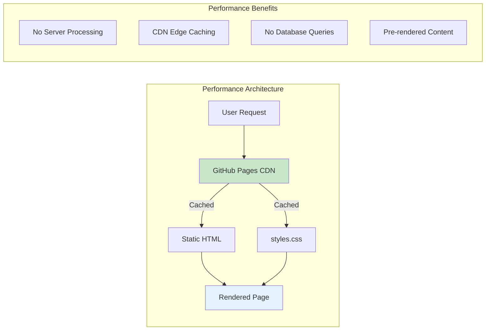

<p align="center">
  
</p>

<h1 align="center">⚡ EU Parliament Monitor — Performance Testing & Benchmarks</h1>

<p align="center">
  <strong>Comprehensive Performance Validation & Monitoring Framework</strong><br>
  <em>🚀 Lighthouse Audits • 📊 Page Load Optimization • ⚡ Static Site Performance</em>
</p>

<p align="center">
  <a href="#"></a>
  <a href="#"></a>
  <a href="#"></a>
  <a href="#"></a>
</p>

**📋 Document Owner:** CEO | **📄 Version:** 1.0 | **📅 Last Updated:**
2026-02-20 (UTC)  
**🔄 Review Cycle:** Quarterly | **⏰ Next Review:** 2026-05-20

---

## 📚 Architecture Documentation Map

<div class="documentation-map">

| Document                                                            | Focus           | Description                                    | Documentation Link                                                                                     |
| ------------------------------------------------------------------- | --------------- | ---------------------------------------------- | ------------------------------------------------------------------------------------------------------ |
| **[Architecture](ARCHITECTURE.md)**                                 | 🏛️ Architecture | C4 model showing current system structure      | [View Source](https://github.com/Hack23/euparliamentmonitor/blob/main/ARCHITECTURE.md)                 |
| **[Future Architecture](FUTURE_ARCHITECTURE.md)**                   | 🏛️ Architecture | C4 model showing future system structure       | [View Source](https://github.com/Hack23/euparliamentmonitor/blob/main/FUTURE_ARCHITECTURE.md)          |
| **[Mindmaps](MINDMAP.md)**                                          | 🧠 Concept      | Current system component relationships         | [View Source](https://github.com/Hack23/euparliamentmonitor/blob/main/MINDMAP.md)                      |
| **[Future Mindmaps](FUTURE_MINDMAP.md)**                            | 🧠 Concept      | Future capability evolution                    | [View Source](https://github.com/Hack23/euparliamentmonitor/blob/main/FUTURE_MINDMAP.md)               |
| **[SWOT Analysis](SWOT.md)**                                        | 💼 Business     | Current strategic assessment                   | [View Source](https://github.com/Hack23/euparliamentmonitor/blob/main/SWOT.md)                         |
| **[Future SWOT Analysis](FUTURE_SWOT.md)**                          | 💼 Business     | Future strategic opportunities                 | [View Source](https://github.com/Hack23/euparliamentmonitor/blob/main/FUTURE_SWOT.md)                  |
| **[Data Model](DATA_MODEL.md)**                                     | 📊 Data         | Current data structures and relationships      | [View Source](https://github.com/Hack23/euparliamentmonitor/blob/main/DATA_MODEL.md)                   |
| **[Future Data Model](FUTURE_DATA_MODEL.md)**                       | 📊 Data         | Enhanced European Parliament data architecture | [View Source](https://github.com/Hack23/euparliamentmonitor/blob/main/FUTURE_DATA_MODEL.md)            |
| **[Flowcharts](FLOWCHART.md)**                                      | 🔄 Process      | Current data processing workflows              | [View Source](https://github.com/Hack23/euparliamentmonitor/blob/main/FLOWCHART.md)                    |
| **[Future Flowcharts](FUTURE_FLOWCHART.md)**                        | 🔄 Process      | Enhanced AI-driven workflows                   | [View Source](https://github.com/Hack23/euparliamentmonitor/blob/main/FUTURE_FLOWCHART.md)             |
| **[State Diagrams](STATEDIAGRAM.md)**                               | 🔄 Behavior     | Current system state transitions               | [View Source](https://github.com/Hack23/euparliamentmonitor/blob/main/STATEDIAGRAM.md)                 |
| **[Future State Diagrams](FUTURE_STATEDIAGRAM.md)**                 | 🔄 Behavior     | Enhanced adaptive state transitions            | [View Source](https://github.com/Hack23/euparliamentmonitor/blob/main/FUTURE_STATEDIAGRAM.md)          |
| **[Security Architecture](SECURITY_ARCHITECTURE.md)**               | 🛡️ Security     | Current security implementation                | [View Source](https://github.com/Hack23/euparliamentmonitor/blob/main/SECURITY_ARCHITECTURE.md)        |
| **[Future Security Architecture](FUTURE_SECURITY_ARCHITECTURE.md)** | 🛡️ Security     | Security enhancement roadmap                   | [View Source](https://github.com/Hack23/euparliamentmonitor/blob/main/FUTURE_SECURITY_ARCHITECTURE.md) |
| **[Threat Model](THREAT_MODEL.md)**                                 | 🎯 Security     | STRIDE threat analysis                         | [View Source](https://github.com/Hack23/euparliamentmonitor/blob/main/THREAT_MODEL.md)                 |
| **[Classification](CLASSIFICATION.md)**                             | 🏷️ Governance   | CIA classification & BCP                       | [View Source](https://github.com/Hack23/euparliamentmonitor/blob/main/CLASSIFICATION.md)               |
| **[CRA Assessment](CRA-ASSESSMENT.md)**                             | 🛡️ Compliance   | Cyber Resilience Act                           | [View Source](https://github.com/Hack23/euparliamentmonitor/blob/main/CRA-ASSESSMENT.md)               |
| **[Workflows](WORKFLOWS.md)**                                       | ⚙️ DevOps       | CI/CD documentation                            | [View Source](https://github.com/Hack23/euparliamentmonitor/blob/main/WORKFLOWS.md)                    |
| **[Future Workflows](FUTURE_WORKFLOWS.md)**                         | 🚀 DevOps       | Planned CI/CD enhancements                     | [View Source](https://github.com/Hack23/euparliamentmonitor/blob/main/FUTURE_WORKFLOWS.md)             |
| **[Business Continuity Plan](BCPPlan.md)**                          | 🔄 Resilience   | Recovery planning                              | [View Source](https://github.com/Hack23/euparliamentmonitor/blob/main/BCPPlan.md)                      |
| **[Financial Security Plan](FinancialSecurityPlan.md)**             | 💰 Financial    | Cost & security analysis                       | [View Source](https://github.com/Hack23/euparliamentmonitor/blob/main/FinancialSecurityPlan.md)        |
| **[End-of-Life Strategy](End-of-Life-Strategy.md)**                 | 📦 Lifecycle    | Technology EOL planning                        | [View Source](https://github.com/Hack23/euparliamentmonitor/blob/main/End-of-Life-Strategy.md)         |
| **[Unit Test Plan](UnitTestPlan.md)**                               | 🧪 Testing      | Unit testing strategy                          | [View Source](https://github.com/Hack23/euparliamentmonitor/blob/main/UnitTestPlan.md)                 |
| **[E2E Test Plan](E2ETestPlan.md)**                                 | 🔍 Testing      | End-to-end testing                             | [View Source](https://github.com/Hack23/euparliamentmonitor/blob/main/E2ETestPlan.md)                  |
| **[Performance Testing](performance-testing.md)**                   | ⚡ Performance  | Performance benchmarks                         | [View Source](https://github.com/Hack23/euparliamentmonitor/blob/main/performance-testing.md)          |
| **[Security Policy](SECURITY.md)**                                  | 🔒 Security     | Vulnerability reporting & security policy      | [View Source](https://github.com/Hack23/euparliamentmonitor/blob/main/SECURITY.md)                     |

</div>

---

## 🎯 Purpose & Scope

This document establishes the **comprehensive performance testing strategy,
benchmarks, and optimization practices** for the EU Parliament Monitor platform,
ensuring optimal user experience across all 14 EU language versions. Aligned
with **Hack23 ISMS Secure Development Policy §8 "Performance Testing &
Monitoring Framework"**.

**Performance validation ensures:**

- ✅ Fast page loads for static HTML/CSS content (<2s)
- ✅ Optimal asset sizes within performance budgets
- ✅ Lighthouse scores meeting quality standards (90+ performance)
- ✅ Multi-language content renders efficiently
- ✅ **ISO 27001 (A.8.26)** compliance for capacity management
- ✅ **NIST CSF (ID.AM-1)** compliance for asset performance

---

## 📊 Performance Standards & Targets

### 🎯 Lighthouse Audit Targets

| Metric             | Target Score | Priority |
| ------------------ | ------------ | -------- |
| **Performance**    | 90+          | ✅ High  |
| **Accessibility**  | 95+          | ✅ High  |
| **Best Practices** | 95+          | ✅ High  |
| **SEO**            | 95+          | ✅ High  |

### ⚡ Page Load Time Targets

| Metric                             | Target       | Measurement             |
| ---------------------------------- | ------------ | ----------------------- |
| **Initial Load**                   | <2 seconds   | GitHub Pages deployment |
| **Time to Interactive (TTI)**      | <3 seconds   | Lighthouse audit        |
| **First Contentful Paint (FCP)**   | <1.5 seconds | Core Web Vitals         |
| **Largest Contentful Paint (LCP)** | <2.5 seconds | Core Web Vitals         |
| **Cumulative Layout Shift (CLS)**  | <0.1         | Core Web Vitals         |

### 📦 Asset Size Targets

| Resource           | Budget      | Notes                          |
| ------------------ | ----------- | ------------------------------ |
| **HTML per page**  | <50 KB      | Single page static HTML        |
| **CSS**            | <20 KB      | Single stylesheet (styles.css) |
| **Total per page** | <100 KB     | Including all assets           |
| **News articles**  | <30 KB each | Generated HTML content         |

---

## 🏗️ Static Site Performance Advantages

EU Parliament Monitor's static site architecture provides inherent performance
benefits:



| 🚀 **Advantage**              | 📋 **Impact**                             |
| ----------------------------- | ----------------------------------------- |
| **No server-side processing** | Zero TTFB (Time to First Byte) overhead   |
| **CDN edge caching**          | Content served from nearest edge location |
| **No database queries**       | Eliminates query latency                  |
| **Pre-rendered HTML**         | No client-side rendering delay            |
| **Minimal JavaScript**        | Faster parse and execute                  |

---

## 🔬 Performance Testing Procedures

### 1. Lighthouse Audit

**Local Testing:**

```bash
# Install Lighthouse CLI
npm install -g lighthouse

# Run audit on deployed site
lighthouse https://hack23.github.io/euparliamentmonitor/ --view

# Run audit on specific language version
lighthouse https://hack23.github.io/euparliamentmonitor/index-fr.html --view
```

### 2. Multi-Language Performance Validation

All 14 language versions should meet the same performance targets:

| Language   | Index Page      | Target Load |
| ---------- | --------------- | ----------- |
| English    | `index.html` | <2s         |
| Swedish    | `index-sv.html` | <2s         |
| Danish     | `index-da.html` | <2s         |
| Norwegian  | `index-no.html` | <2s         |
| Finnish    | `index-fi.html` | <2s         |
| German     | `index-de.html` | <2s         |
| French     | `index-fr.html` | <2s         |
| Spanish    | `index-es.html` | <2s         |
| Dutch      | `index-nl.html` | <2s         |
| Arabic     | `index-ar.html` | <2s         |
| Hebrew     | `index-he.html` | <2s         |
| Japanese   | `index-ja.html` | <2s         |
| Korean     | `index-ko.html` | <2s         |
| Chinese    | `index-zh.html` | <2s         |

### 3. Build Performance

| Metric              | Target | Measurement             |
| ------------------- | ------ | ----------------------- |
| **Lint time**       | <30s   | `npm run lint`          |
| **Unit test time**  | <60s   | `npm run test`          |
| **E2E test time**   | <5 min | `npm run test:e2e`      |
| **News generation** | <5 min | `npm run generate-news` |

---

## 📈 Performance Optimization Best Practices

### HTML Optimization

- ✅ Semantic HTML5 elements
- ✅ Minimal inline styles
- ✅ Proper heading hierarchy
- ✅ Lazy loading for images (if applicable)

### CSS Optimization

- ✅ Single stylesheet (`styles.css`)
- ✅ No unused CSS rules
- ✅ Efficient selectors
- ✅ CSS custom properties for theming

### Network Optimization

- ✅ GitHub Pages CDN caching
- ✅ Minimal HTTP requests (single CSS file)
- ✅ No external JavaScript dependencies
- ✅ Compressed responses (automatic via GitHub Pages)

---

## 📊 Performance Regression Prevention

### Automated Monitoring

| 🔧 **Tool**        | 📋 **Check**           | 🔄 **Frequency** |
| ------------------ | ---------------------- | ---------------- |
| **ESLint**         | Code quality           | Every push/PR    |
| **HTMLHint**       | HTML quality           | Every push/PR    |
| **Playwright E2E** | Functional performance | Every push/PR    |
| **Lighthouse**     | Performance scores     | Periodic manual  |

### Manual Testing Schedule

| 📅 **Activity**                  | 🔄 **Frequency** |
| -------------------------------- | ---------------- |
| Lighthouse audit (all languages) | Quarterly        |
| Page load time measurement       | Monthly          |
| Asset size analysis              | Per release      |
| Mobile performance testing       | Quarterly        |

---

## 🎯 Compliance Mapping

### ISO 27001 Alignment

| Control    | Requirement         | Implementation                                          |
| ---------- | ------------------- | ------------------------------------------------------- |
| **A.8.26** | Capacity Management | Performance budgets, monitoring and asset size tracking |

### NIST CSF Alignment

| Function    | Category               | Implementation                         |
| ----------- | ---------------------- | -------------------------------------- |
| **ID.AM-1** | Asset Management       | Performance characteristics documented |
| **PR.IP-2** | Information Protection | Performance validation in CI/CD        |

### CIS Controls Alignment

| Control   | Description            | Implementation                       |
| --------- | ---------------------- | ------------------------------------ |
| **16.12** | Application Security   | Performance doesn't degrade security |
| **16.13** | Performance Monitoring | Continuous performance tracking      |

---

## 📋 Performance Testing Checklist

**Before Release:**

- [ ] Lighthouse audit scores >90 (all categories)
- [ ] All 14 language pages load in <2 seconds
- [ ] HTML file sizes within budget (<50 KB each)
- [ ] CSS file size within budget (<20 KB)
- [ ] No layout shifts (CLS <0.1)
- [ ] E2E tests pass
- [ ] Mobile responsiveness validated
- [ ] Accessibility score >95

---

## 🔗 Related Documentation

### Internal Documentation

- [🧪 Unit Test Plan](UnitTestPlan.md) — Unit testing strategy
- [🔍 E2E Test Plan](E2ETestPlan.md) — End-to-end testing
- [🏛️ Architecture](ARCHITECTURE.md) — System design
- [🛡️ Security Architecture](SECURITY_ARCHITECTURE.md) — Security controls
- [⚙️ Workflows](WORKFLOWS.md) — CI/CD documentation

### External Resources

- [Hack23 ISMS Secure Development Policy](https://github.com/Hack23/ISMS-PUBLIC/blob/main/Secure_Development_Policy.md)
- [Lighthouse Documentation](https://developer.chrome.com/docs/lighthouse/)
- [Web Vitals](https://web.dev/vitals/)
- [Performance Budgets 101](https://web.dev/performance-budgets-101/)

---

**📋 Document Control:**  
**✅ Approved by:** James Pether Sörling, CEO  
**📤 Distribution:** Public  
**🏷️ Classification:**
[](https://github.com/Hack23/ISMS-PUBLIC/blob/main/CLASSIFICATION.md#confidentiality-levels)
[](https://github.com/Hack23/ISMS-PUBLIC/blob/main/CLASSIFICATION.md#integrity-levels)
[](https://github.com/Hack23/ISMS-PUBLIC/blob/main/CLASSIFICATION.md#availability-levels)  
**🎯
Framework Compliance:**
[](https://github.com/Hack23/ISMS-PUBLIC/blob/main/CLASSIFICATION.md)
[](https://github.com/Hack23/ISMS-PUBLIC/blob/main/CLASSIFICATION.md)
[](https://github.com/Hack23/ISMS-PUBLIC/blob/main/CLASSIFICATION.md)
