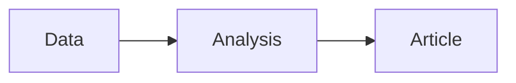

# Synthesis Summary — Test Run

## Top Findings

The week's developments align along three tracks. Trade defence enters operational use, banking union closes its final gaps, and the digital omnibus reduces AI Act implementation friction.

## Narrative

Parliament pre-positioned trade defence on March 26 — one week before the Trump "Liberation Day" tariffs — and is now returning to Strasbourg with the tools operative. The banking union package (BRRD3, SRMR3, DGSD2) completes the post-2014 reform programme. The digital omnibus simplifies AI Act compliance for small providers.

## Cross-References

See also [coalition dynamics](../intelligence/coalition-dynamics.md) and [risk matrix](../risk-scoring/risk-matrix.md).
